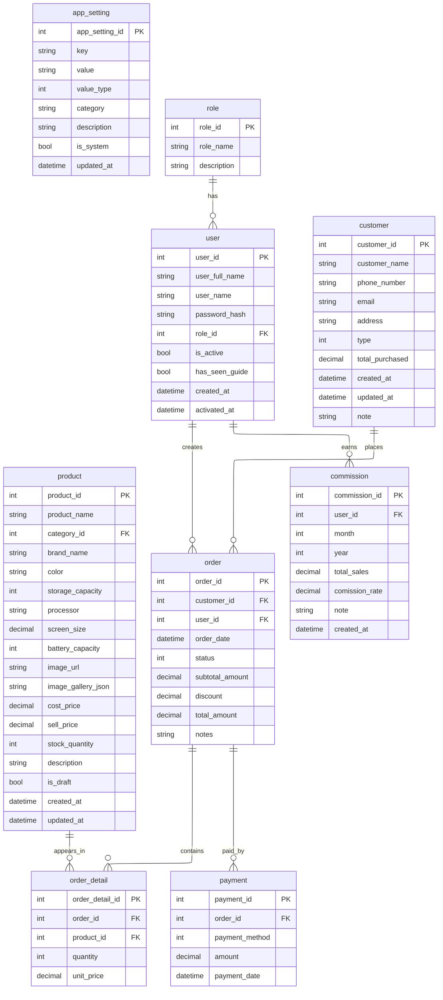

```mermaid
---
config:
  layout: elk
---
erDiagram
    app_setting {
        int app_setting_id PK
        string key
        string value
        int value_type
        string category
        string description
        bool is_system
        datetime updated_at
    }

    role {
        int role_id PK
        string role_name
        string description
    }

    user {
        int user_id PK
        string user_full_name
        string user_name
        string password_hash
        int role_id FK
        bool is_active
        bool has_seen_guide
        datetime created_at
        datetime activated_at
    }

    product {
        int product_id PK
        string product_name
        int category_id FK
        string brand_name
        string color
        int storage_capacity
        string processor
        decimal screen_size
        int battery_capacity
        string image_url
        string image_gallery_json
        decimal cost_price
        decimal sell_price
        int stock_quantity
        string description
        bool is_draft
        datetime created_at
        datetime updated_at
    }

    customer {
        int customer_id PK
        string customer_name
        string phone_number
        string email
        string address
        int type
        decimal total_purchased
        datetime created_at
        datetime updated_at
        string note
    }

    order {
        int order_id PK
        int customer_id FK
        int user_id FK
        datetime order_date
        int status
        decimal subtotal_amount
        decimal discount
        decimal total_amount
        string notes
    }

    order_detail {
        int order_detail_id PK
        int order_id FK
        int product_id FK
        int quantity
        decimal unit_price
    }

    payment {
        int payment_id PK
        int order_id FK
        int payment_method
        decimal amount
        datetime payment_date
    }

    commission {
        int commission_id PK
        int user_id FK
        int month
        int year
        decimal total_sales
        decimal comission_rate
        string note
        datetime created_at
    }

    %% Relationships
    role ||--o{ user : has
    user ||--o{ order : creates
    customer ||--o{ order : places
    product ||--o{ order_detail : appears_in
    order ||--o{ order_detail : contains
    order ||--o{ payment : paid_by
    user ||--o{ commission : earns
```