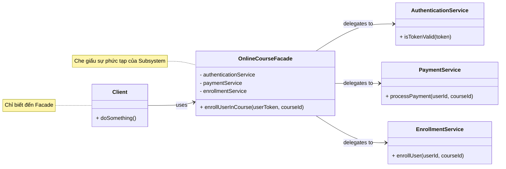
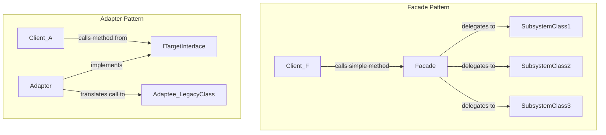

# Facade Pattern
> researched by Hoang Nguyen Phuc

# **1. Bản chất của Facade Pattern (First Principles)**

Hãy tạm quên đi code và các sơ đồ UML phức tạp. Trước hết, hãy cùng phân tích ý nghĩa của từ "Facade".

Trong kiến trúc xây dựng, **"facade"** (bắt nguồn từ tiếng Pháp) có nghĩa là **mặt tiền** của một tòa nhà. Đây là bộ mặt bên ngoài, thứ mà chúng ta nhìn thấy đầu tiên. Nó thường được thiết kế để trông đơn giản, đẹp mắt và có một lối vào chính rõ ràng. Đằng sau mặt tiền đó là một hệ thống cực kỳ phức tạp: kết cấu dầm, cột, hệ thống điện, đường ống nước, hệ thống thông gió, thang máy...

Người đi vào tòa nhà (client) chỉ cần biết cách mở cánh cửa chính (the facade's interface). Họ không cần và cũng không muốn biết sơ đồ đi dây điện phức tạp hay cách hệ thống ống nước hoạt động để có thể sử dụng các chức năng của tòa nhà.

**Facade Pattern trong kỹ thuật phần mềm áp dụng chính xác tư tưởng này.**


---

### **Phép so sánh (Analogy): Dàn âm thanh tại gia (Home Theater System)**

Hãy hình dung bạn có một dàn âm thanh hiện đại tại nhà bao gồm rất nhiều thiết bị:

- Một chiếc Smart TV
- Một bộ loa Soundbar
- Một đầu chơi game (PlayStation/Xbox)
- Một thiết bị streaming (Apple TV/Chromecast)
- Hệ thống đèn thông minh có thể điều chỉnh độ sáng

Để chuẩn bị cho một buổi xem phim, bạn phải thực hiện một chuỗi các thao tác phức tạp:

1. Dùng remote TV để bật TV.
2. Dùng remote TV để chuyển đầu vào (input) sang cổng HDMI 2 (của Apple TV).
3. Dùng remote Soundbar để bật loa.
4. Dùng remote Soundbar để chuyển chế độ âm thanh sang "Cinema".
5. Dùng remote Apple TV để bật thiết bị và chọn phim trên Netflix.
6. Dùng điện thoại mở app để giảm độ sáng của đèn phòng khách xuống 20%.

Quá trình này rất rườm rà, dễ sai sót và đòi hỏi bạn phải biết cách sử dụng *tất cả* các thiết bị riêng lẻ. Hệ thống này có **coupling rất cao** với bạn (người dùng).

**Đây chính là lúc "Facade" xuất hiện.**

Bạn mua một chiếc remote đa năng (Universal Remote) hoặc thiết lập một kịch bản trên trợ lý ảo (Google Assistant/Alexa). Bây giờ, bạn chỉ cần thực hiện **một hành động duy nhất**:

- Nhấn nút **"Movie Time"** trên remote.
- Hoặc nói: **"Hey Google, it's movie time."**

Cái nút "Movie Time" này chính là **Facade**. Nó cung cấp một giao diện (interface) cực kỳ đơn giản. Khi bạn tương tác với nó, nó sẽ tự động thực hiện tất cả 6 bước phức tạp kia ở "hậu trường". Bạn không cần quan tâm nó làm thế nào, bạn chỉ cần biết nhấn nút đó là có thể xem phim.

---

### **Dịch sang Kỹ thuật Phần mềm**

Bây giờ, hãy "dịch" phép so sánh này sang thế giới phần mềm:

- **Dàn thiết bị phức tạp (TV, Loa, Đèn...)** → **Một Subsystem (hệ thống con)**: Đây là một tập hợp các class, thư viện, hoặc module có liên quan với nhau nhưng lại có giao diện phức tạp và khó sử dụng. Ví dụ: một thư viện xử lý video có các class riêng cho việc đọc file (`VideoFileReader`), giải mã codec (`CodecFactory`, `H264Decoder`), xử lý âm thanh (`AudioMixer`), render phụ đề (`SubtitleRenderer`), v.v.
- **Bạn (người dùng)** → **Client Code**: Đây là phần code của bạn (ví dụ: một `ViewModel` trong ứng dụng WinUI, một `Controller` trong WebAPI) muốn sử dụng chức năng của subsystem kia.
- **Nút "Movie Time"** → **Lớp Facade**: Đây là một class duy nhất mà bạn tạo ra. Nó cung cấp một vài method đơn giản, dễ hiểu (ví dụ: `ConvertVideo(inputFile, outputFile, format)`). Client code chỉ cần gọi method này. Bên trong method đó, lớp Facade sẽ tự mình khởi tạo và điều phối các đối tượng phức tạp của subsystem (gọi `VideoFileReader`, `CodecFactory`, `AudioMixer`...) để hoàn thành công việc.

### **Vấn đề cốt lõi Facade giải quyết**

Facade Pattern sinh ra để giải quyết 2 vấn đề chính:

1. **Giảm thiểu sự phức tạp (Reduce Complexity):** Nó che giấu sự phức tạp của một hệ thống con, cung cấp một "lối vào" đơn giản và dễ sử dụng hơn cho client.
2. **Giảm sự phụ thuộc (Reduce Coupling):** Client code chỉ phụ thuộc vào lớp Facade, chứ không phải vào hàng tá các class lằng nhằng bên trong subsystem. Điều này có nghĩa là: nếu sau này bạn muốn nâng cấp, thay đổi hoặc thậm chí thay thế toàn bộ subsystem đó, bạn chỉ cần sửa logic bên trong lớp Facade. Toàn bộ client code sẽ không bị ảnh hưởng, miễn là "chữ ký" (signature) của các method trong Facade không đổi. Đây là một lợi ích cực lớn cho việc bảo trì và phát triển phần mềm.

Về bản chất, Facade Pattern không phải là một ý tưởng gì đó quá mới mẻ hay phức tạp. Nó là một ứng dụng rất tự nhiên của hai nguyên tắc lập trình hướng đối tượng cốt lõi mà bạn đã quen thuộc: **Abstraction (Trừu tượng hóa)** và **Encapsulation (Đóng gói)**, nhưng được áp dụng ở cấp độ kiến trúc giữa các module.

---

# **2. Cấu trúc và Cách hoạt động (How it works)**

### **A. Các thành phần tham gia (The Key Players)**

Một Facade Pattern điển hình luôn có 3 thành phần chính. Hãy hình dung chúng như 3 vai diễn trong một vở kịch:

1. **The Subsystem (Hệ thống con):**
    - **Vai trò:** Đây là tập hợp các lớp, module, thư viện phức tạp mà chúng ta muốn đơn giản hóa việc sử dụng. Chúng chứa logic nghiệp vụ thực sự.
    - **Đặc điểm:** Các lớp trong Subsystem không hề biết đến sự tồn tại của Facade. Chúng hoạt động độc lập và có thể được sử dụng trực tiếp bởi các client "chuyên gia" nếu cần. Chúng là những "chuyên gia" làm việc ở hậu trường.
2. **The Facade (Mặt tiền):**
    - **Vai trò:** Đây là nhân vật chính. Nó là một lớp duy nhất đóng vai trò là "người phát ngôn" hay "điều phối viên" cho Subsystem.
    - **Đặc điểm:**
        - Nó biết về các lớp trong Subsystem và cách ra lệnh cho chúng (nó giữ tham chiếu đến các đối tượng của Subsystem).
        - Nó nhận các yêu cầu từ Client, sau đó "dịch" yêu cầu đơn giản đó thành một chuỗi các hành động phức tạp trên các lớp của Subsystem.
        - Bản thân Facade thường không chứa logic nghiệp vụ. Công việc của nó là **ủy thác (delegate)** và **điều phối (orchestrate)**.
3. **The Client (Người sử dụng):**
    - **Vai trò:** Đây là bất kỳ phần code nào cần sử dụng chức năng của Subsystem.
    - **Đặc điểm:** Thay vì tương tác trực tiếp với hàng tá lớp trong Subsystem, Client chỉ cần "nói chuyện" với một đối tượng duy nhất: Facade. Điều này làm cho code của Client trở nên gọn gàng, dễ đọc và ít phụ thuộc hơn rất nhiều.

### **B. Sơ đồ kiến trúc**

Sơ đồ sau minh họa mối quan hệ giữa 3 thành phần này. Chúng ta sẽ dùng code Mermaid để vẽ nó.



**Phân tích sơ đồ:**

- `Client` chỉ có một mũi tên duy nhất trỏ đến `OnlineCourseFacade`. Nó hoàn toàn không biết về sự tồn tại của `AuthenticationService`, `PaymentService`, hay `EnrollmentService`.
- `OnlineCourseFacade` đóng vai trò trung gian, nhận yêu cầu từ `Client` và sau đó gọi đến các dịch vụ tương ứng trong `Complex Subsystem`.

### **C. Ví dụ bằng Code (C#)**

Hãy hiện thực hóa ví dụ về việc đăng ký một khóa học trực tuyến ở trên.

**Bước 1: Tạo ra "Complex Subsystem"**

Đây là các dịch vụ riêng lẻ, mỗi dịch vụ làm một việc chuyên biệt.

```csharp
// Subsystem Part 1: Dịch vụ xác thực
public class AuthenticationService
{
    public bool IsTokenValid(string userToken)
    {
        Console.WriteLine($"Checking validity of token: {userToken}");
        // Logic phức tạp để kiểm tra token...
        return !string.IsNullOrEmpty(userToken);
    }
    public int GetUserIdFromToken(string userToken)
    {
        // Giả sử lấy được User ID từ token
        return 123;
    }
}

// Subsystem Part 2: Dịch vụ thanh toán
public class PaymentService
{
    public bool ProcessPayment(int userId, int courseId)
    {
        Console.WriteLine($"Processing payment for user {userId} for course {courseId}");
        // Logic phức tạp để kết nối với cổng thanh toán (Stripe, PayPal)...
        return true; // Giả sử thanh toán thành công
    }
}

// Subsystem Part 3: Dịch vụ đăng ký học
public class EnrollmentService
{
    public void EnrollUserInCourse(int userId, int courseId)
    {
        Console.WriteLine($"Enrolling user {userId} in course {courseId}");
        // Logic phức tạp để ghi vào database...
    }
}
```

**Bước 2: Xây dựng lớp Facade**

Lớp này sẽ là "mặt tiền" đơn giản, che giấu đi 3 dịch vụ phức tạp kia.

```csharp
// The Facade
public class CourseEnrollmentFacade
{
    // Facade giữ tham chiếu đến các thành phần của subsystem
    private readonly AuthenticationService _authService;
    private readonly PaymentService _paymentService;
    private readonly EnrollmentService _enrollmentService;

    // Sử dụng constructor injection để cung cấp các dependency
    public CourseEnrollmentFacade()
    {
        _authService = new AuthenticationService();
        _paymentService = new PaymentService();
        _enrollmentService = new EnrollmentService();
    }

    // Đây là phương thức duy nhất, đơn giản mà Client cần gọi
    public bool EnrollUser(string userToken, int courseId)
    {
        Console.WriteLine("\\n--- Facade: Starting enrollment process ---");

        // 1. Ủy thác cho AuthenticationService
        if (!_authService.IsTokenValid(userToken))
        {
            Console.WriteLine("Facade: Invalid token. Enrollment failed.");
            return false;
        }
        int userId = _authService.GetUserIdFromToken(userToken);

        // 2. Ủy thác cho PaymentService
        bool paymentSuccess = _paymentService.ProcessPayment(userId, courseId);
        if (!paymentSuccess)
        {
            Console.WriteLine("Facade: Payment failed. Enrollment stopped.");
            return false;
        }

        // 3. Ủy thác cho EnrollmentService
        _enrollmentService.EnrollUserInCourse(userId, courseId);

        Console.WriteLine("--- Facade: Enrollment process completed successfully! ---\\n");
        return true;
    }
}

```

**Bước 3: Client sử dụng Facade**

Code của Client giờ đây trở nên sạch sẽ và dễ hiểu đến kinh ngạc.

```csharp
// The Client
public class Program
{
    public static void Main(string[] args)
    {
        // Client chỉ cần khởi tạo và làm việc với Facade
        var enrollmentFacade = new CourseEnrollmentFacade();

        // Thực hiện một hành động phức tạp chỉ bằng một lời gọi hàm
        enrollmentFacade.EnrollUser("valid_user_token_abc123", 99);

        // So sánh với việc KHÔNG DÙNG Facade:
        /*
            var auth = new AuthenticationService();
            var payment = new PaymentService();
            var enroll = new EnrollmentService();

            if (auth.IsTokenValid("some_token")) {
                int userId = auth.GetUserIdFromToken("some_token");
                if (payment.ProcessPayment(userId, 99)) {
                    enroll.EnrollUserInCourse(userId, 99);
                }
            }
        */
        // Rõ ràng code của client sẽ trở nên rất rối và phụ thuộc nặng nề vào subsystem.
    }
}
```

### **Một chi tiết quan trọng: "Cửa thoát hiểm" (Escape Hatch)**

Facade không bắt buộc phải che giấu *hoàn toàn* Subsystem. Nếu một Client nào đó có nhu cầu đặc biệt và cần truy cập trực tiếp vào các chức năng nâng cao của `PaymentService` (ví dụ: hoàn tiền, xem lịch sử giao dịch), họ vẫn có thể làm điều đó. Facade chỉ cung cấp một con đường đơn giản cho các tác vụ phổ biến, nó không phải là một bức tường chặn mọi lối đi khác.

Như vậy, bạn đã thấy rõ cách Facade được cấu trúc và cách nó điều phối các thành phần phức tạp bên dưới để cung cấp một giao diện đơn giản cho Client.

---

# **3. So sánh Facade với các Pattern liên quan**

### **A. Bảng tóm tắt nhanh**

| Tiêu chí | Facade Pattern | Adapter Pattern | API Gateway Pattern |
| --- | --- | --- | --- |
| **Mục đích chính (Intent)** | **Đơn giản hóa** một interface phức tạp của một hệ thống con (subsystem). | **Chuyển đổi** một interface này thành một interface khác mà client mong đợi. | **Tạo một điểm vào duy nhất** (single entry point) cho một hệ thống các microservices. |
| **Vấn đề giải quyết** | "Hệ thống này có quá nhiều thứ, khó dùng quá. Cho tôi một cái remote đơn giản đi." | "Tôi cần cắm cái phích 2 chấu này vào ổ cắm 3 chấu. Cho tôi một cục chuyển đổi." | "Tôi có 10 dịch vụ backend, client không thể nào gọi cả 10 được. Cho tôi một cổng chung." |
| **Phạm vi (Scope)** | Hoạt động trên một tập hợp các lớp/đối tượng trong cùng một process (in-process). | Thường hoạt động trên một lớp/đối tượng duy nhất. | Hoạt động ở tầng mạng (network-level), đứng trước nhiều services (out-of-process). |
| **Phép so sánh (Analogy)** | **Remote đa năng "Movie Time"**: Một nút bấm điều khiển nhiều thiết bị. | **Cục sạc chuyển đổi chân cắm (Travel Adapter)**: Giúp phích cắm không tương thích dùng được với ổ cắm. | **Nhân viên lễ tân của tòa nhà**: Nhận mọi yêu cầu và chuyển đến đúng phòng ban. |

---

### **B. Phân tích chi tiết: Facade vs. Adapter**

Đây là cặp đôi kinh điển trong "Gang of Four" Design Patterns. Sự khác biệt cốt lõi nằm ở **MỤC ĐÍCH**.

- **Facade: Tạo ra một Interface MỚI, ĐƠN GIẢN HƠN.**
    - Nó không thay đổi interface của các lớp trong subsystem.
    - Nó chỉ cung cấp một "lối tắt" tiện lợi. Bạn vẫn có thể truy cập trực tiếp các lớp phức tạp kia nếu muốn.
    - **Ví dụ:** Bạn có một thư viện đồ họa với các lớp `DrawPixel`, `DrawLine`, `FillColor`. Facade sẽ cung cấp một interface mới là `DrawSquare(topLeft, size)` mà bên trong nó sẽ tự gọi `DrawLine` 4 lần.
- **Adapter: Sử dụng một Interface CŨ theo một cách MỚI.**
    - Mục đích của nó là làm cho hai thứ vốn **không tương thích** có thể làm việc được với nhau.
    - Client có một yêu cầu rất cụ thể: "Tôi cần một đối tượng implement interface `IShape`". Nhưng bạn lại chỉ có một lớp `LegacyRectangle` từ một thư viện cũ không implement `IShape`.
    - Adapter (`RectangleAdapter`) sẽ được tạo ra, nó sẽ implement `IShape` và "bọc" (wrap) đối tượng `LegacyRectangle` bên trong. Khi Client gọi `adapter.Draw()`, bên trong nó sẽ gọi `legacyRectangle.Paint()`.

**Sơ đồ minh họa sự khác biệt:**



**Tóm lại:** Hãy hỏi câu này: "Tôi đang muốn **đơn giản hóa** hay **làm cho tương thích**?"

- Đơn giản hóa → Dùng **Facade**.
- Làm cho tương thích → Dùng **Adapter**.

---

### **C. Phân tích chi tiết: Facade vs. API Gateway**

Đây là một sự so sánh ở tầm kiến trúc, rất liên quan đến dự án của bạn vì bạn có cả Frontend (WinUI) và Backend ([ASP.NET](http://asp.net/) WebAPI).

- **Facade là một pattern ở cấp độ code (code-level).**
    - Nó là một lớp (class) nằm bên trong một ứng dụng hoặc một thư viện.
    - Nó giúp các phần khác nhau của *cùng một hệ thống* (hoặc một process) giao tiếp với nhau dễ dàng hơn.
    - Trong dự án của bạn, `Application` layer có thể được xem như một Facade cho `Domain` và `Infrastructure` layers. `OrdersController` của bạn cũng hoạt động như một Facade, cung cấp một endpoint HTTP đơn giản cho một loạt các hành động nghiệp vụ phức tạp bên dưới.
- **API Gateway là một pattern ở cấp độ kiến trúc hệ thống (architectural-level).**
    - Nó là một **server riêng biệt**, một "con proxy ngược" đứng chắn trước toàn bộ hệ thống backend của bạn.
    - Nó là điểm vào duy nhất cho tất cả các client bên ngoài (ứng dụng mobile, web app, WinUI app của bạn).
    - **Ngoài việc đơn giản hóa**, API Gateway còn làm rất nhiều việc khác mà Facade không làm:
        - **Request Routing:** Định tuyến yêu cầu `/api/products` đến Product-Microservice, `/api/orders` đến Order-Microservice.
        - **Authentication & Authorization:** Kiểm tra token, API key ngay tại cửa ngõ trước khi cho vào hệ thống.
        - **Rate Limiting & Throttling:** Chống DDOS, giới hạn số request từ một client.
        - **SSL Termination:** Giải mã HTTPS.
        - **Logging & Monitoring:** Ghi log tập trung cho mọi request.
        - **Response Caching:** Cache lại các response phổ biến để giảm tải cho backend.
        - **Protocol Translation:** Chuyển đổi từ REST sang gRPC chẳng hạn.

**Khi nào dùng cái nào trong dự án của bạn?**

- Hiện tại, `TechHaven.WebAPI` của bạn đang đóng vai trò là một **Monolith Backend** (một khối thống nhất). Bản thân cái `WebAPI` này đã hoạt động như một **Facade** cho toàn bộ logic nghiệp vụ bên trong. Ứng dụng WinUI của bạn chỉ cần nói chuyện với cái Facade này là đủ.
- Trong tương lai, nếu bạn phát triển hệ thống lớn mạnh hơn và tách `TechHaven.WebAPI` thành 3 **Microservices** riêng biệt: `ProductService`, `OrderService`, `UserService`. Lúc này, bạn sẽ cần một **API Gateway** đứng trước cả 3 services này. Ứng dụng WinUI sẽ chỉ gọi đến API Gateway, và Gateway sẽ tự biết phải chuyển yêu cầu đến service nào.

---

# **4. Ứng dụng Facade vào dự án "TechHaven"**

Chúng ta sẽ chia phần này làm 2 mục:
A. Nơi bạn **đã vô tình** áp dụng tư tưởng của Facade.
B. Nơi bạn có thể **chủ động áp dụng** Facade để hệ thống tốt hơn.

---

### **A. Nơi bạn đã (và đang) áp dụng Facade một cách tự nhiên**

Kiến trúc Clean Architecture của bạn vốn dĩ đã khuyến khích việc sử dụng Facade để phân tách các lớp (layer).

**1. Lớp `Application` chính là một Facade cho lớp `Domain` và `Infrastructure`**

Đây là ví dụ điển hình và quan trọng nhất trong dự án của bạn.

- **Subsystem phức tạp:** Bao gồm `TechHaven.Domain` (chứa các Entities, business rules cốt lõi) và `TechHaven.Infrastructure` (chứa logic truy cập database qua EF Core, gọi dịch vụ bên ngoài). Việc tương tác trực tiếp với chúng đòi hỏi phải hiểu về `DbContext`, `Repository`, các `Domain Event`,...
- **Facade:** Chính là lớp `TechHaven.Application` của bạn.
- **Giao diện đơn giản (Simple Interface):** Là các `Command` và `Query` mà bạn định nghĩa với MediatR (ví dụ: `CreateOrderCommand`, `GetProductByIdQuery`).

Hãy xem lại luồng "Tạo Đơn hàng" mà bạn đã mô tả:

1. `OrdersController` (Client) nhận một HTTP Request.
2. Nó không quan tâm đến `DbContext` hay `Order` entity. Nó chỉ tạo một object đơn giản: `CreateOrderCommand`.
3. Nó gửi command này cho MediatR.
4. `CreateOrderCommandHandler` (một phần của Facade `Application`) nhận command này.
5. **Bên trong Handler này, sự phức tạp được che giấu:**
    - Nó gọi `IProductRepository` để kiểm tra tồn kho (ủy thác cho Infrastructure).
    - Nó tạo ra một `Order` entity và thực thi logic nghiệp vụ (tương tác với Domain).
    - Nó gọi `IOrderRepository.AddAsync()` để lưu vào database (ủy thác cho Infrastructure).
    - Nó có thể gọi `IEmailService` để gửi mail xác nhận (ủy thác cho Infrastructure).

`OrdersController` không cần biết bất kỳ điều gì trong 5 bước trên. Nó chỉ cần biết "gửi một `CreateOrderCommand` đi". Như vậy, `Application Layer` đã đóng vai trò là một **Facade** hoàn hảo, giúp cho lớp Presentation (WebAPI) trở nên cực kỳ gọn nhẹ và không bị phụ thuộc vào logic nghiệp vụ chi tiết.

**2. Các `API Controllers` là một Facade cho toàn bộ Backend**

Nhìn từ góc độ của ứng dụng Frontend (`TechHaven.Presentation.WinUI`):

- **Subsystem phức tạp:** Toàn bộ hệ thống backend của bạn, với CQRS, MediatR, EF Core, các tầng Application, Domain, Infrastructure.
- **Facade:** Chính là lớp `TechHaven.Presentation.WebAPI`.
- **Giao diện đơn giản:** Là các HTTP endpoints mà bạn cung cấp (ví dụ: `POST /api/orders`, `GET /api/products/{id}`).

Ứng dụng WinUI của bạn không cần biết backend được viết bằng .NET, Java hay Python. Nó cũng không cần biết bạn dùng kiến trúc gì. Nó chỉ cần biết rằng "để tạo đơn hàng, hãy gửi một JSON object đến endpoint `POST /api/orders`".

`API Controller` đã cung cấp một "mặt tiền" dựa trên chuẩn HTTP, che giấu toàn bộ sự phức tạp của hệ thống bên trong. Đây chính là lý do tại sao chúng ta có thể thay đổi toàn bộ backend mà không cần sửa một dòng code nào ở frontend, miễn là "hợp đồng" (contract) API không thay đổi.

---

### **B. Nơi bạn có thể chủ động tạo ra một Facade mới**

Bây giờ, hãy xem xét một kịch bản mà việc tạo ra một lớp Facade tường minh sẽ giúp ích.

**Kịch bản: Tổng hợp dữ liệu cho Dashboard**

Trong file đề cương, bạn có chức năng "Dashboard tổng quan hệ thống". Một dashboard thường hiển thị rất nhiều thông tin tổng hợp từ nhiều nguồn khác nhau:

- Doanh thu trong ngày (từ `Order`).
- Số đơn hàng mới (từ `Order`).
- Số sản phẩm sắp hết hàng (từ `Product`/`Stock`).
- Khách hàng mới trong tuần (từ `Customer`).

**Cách tiếp cận thông thường (Chưa có Facade):**

Trong `DashboardViewModel` của ứng dụng WinUI, bạn có thể phải gọi nhiều API khác nhau:

1. Gọi `GET /api/reports/daily-revenue`
2. Gọi `GET /api/reports/new-orders-count`
3. Gọi `GET /api/products?lowOnStock=true`
4. Gọi `GET /api/customers?newThisWeek=true`

Hoặc ở phía backend, trong `ReportsController`, bạn sẽ phải inject rất nhiều service/repository: `IOrderRepository`, `IProductRepository`, `ICustomerRepository`... Điều này làm cho Controller bị phình to và vi phạm Nguyên tắc Trách nhiệm đơn (Single Responsibility Principle).

**Giải pháp: Tạo một `ReportingFacade` (hoặc `DashboardService`)**

Hãy tạo một lớp Facade mới trong `Application Layer` chuyên cho việc này.

**Bước 1: Định nghĩa Interface cho Facade**

```csharp
// Trong TechHaven.Application/Interfaces
public interface IDashboardFacade
{
    Task<DashboardSummaryDto> GetDashboardSummaryAsync();
}

public class DashboardSummaryDto
{
    public decimal DailyRevenue { get; set; }
    public int NewOrdersCount { get; set; }
    public int ProductsLowOnStockCount { get; set; }
    public int NewCustomersCount { get; set; }
}
```

**Bước 2: Triển khai Facade**

Lớp này sẽ là nơi chứa đựng sự phức tạp.

```csharp
// Trong TechHaven.Application/Services hoặc Features/Dashboard
public class DashboardFacade : IDashboardFacade
{
    private readonly IOrderRepository _orderRepository;
    private readonly IProductRepository _productRepository;
    private readonly ICustomerRepository _customerRepository; // Giả sử có

    public DashboardFacade(
        IOrderRepository orderRepository,
        IProductRepository productRepository,
        ICustomerRepository customerRepository)
    {
        _orderRepository = orderRepository;
        _productRepository = productRepository;
        _customerRepository = customerRepository;
    }

    public async Task<DashboardSummaryDto> GetDashboardSummaryAsync()
    {
        // 1. Lấy dữ liệu từ nhiều nguồn
        var revenueTask = _orderRepository.GetDailyRevenueAsync();
        var ordersCountTask = _orderRepository.GetNewOrdersCountAsync();
        var lowStockTask = _productRepository.GetLowOnStockCountAsync();
        var newCustomersTask = _customerRepository.GetNewCustomersCountAsync();

        // Chạy song song để tối ưu hiệu năng
        await Task.WhenAll(revenueTask, ordersCountTask, lowStockTask, newCustomersTask);

        // 2. Tổng hợp lại thành một DTO duy nhất
        return new DashboardSummaryDto
        {
            DailyRevenue = revenueTask.Result,
            NewOrdersCount = ordersCountTask.Result,
            ProductsLowOnStockCount = lowStockTask.Result,
            NewCustomersCount = newCustomersTask.Result
        };
    }
}
```

**Bước 3: Sử dụng Facade**

Bây giờ, `API Controller` và `ViewModel` của bạn trở nên cực kỳ đơn giản.

- **Trong API Controller:**

```csharp
[ApiController]
[Route("api/dashboard")]
public class DashboardController : ControllerBase
{
    private readonly IDashboardFacade _dashboardFacade;

    public DashboardController(IDashboardFacade dashboardFacade)
    {
        _dashboardFacade = dashboardFacade;
    }

    [HttpGet("summary")]
    public async Task<ActionResult<DashboardSummaryDto>> GetSummary()
    {
        // Chỉ một dòng duy nhất!
        var summary = await _dashboardFacade.GetDashboardSummaryAsync();
        return Ok(summary);
    }
}
```

- **Lợi ích của việc này:**
    1. **Đơn giản hóa Client:** `DashboardController` (client của facade) giờ đây rất gọn, chỉ phụ thuộc vào một interface duy nhất.
    2. **Đóng gói sự phức tạp:** Toàn bộ logic về việc lấy dữ liệu từ đâu, tổng hợp như thế nào được gói gọn trong `DashboardFacade`.
    3. **Dễ dàng Test:** Bạn có thể unit test `DashboardFacade` một cách độc lập. Test `DashboardController` cũng dễ hơn vì chỉ cần mock `IDashboardFacade`.
    4. **Tái sử dụng:** Nếu sau này bạn cần gửi báo cáo dashboard qua email, `EmailService` của bạn cũng có thể sử dụng lại `IDashboardFacade` này.

---

# **5. Ưu và Nhược điểm (Pros & Cons)**

### **A. Ưu điểm (Pros)**

1. **Giảm sự phụ thuộc (Decoupling):** Đây là lợi ích lớn nhất. Facade giúp tách biệt (decouple) client code khỏi sự phức tạp của một hệ thống con (subsystem).
    - **Ví dụ trong dự án của bạn:** `TechHaven.Presentation.WinUI` chỉ phụ thuộc vào các endpoint của `TechHaven.Presentation.WebAPI` (Facade), chứ không phụ thuộc vào `EF Core` hay `MediatR` bên trong backend. Nhờ vậy, bạn có thể thay đổi ORM từ `EF Core` sang `Dapper` mà không cần thay đổi bất kỳ dòng code nào ở phía Frontend. Việc bảo trì và nâng cấp hệ thống con trở nên dễ dàng hơn rất nhiều.
2. **Đơn giản hóa việc sử dụng (Simplifies Usage):** Facade cung cấp một API cấp cao, đơn giản và dễ hiểu hơn cho các tác vụ phổ biến.
    - **Ví dụ:** Thay vì client phải tự mình gọi 3-4 service để thực hiện quy trình đăng ký khóa học, họ chỉ cần gọi một phương thức duy nhất `enrollmentFacade.EnrollUser()`. Điều này giúp giảm khả năng mắc lỗi và tăng tốc độ phát triển cho các client.
3. **Cải thiện khả năng đọc hiểu của Code (Improves Code Readability):** Code của client trở nên gọn gàng, rõ ràng và thể hiện rõ ý định (intent) hơn.
    - **So sánh:**
        - `var summary = await _dashboardFacade.GetDashboardSummaryAsync();`
        - So với một loạt các lời gọi `_orderRepo.Get...`, `_productRepo.Get...` nằm trực tiếp trong controller. Rõ ràng cách đầu tiên dễ đọc và dễ hiểu hơn rất nhiều.
4. **Tổ chức code theo lớp (Layering):** Facade là một công cụ tuyệt vời để thực thi kiến trúc phân lớp. Nó hoạt động như một "cổng kiểm soát" giữa các lớp, đảm bảo rằng giao tiếp giữa chúng đi theo một luồng xác định.
    - **Ví dụ trong dự án của bạn:** Lớp `Application` chính là một Facade, nó bắt buộc `WebAPI` phải đi qua nó để nói chuyện với `Domain` và `Infrastructure`, giúp duy trì sự trong sáng của kiến trúc Clean Architecture.

### **B. Nhược điểm và Rủi ro tiềm ẩn (Cons & Potential Risks)**

1. **Nguy cơ trở thành "God Object":** Đây là rủi ro lớn nhất khi sử dụng Facade. Nếu một Facade ôm đồm quá nhiều trách nhiệm và cung cấp quá nhiều phương thức cho mọi thứ trong subsystem, nó có thể biến thành một "God Object" - một anti-pattern.
    - **Dấu hiệu:** Một lớp Facade có hàng ngàn dòng code, inject hàng chục service khác nhau.
    - **Cách phòng tránh:** Chia nhỏ! Nếu `ApplicationFacade` của bạn trở nên quá lớn, hãy tách nó thành các Facade nhỏ hơn, chuyên biệt hơn như `OrderFacade`, `ProductFacade`, `ReportingFacade`. Điều này tuân thủ Nguyên tắc Trách nhiệm đơn (Single Responsibility Principle).
2. **Che giấu các tính năng cần thiết (Can Hide Necessary Features):** Đôi khi, việc đơn giản hóa quá mức có thể làm cho các client "chuyên gia" (power users) khó tiếp cận các tính năng cấp thấp, linh hoạt hơn của subsystem.
    - **Cách phòng tránh:** Facade không nên là cách *duy nhất* để truy cập subsystem. Nó chỉ là một "lối đi tiện lợi". Hãy đảm bảo rằng các lớp trong subsystem vẫn có thể được truy cập trực tiếp nếu cần. Trong kiến trúc của bạn, điều này được đảm bảo: một service trong lớp `Application` hoàn toàn có thể gọi trực tiếp một service khác thay vì đi qua một Facade trung gian nếu điều đó hợp lý.
3. **Tăng thêm một lớp trừu tượng (Adds another layer of indirection):** Mỗi khi bạn thêm một lớp mới, bạn cũng đang thêm một chút phức tạp vào hệ thống. Đối với những subsystem cực kỳ đơn giản, việc tạo ra một Facade có thể là "over-engineering" (thiết kế thừa).
    - **Khi nào cần cân nhắc:** Nếu subsystem của bạn chỉ có 1-2 lớp và quy trình sử dụng đã rất đơn giản, việc thêm Facade có thể không mang lại nhiều giá trị. Hãy áp dụng nguyên tắc YAGNI (You Ain't Gonna Need It - Bạn sẽ không cần nó đâu).
4. **Có thể bị ràng buộc với một Interface cụ thể:** Nếu Facade được thiết kế không tốt, nó có thể bị ràng buộc chặt chẽ với một cách triển khai cụ thể của subsystem.
    - **Cách phòng tránh:** Luôn lập trình hướng tới interface, không phải implementation (programming to an interface, not an implementation). Trong ví dụ `DashboardFacade`, nó phụ thuộc vào `IOrderRepository`, `IProductRepository` (interfaces), chứ không phải các lớp `OrderRepository`, `ProductRepository` cụ thể. Điều này cho phép bạn dễ dàng thay đổi cách triển khai (ví dụ: dùng một repository giả để test) mà không ảnh hưởng đến Facade.

---

**Kết luận**

Facade Pattern, giống như mọi design pattern khác, là một con dao hai lưỡi. Khi được sử dụng đúng chỗ, nó là một công cụ cực kỳ mạnh mẽ để quản lý sự phức tạp, giảm sự phụ thuộc và làm cho code của bạn sạch sẽ hơn. Trong kiến trúc Clean Architecture mà bạn đang theo đuổi, Facade không chỉ là một lựa chọn, mà nó gần như là một thành phần cốt lõi giúp các lớp giao tiếp với nhau một cách có trật tự.

Chìa khóa là nhận biết được "mùi" của sự phức tạp (code smell) - khi một client phải biết quá nhiều chi tiết về cách một hệ thống con hoạt động - đó là lúc bạn nên cân nhắc giới thiệu một Facade.