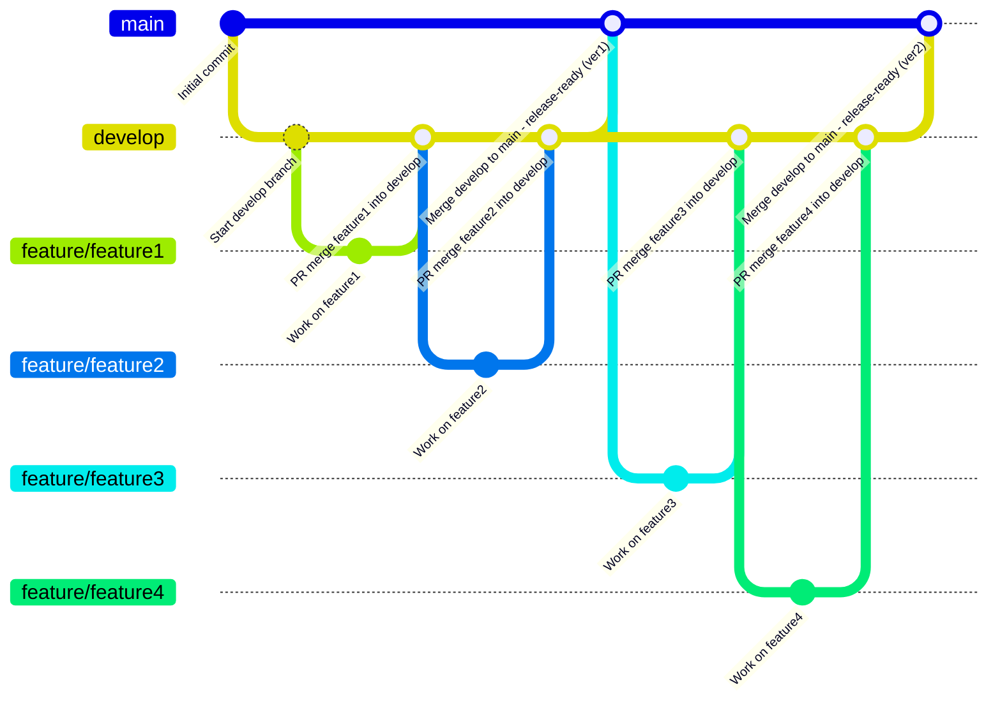
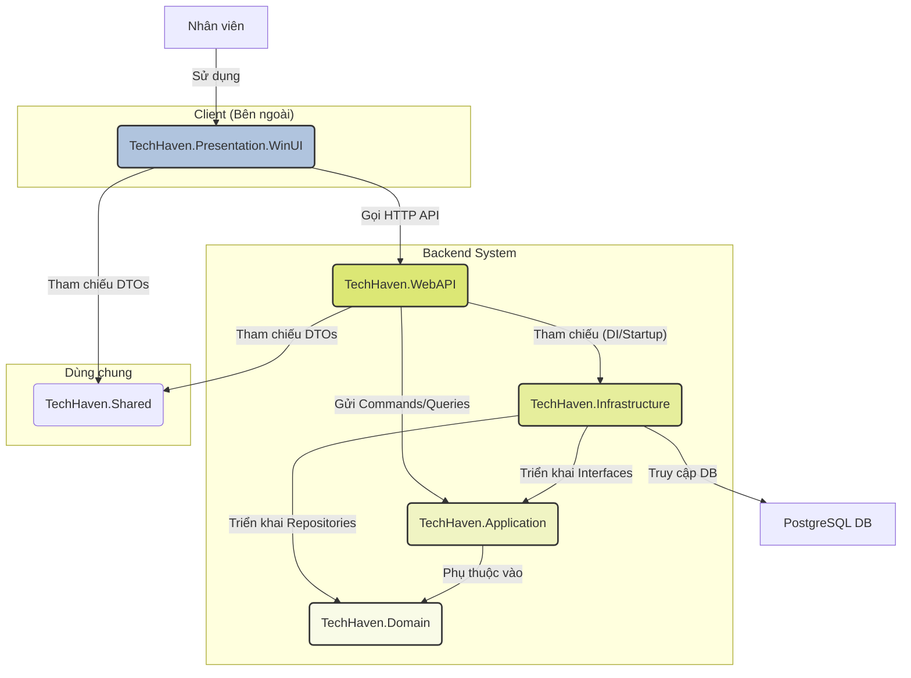
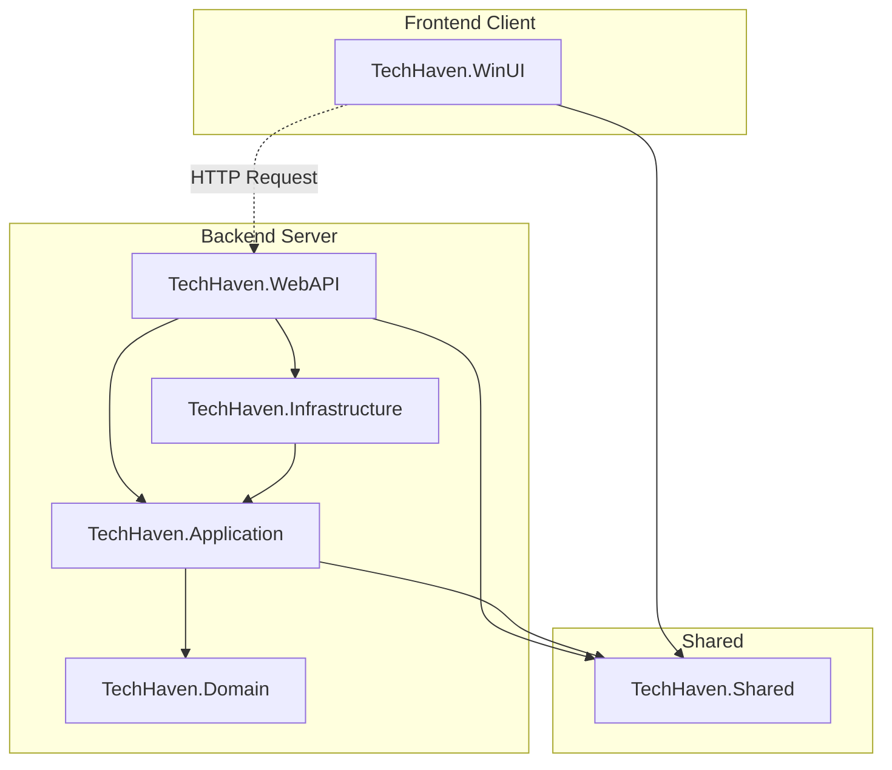

# Project Report Template

## 0. Thông tin các thành viên

| STT | Họ và tên             | MSSV     | Nhiệm vụ chính | Ghi chú |
| --- | --------------------- | -------- | -------------- | ------- |
| 1   | Nguyễn Văn Bình Dương | 23120242 | BE             |         |
| 2   | Nguyễn Phúc Hậu       | 23120252 | FE             |         |
| 3   | Nguyễn Phúc Hoàng     | 23120264 | BE             |         |
| 4   | Nguyễn Khắc Vượng     | 23120409 | FE             |         |
| 5   | Trần Quốc Vỹ          | 23120410 | Lead           |         |

---

## 1. Chức năng

### A. Các chức năng cơ sở (5 điểm)

| # | Chức năng                                    | Điểm |
| - | -------------------------------------------- | ---- |
| 1 | Đăng nhập                                    | 0.25 |
| 2 | Dashboard tổng quan hệ thống                 | 0.5  |
| 3 | Quản lý sản phẩm – Products (Master data)    | 1.25 |
| 4 | Quản lý đơn hàng – Orders (Transaction data) | 1.5  |
| 5 | Báo cáo thống kê – Report                    | 1    |
| 6 | Cấu hình chương trình                        | 0.25 |
| 7 | Đóng gói thành file cài đặt                  | 0.25 |

### B. Các chức năng tự chọn (5.5 điểm)

| #  | Tính năng                                               | Điểm |
| -- | ------------------------------------------------------- | ---- |
| 1  | Auto-save khi tạo đơn hàng / thêm sản phẩm              | 0.25 |
| 2  | Responsive layout – tự điều chỉnh theo độ rộng màn hình | 0.5  |
| 3  | Làm rối mã nguồn (obfuscator) chống dịch ngược          | 0.25 |
| 4  | Backup / restore database                               | 0.25 |
| 5  | Áp dụng kiến trúc MVVM                                  | 0.5  |
| 6  | Dependency Injection                                    | 0.5  |
| 7  | Phân quyền admin / moderator / sale                     | 0.5  |
| 8  | Hoa hồng KPI cho sale                                   | 0.25 |
| 9  | Quản lý khách hàng                                      | 0.5  |
| 10 | Test case chức năng & giao diện                         | 0.5  |
| 11 | In đơn hàng ra PDF/XPS                                  | 0.5  |
| 12 | Sắp xếp danh sách theo nhiều tiêu chí                   | 0.5  |
| 13 | Onboarding – hướng dẫn sử dụng lần đầu                  | 0.5  |

### C. Mức độ bao phủ các chuẩn đầu ra của môn học

| Mã chuẩn đầu ra | Mô tả chuẩn đầu ra                                                    | Cách mà ứng dụng nhóm đáp ứng                                                                                                                                                                              |
| --------------- | --------------------------------------------------------------------- | ---------------------------------------------------------------------------------------------------------------------------------------------------------------------------------------------------------- |
| **G1.1**        | Liệt kê được các thành phần giao diện đồ họa Windows                  | Các form chức năng chính như **Quản lý sản phẩm**, **Tạo đơn hàng** sử dụng đầy đủ các điều khiển WinUI3: `DataGrid`, `Button`, `TextBox`, `ComboBox`, cùng layout `Grid`, `StackPanel`, `NavigationView`. |
| **G1.2**        | Liệt kê được các loại tài nguyên ứng dụng                             | Ứng dụng quản lý nhiều loại resource như **ảnh sản phẩm**, **icon**, **theme**, **chuỗi nội dung**, và **file cấu hình JSON**.                                                                             |
| **G1.3**        | Hiểu, giải thích được các thuật ngữ tiếng Anh trong Lập trình Windows | Hai tính năng **MVVM** và **Dependency Injection** yêu cầu hiểu rõ các thuật ngữ như `ViewModel`, `Repository`, `Service`, `Binding`, `Command`, `ObservableCollection`.                                   |
| **G2.1**        | Tạo ra ứng dụng sử dụng các điều khiển đơn giản                       | Các form **Thêm/Sửa Sản phẩm** sử dụng điều khiển `TextBox`, `ComboBox`, `DatePicker`, `Button` để nhập dữ liệu.                                                                                           |
| **G2.2**        | Thao tác với tài nguyên (menu, hình ảnh, hộp thoại, chuỗi)            | Ứng dụng có **menu điều hướng**, **hộp thoại xác nhận (ContentDialog)**, **thông báo (InfoBar)** và hiển thị **ảnh sản phẩm**.                                                                             |
| **G2.3**        | Tạo, hiệu chỉnh đối tượng đồ họa                                      | Giao diện được **tùy biến bằng ControlTemplate và Style**, sử dụng **bố cục responsive**, màu sắc và theme được hiệu chỉnh để phù hợp nhận diện ứng dụng.                                                  |
| **G2.4**        | Xử lý sự kiện chuột, bàn phím                                         | Các event `Click`, `KeyDown`, `PointerPressed` được sử dụng trong các thao tác thêm, xóa, sửa dữ liệu.                                                                                                     |
| **G2.5**        | Làm việc với hệ thống tập tin Windows                                 | Tính năng **In đơn hàng ra PDF/XPS** và **Backup / Restore Database** thao tác trực tiếp với file hệ thống thông qua `FileSavePicker`, `FileOpenPicker`.                                                   |
| **G2.6**        | Làm việc với clipboard & registry                                     | Cho phép sao chép **mã đơn hàng** hoặc **mã sản phẩm** vào clipboard để tra cứu nhanh.                                                                                                                     |
| **G2.7**        | Tạo và sử dụng thư viện liên kết động DLL                             | Dự án tách thành nhiều module (`WindowShop.Core`, `WindowShop.Services`). Các thư viện `.dll` được **inject động** bằng **Dependency Injection**.                                                          |
| **G2.8**        | Đọc tập tin đa phương tiện                                            | Ứng dụng cho phép **chủ cửa hàng chọn và hiển thị ảnh sản phẩm** từ máy tính thông qua `FileOpenPicker`, hỗ trợ các định dạng ảnh phổ biến như `.jpg`, `.png`.                                             |
| **G2.9**        | Giám sát sự kiện bằng Hook                                            | *(Không áp dụng – không cần truy cập hệ thống mức thấp.)*                                                                                                                                                  |
| **G3.1**        | Làm việc độc lập để giải quyết bài toán                               | Mỗi thành viên phụ trách 1–2 module riêng (UI, API, Database, Pattern) và báo cáo tiến độ cá nhân.                                                                                                         |
| **G3.2**        | Làm việc theo nhóm để giải quyết bài toán                             | Dự án quản lý qua **GitHub**, sử dụng **branching**, **commit convention**, và **review code định kỳ**.                                                                                                    |
| **G4.1**        | Viết báo cáo ứng dụng                                                 | Nhóm có báo cáo `.md` mô tả **chức năng, kiến trúc, quy trình phát triển và kết quả thực hiện**.                                                                                                           |
| **G4.2**        | Trình bày chủ đề nhóm tìm hiểu                                        | Nhóm chuẩn bị **slide và báo cáo thuyết trình** giới thiệu ứng dụng **Window Shop**, trình bày về **kiến trúc, quy trình phát triển**, và **các công nghệ được áp dụng (MVVM, Dependency Injection)**.     |
| **G5**          | Tạo ứng dụng thao tác với cơ sở dữ liệu                               | Các chức năng **Quản lý sản phẩm** và **Đơn hàng** thực hiện **CRUD(Create, Read, Update, Delete)** trực tiếp trên cơ sở dữ liệu cục bộ (SQLite) hoặc Supabase.                                                                              |
| **G6.1**        | Tạo ứng dụng gọi Restful API                                          | Ứng dụng kết nối backend qua **Restful API** để truy vấn, thêm, sửa dữ liệu sản phẩm và đơn hàng.                                                                                       |
| **G6.2**        | Tạo ứng dụng gọi GraphQL API                                          | *(Chưa áp dụng – có thể mở rộng trong bản nâng cấp.)*                                                                                                                                                      |

#### Kết luận

> Ứng dụng **Window Shop** đáp ứng **hầu hết các chuẩn đầu ra từ G1 → G5** và **một phần G6.1**
> Mức độ bao phủ ước tính: **~90–95% chuẩn đầu ra môn học.**

---

## 2. Giao diện (Prototype)

- Link Figma: [Figma Prototype](#)
- Mô tả ngắn gọn các luồng chức năng chính (VD: Màn hình đăng nhập → Trang chủ → Quản lý sản phẩm → Báo cáo doanh thu).

---

## 3. Làm việc nhóm

### 3.1 Công cụ quản lý & theo dõi tiến độ

#### Theo dõi tiến độ & quản lý tài liệu
- Nhóm sử dụng **2 repository trên GitHub** để tách biệt rõ ràng giữa tài liệu và mã nguồn:
- **[`window-shop-docs`](https://github.com/tranquocvy/window-shop-docs)**: Lưu trữ tất cả các loại tài liệu của dự án, bao gồm meeting notes, thiết kế giao diện, báo cáo tiến độ, sơ đồ kiến trúc phần mềm, và các tài liệu tham khảo khác.  
- **[`window-shop-app`](https://github.com/tranquocvy/window-shop-app)**: Lưu trữ toàn bộ mã nguồn chính của ứng dụng, bao gồm Frontend, Backend, và các module bổ trợ. Repo này quản lý version code, đảm bảo việc phát triển và deploy được kiểm soát chặt chẽ.


#### Kênh liên lạc
- **Zalo:** Trao đổi nhanh các vấn đề hằng ngày, chia sẻ thông tin tức thời, phối hợp khi gặp khó khăn hoặc cần sự hỗ trợ ngay lập tức.
- **Google Meet:** Sử dụng cho các buổi họp nhóm định kỳ và các cuộc họp quan trọng, giúp nhóm cập nhật tiến độ, thảo luận các vấn đề kỹ thuật.

#### Họp nhóm
- Nhóm tổ chức họp **hằng tuần** để các thành viên báo cáo tiến độ công việc, nêu ra các khó khăn gặp phải, và thống nhất hướng giải quyết.
- Trong trường hợp phát sinh vấn đề quan trọng, nhóm có thể tổ chức **họp đột xuất** để xử lý ngay.
- Mỗi buổi họp đều có lịch trình rõ ràng, bao gồm cập nhật task, thảo luận giải pháp, và xác định nhiệm vụ cho tuần tới.

#### Lưu biên bản họp
- Biên bản họp sẽ được ghi lại chi tiết, bao gồm các quyết định, nhiệm vụ được phân công, thời hạn hoàn thành, và các vấn đề còn tồn đọng.
- Tất cả biên bản sẽ được lưu trữ trên **`window-shop-docs/meeting_notes`** dưới định dạng **Markdown (.md)**, giúp mọi thành viên truy cập, theo dõi và đảm bảo minh bạch trong quá trình làm việc.

#### Phân công công việc
- **Google Sheets([Task Tracker.xlsx](https://docs.google.com/spreadsheets/d/1KWgpPFkc63lKFDBwlLQgoh0oQovb13Z8vq_c4CN8w3I/edit?usp=drive_link))** được sử dụng làm công cụ quản lý nhiệm vụ, trong đó ghi rõ từng task, người chịu trách nhiệm, deadline và trạng thái công việc.

- Công việc được phân chia theo từng giai đoạn dự án và giao nhiệm vụ cụ thể cho từng thành viên dựa trên kỹ năng và vai trò (Frontend, Backend, Lead).
- Lead sẽ theo dõi tổng thể tiến độ, cập nhật sheet định kỳ và phối hợp giữa các thành viên để đảm bảo các task được thực hiện đúng kế hoạch.

#### Theo dõi tiến độ
- Tiến độ công việc được cập nhật liên tục trên **Google Sheets**, thông qua các trạng thái task như `Not started`, `Blocked`, `In Progress`, và `Completed`.
- Nhóm thực hiện **đánh giá hàng tuần**, kiểm tra các task đã giao để đảm bảo tiến độ dự án phù hợp với kế hoạch.
- Trong quá trình kiểm tra, nhóm có thể **điều chỉnh kế hoạch**, phân bổ lại task, hoặc hỗ trợ lẫn nhau nếu gặp khó khăn.
- Việc theo dõi chi tiết này giúp nhóm nhận biết sớm các vấn đề, cải thiện phối hợp giữa các thành viên, và đảm bảo chất lượng sản phẩm cuối cùng.

### 3.2 Chiến lược làm việc với Git

#### Chiến lược làm việc với Git
Nhóm áp dụng **Gitflow cơ bản** để quản lý mã nguồn dự án WinUI, giúp code trên nhánh chính luôn ổn định và cho phép các thành viên phát triển tính năng song song.

- **Nhánh chính**
  - `main`: Lưu trữ code ổn định, sẵn sàng deploy. Nhánh này chỉ được cập nhật từ nhánh `develop` sau khi các tính năng đã được kiểm thử.
  - `develop`: Nhánh tích hợp các tính năng mới trước khi đưa vào `main`. Tất cả feature branch đều xuất phát từ nhánh này.

- **Những nhánh phát sinh (feature branches)**
  - Mỗi tính năng được phát triển trên một nhánh riêng từ `develop`.
  - Ví dụ: `feature/login-frontend`, `feature/login-backend`, `feature/product-frontend`, `feature/product-backend`.
  - Các nhánh này cho phép FE và BE làm việc song song mà không ảnh hưởng đến nhánh chính.
  - Khi hoàn thành, nhánh feature sẽ được **merge trở lại `develop`** thông qua **pull request**, do Lead review để đảm bảo code đúng chuẩn, không xung đột, và logic hoạt động chính xác.

- **Quy trình làm việc**
  1. Lead tạo nhánh `develop` từ `main` khi bắt đầu dự án.
  2. FE/BE tạo feature branch từ `develop`, commit và push thường xuyên để backup và dễ theo dõi.
  3. Khi feature hoàn tất, tạo pull request lên `develop`:
     - Pull request sẽ được Lead hoặc một thành viên khác review.
     - Review bao gồm: kiểm tra code style, logic, khả năng tương thích với các tính năng khác và tài liệu liên quan.
     - Nếu cần, yêu cầu chỉnh sửa trước khi merge.
  4. Sau khi pull request được chấp thuận, merge feature branch vào `develop`.
  5. Khi `develop` tích hợp đủ các tính năng, Lead sẽ merge `develop` vào `main`, đảm bảo nhánh chính luôn ổn định.

- **Lợi ích**
  - Code trên `main` luôn ổn định và sẵn sàng deploy.
  - FE và BE có thể phát triển song song mà không xung đột.
  - Lead dễ dàng kiểm soát chất lượng qua pull request.
  - Nhóm có thể theo dõi tiến độ và lịch sử commit một cách rõ ràng.
  - Phân tách rõ ràng giữa nhánh chính và nhánh phát sinh.

---
**Sơ đồ Gitflow minh họa quá trình phát triển tính năng và merge vào nhánh chính:**

---

## 4. Kiến trúc phần mềm

### 4.1. Phạm vi

Hệ thống bao gồm hai thành phần chính:

- **Backend:** Một `ASP.NET WebAPI` xử lý toàn bộ logic nghiệp vụ, quản lý dữ liệu và cung cấp API cho các client.
- **Frontend:** Một ứng dụng Desktop `WinUI 3` dành cho nhân viên cửa hàng (quản lý, bán hàng, kho) để thao tác với hệ thống.

### 4.2. Mẫu kiến trúc áp dụng

* **3-layer architecture**: Phân tách lớp đảm nhiệm các chức năng riêng biệt
* **Clean architecture**: Một bản nâng cấp của 3-layer áp dụng các kiến thức về OOP như SOLID cũng như Dependency Rule nhưng thực hiện ở mức đơn giản để tránh over engineering.
* **MVVM**: cho phần Presentation (UI cho ứng dụng)

### 4.3. Sơ đồ kiến trúc



**Ví dụ luồng "Tạo Đơn hàng" giải thích kiến trúc trên**

1. **WinUI App:** Nhân viên bán hàng nhấn nút "Tạo Đơn hàng" trên giao diện WinUI.
2. **ViewModel (WinUI):** Thu thập dữ liệu từ Form, tạo một DTO/Request (ví dụ: `CreateOrderRequestDto`).
3. **HTTP Client (WinUI):** Gửi `CreateOrderRequestDto` qua một `POST` request đến endpoint `api/orders` trên `TechHaven.WebAPI`.
4. **OrdersController (WebAPI):** Nhận request, chuyển đổi DTO thành `CreateOrderCommand`.
5. **MediatR (WebAPI):** Gửi `CreateOrderCommand` đi.
6. **CreateOrderCommandHandler (Application):** Nhận Command, thực thi logic nghiệp vụ (kiểm tra tồn kho, tính tổng tiền), tạo Entity `Order`.
7. **IOrderRepository (Application):** Gọi hàm `AddAsync(order)`.
8. **OrderRepository (Infrastructure):** Sử dụng EF Core DbContext để chuyển Entity `Order` thành lệnh SQL và lưu vào CSDL **PostgreSQL**.
9. **(Hoàn tất):** Kết quả được trả ngược về `WebAPI`, sau đó trả về `WinUI` (ví dụ: trả về `OrderID` vừa tạo).


### 4.4. Phân tích chi tiết từng layer

#### 1. `TechHaven.Domain`

Đây là lớp trong cùng, chứa đựng logic nghiệp vụ cốt lõi và không phụ thuộc vào bất kỳ công nghệ cụ thể nào.

- **Entities:** Các đối tượng nghiệp vụ thuần túy (POCO).
    - Ví dụ: `Product`, `Order`, `OrderItem`, `Customer`, `Stock`.
- **Interfaces (Repository):** Các định nghĩa (contract) cho việc truy cập dữ liệu.
    - Ví dụ: `IProductRepository`, `IOrderRepository`.
- **Domain Events:** (Tùy chọn) Các sự kiện nghiệp vụ.
    - Ví dụ: `OrderPlacedEvent`.

#### 2. `TechHaven.Application`

Lớp này chứa các quy trình nghiệp vụ (use cases) của hệ thống.

- **Use Cases/Features:** Thường được triển khai bằng mẫu **CQRS** (Command Query Responsibility Segregation) với **MediatR**.
    - **Commands:** Các tác vụ thay đổi dữ liệu (Create, Update, Delete).
        - Ví dụ: `CreateOrderCommand`, `UpdateProductStockCommand`.
    - **Queries:** Các tác vụ truy vấn dữ liệu (Read).
        - Ví dụ: `GetProductByIdQuery`, `GetSalesDashboardQuery`.
- **Interfaces (External Services):** Các định nghĩa cho dịch vụ bên ngoài.
    - Ví dụ: `IEmailService`, `IPaymentGateway`.
- **Validators:** Sử dụng `FluentValidation` để kiểm tra tính hợp lệ của các Command và Query.

#### 3. `TechHaven.Infrastructure`

Lớp này là nơi triển khai các chi tiết "how" cho các định nghĩa (what) ở lớp `Application` và `Domain`.

- **Database Access:** Triển khai các Repository Interface.
    - Sử dụng **Entity Framework Core** để làm việc với **PostgreSQL**.
    - Ví dụ: `ProductRepository` (triển khai `IProductRepository`).
- **External Services:** Triển khai các Interface dịch vụ.
    - Ví dụ: `SmtpEmailService` (triển khai `IEmailService`).
- **Authentication:** Cấu hình **ASP.NET Core Identity** hoặc **JWT**.

#### 4. Các Lớp Ngoài

##### `TechHaven.WebAPI` (Backend Entry Point)

- Đây là lớp Presentation cho backend.
- Chứa các **API Controllers** (ví dụ: `ProductsController`, `OrdersController`).
- Nhận các yêu cầu HTTP từ client (WinUI), gửi các `Command` hoặc `Query` (dùng MediatR) đến lớp `Application` và trả về kết quả (thường là JSON).
- Chịu trách nhiệm khởi tạo và **Dependency Injection (DI)**.

##### `TechHaven.Presentation.WinUI` (Frontend Client)

- Một ứng dụng Desktop **hoàn toàn tách biệt**.
- Là "người tiêu dùng" (consumer) của `TechHaven.WebAPI`.
- Giao tiếp với Backend thông qua **HTTP Requests** (sử dụng `HttpClient`).
- Chứa giao diện người dùng (XAML), ViewModels (MVVM) và logic gọi API.

##### `TechHaven.Shared` (Dùng chung)

- Chứa các lớp **DTOs (Data Transfer Objects)**, các lớp hằng số (Constants), hoặc các lớp tiện ích (Utilities) được dùng chung bởi cả `WebAPI` (khi trả về) và `WinUI` (khi nhận về).
- Giúp giảm sự phụ thuộc trực tiếp giữa Client và Server.

#### Luồng phụ thuộc
Mọi phụ thuộc chỉ được phép hướng vào trong


### 4.5. Deployment View

Hệ thống sẽ được triển khai như sau:

1. **Client (Máy nhân viên):** Ứng dụng `TechHaven.Presentation.WinUI` được cài đặt (ví dụ: qua MSIX) trên các máy tính Windows tại cửa hàng.
2. **Application Server:** `TechHaven.WebAPI` (ASP.NET) được triển khai dưới dạng dịch vụ (ví dụ: Docker Container, Azure App Service, hoặc trên IIS) trên một máy chủ (cloud hoặc on-premise).
3. **Database Server:** `PostgreSQL` chạy trên một máy chủ cơ sở dữ liệu riêng biệt, được bảo mật và chỉ cho phép kết nối từ Application Server.
4. **Mạng:** Client (WinUI) giao tiếp với Application Server (WebAPI) qua mạng (Internet/LAN) bằng giao thức HTTPS.

### 4.6. Công nghệ

- **Backend:** .NET 8, ASP.NET Core Web API
- **Database:** PostgreSQL
- **ORM:** Entity Framework Core (EF Core)
- **Frontend:** WinUI 3, .NET (chạy trên Windows App SDK)
- **Kiến trúc:** Clean Architecture + MVVM
- **Thư viện (Backend):**
*(Dự kiến có thể thay đổi trong lúc thực hiện đồ án)*
    - `MediatR`: Triển khai CQRS.
    - `AutoMapper`: Ánh xạ giữa Entities và DTOs.
    - `FluentValidation`: Xác thực dữ liệu đầu vào.
    - `Serilog`: Ghi log.
    - `Swashbuckle`: Tạo tài liệu API (Swagger).
- **Giao tiếp:** RESTful API (JSON qua HTTPS).

### 4.6. Cross-cutting Concerns
*(Dự kiến triển khai, có thể thay đổi trong lúc thực hiện đồ án)*

- **Xác thực & Phân quyền:** Sử dụng **JWT Bearer Token**. `WebAPI` sẽ cấp token khi đăng nhập. `WinUI` sẽ lưu token này (ví dụ: trong Windows Credential Manager) và đính kèm vào header của mỗi request.
- **Xử lý lỗi:** `WebAPI` sử dụng Middleware (Global Exception Handler) để bắt lỗi và trả về mã lỗi HTTP chuẩn (400, 404, 500). `WinUI` sẽ diễn giải các mã lỗi này và hiển thị thông báo thân thiện.
- **Logging:** Sử dụng `Serilog` để ghi log tập trung (ra file, console, hoặc hệ thống giám sát) ở cả `WebAPI` và `WinUI`.

### 4.7. Thư mục mô phỏng kiến trúc phần mềm
```cpp
TechHaven.sln
│
├── src/
│   │
│   ├── TechHaven.Domain/   // LỚP LÕI (CORE): Chứa nghiệp vụ cốt lõi, không phụ thuộc vào bất cứ project nào khác.
│   │   ├── TechHaven.Domain.csproj
│   │   ├── Entities/       // Các đối tượng nghiệp vụ (ví dụ: Product, Order, Customer). Đây là "trái tim" của Domain.
│   │   ├── Interfaces/     // Các "hợp đồng" (interfaces) mà Infrastructure PHẢI triển khai (ví dụ: IProductRepository).
│   │   ├── Events/         // Các "Domain Events" (sự kiện nghiệp vụ, ví dụ: OrderCreatedEvent). Dùng cho các logic phức tạp, tách biệt.
│   │   ├── Exceptions/     // Các ngoại lệ (exceptions) nghiệp vụ tùy chỉnh (ví dụ: ProductNotFoundException).
│   │   └── Services/       // Các "Domain Services", chứa logic nghiệp vụ phức tạp không thuộc về một Entity cụ thể.
│   │
│   ├── TechHaven.Application/
│   │   ├── TechHaven.Application.csproj
│   │   ├── Interfaces/     // Các "hợp đồng" của Application (ví dụ: IEmailService, IAuthenticationService) mà Infrastructure sẽ triển khai.
│   │   ├── UseCases/Features/ // Chứa các "trường hợp sử dụng" (use cases), thường chia theo "Tính năng" (Features). Rất phổ biến khi dùng CQRS.
│   │   │                   // Ví dụ: Features/Products/Queries/GetProductListQuery.cs
│   │   │                   // Ví dụ: Features/Products/Commands/CreateProductCommand.cs
│   │   ├── Mappings/       // Cấu hình AutoMapper, để chuyển đổi (map) tự động giữa Entities <-> DTOs.
│   │   └── Validators/     // Chứa các bộ quy tắc xác thực (validation) cho DTOs/Commands (thường dùng thư viện FluentValidation).
│   │
│   ├── TechHaven.Infrastructure/
│   │   ├── TechHaven.Infrastructure.csproj
│   │   ├── Persistence/    // Chứa mọi thứ liên quan đến cơ sở dữ liệu.
│   │   │   ├── AppDbContext.cs // File DbContext của Entity Framework Core, quản lý kết nối và ánh xạ CSDL.
│   │   │   └── Repositories/ // Nơi triển khai (implement) các interfaces từ Domain (ví dụ: ProductRepository.cs).
│   │   ├── ExternalServices/ // Nơi triển khai (implement) các interfaces từ Application (ví dụ: EmailService.cs, PaymentService.cs).
│   │   ├── Migrations/     // Thư mục do EF Core tự động tạo, chứa các file C# để cập nhật schema (cấu trúc) CSDL.
│   │   └── Authentication/ // Chứa logic liên quan đến xác thực (ví dụ: cấu hình JWT, Identity).
│   │
│   ├── TechHaven.Presentation.WebAPI/
│   │   ├── TechHaven.Presentation.WebAPI.csproj
│   │   └── Controllers/    // Chứa các API controllers (ví dụ: ProductsController.cs). Đây là "cửa ngõ" của backend.
│   │
│   └── TechHaven.Presentation.WinUI/ // LỚP TRÌNH BÀY (Frontend): Ứng dụng desktop WinUI.
│       ├── TechHaven.Presentation.WinUI.csproj
│       ├── Views/          // Chứa các file XAML (giao diện người dùng) và file code-behind (.xaml.cs).
│       ├── ViewModels/     // Chứa các file ViewModel (theo mẫu MVVM), là logic chính của UI, gọi API từ WebAPI.
│       ├── Utils/        // Các lớp tiện ích cho UI (ví dụ: NavigationService để chuyển trang).
│       └── App.xaml        // File "khởi động" của ứng dụng WinUI, quản lý tài nguyên (resources) toàn cục.
│
├── tests/
│   │
│   ├── TechHaven.UnitTests/ // Project kiểm thử đơn vị (Unit Test), test Domain và Application mà không cần CSDL.
│   │   ├── TechHaven.UnitTests.csproj
│   │   └── Domain/         // Thư mục con, ví dụ chứa các unit test cho lớp Domain.
│   │
│   └── TechHaven.IntegrationTests/ // Project kiểm thử tích hợp (Integration Test), test Application + Infrastructure.
│       └── TechHaven.IntegrationTests.csproj // Thường test với CSDL giả lập trong bộ nhớ (in-memory database).
│
└── docs/
    ├── ARCHITECTURE.md     // File Markdown giải thích về các quyết định kiến trúc đã chọn.
    └── README.md           // File hướng dẫn chính của dự án (cách cài đặt, chạy...).
```

---

## 5. Design Patterns

Liệt kê các **Design Pattern** nhóm áp dụng (mỗi thành viên ít nhất 1 pattern, không tính Builder & Singleton).

| Pattern | Mục đích | Vị trí áp dụng trong dự án | Người thực hiện |
| ------- | -------- | -------------------------- | --------------- |
|         |          |                            |                 |
|         |          |                            |                 |

---

## 6. Đảm bảo chất lượng

### 6.1 Coding Convention

#### a. Quy ước cho C#

##### 1. **Naming Rules**

| Loại                | Quy tắc                   | Ví dụ                                 |
| ------------------- | ------------------------- | ------------------------------------- |
| Namespace           | PascalCase                | `MyApp.ViewModels`                    |
| Class, Struct, Enum | PascalCase                | `ProductViewModel`, `OrderStatus`     |
| Interface           | PascalCase, tiền tố **I** | `IProductService`                     |
| Method (public)     | PascalCase, động từ       | `CalculateTotalPrice()`               |
| Method (private)    | _camelCase                | `_validateInput()`                    |
| Property            | PascalCase                | `UserName`, `TotalAmount`             |
| Field (private)     | _camelCase                | `_userRepository`                     |
| Parameter           | camelCase                 | `void AddProduct(Product newProduct)` |
| Constant            | ALL_CAPS                  | `MAX_BUFFER_SIZE`                     |

**Lưu ý (Có dặn trên lớp):**

* Không dùng Hungarian notation (ví dụ: `btnSave`, `txtUser`).
* Hậu tố `Async` cho các hàm bất đồng bộ (ví dụ: `GetUserAsync()`).

---

##### 2. **Formatting & Layout**

* **Sử dụng `var` một cách thông minh:**
    - **NÊN** dùng `var` khi kiểu dữ liệu được thể hiện rõ ràng ở phía bên phải của phép gán. Điều này giúp code ngắn gọn hơn.
        
        ```csharp
        // Good
        var products = new List<Product>();
        var user = _userService.GetUserById(1);
        ```
        
    - **KHÔNG NÊN** dùng `var` cho các kiểu dữ liệu cơ bản (`int`, `string`, `bool`, `double`) hoặc khi kiểu dữ liệu không rõ ràng.
        
        ```csharp
        // Bad
        var count = 10; // Nên dùng: int count = 10;
        var result = GetResult(); // Kiểu của result là gì?
        ```
        
* **Braces `{}`:**
    - **Luôn luôn** sử dụng dấu ngoặc `{}` cho các khối lệnh `if`, `for`, `foreach`, `while`, ngay cả khi nó chỉ chứa một dòng lệnh. Điều này tránh các lỗi logic tiềm ẩn khi thêm code sau này.
        
        ```csharp
        // Good
        if (user != null)
        {
            ProcessUser(user);
        }
        
        // Bad - Rất nguy hiểm
        if (user != null)
            ProcessUser(user); // Nếu sau này thêm 1 dòng nữa mà quên ngoặc -> lỗi logic
        
        ```
        
    - Đặt dấu `{` ở một dòng riêng, không đặt cùng dòng với câu lệnh.
* **Thứ tự trong class (optional):**

  1. Fields
  2. Constructors
  3. Properties
  4. Public Methods
  5. Private Methods

**Ví dụ chuẩn:**

```csharp
public class ProductService
{
    private readonly IProductRepository _productRepository;

    public ProductService(IProductRepository productRepository)
    {
        _productRepository = productRepository;
    }

    public async Task<ProductDto> GetProductAsync(int id)
    {
        return await _productRepository.GetByIdAsync(id);
    }

    private bool _isValidId(int id) => id > 0;
}
```

---

##### 3. **Comment & Documentation**

* Nên comment trả lời **“Why?”** thay vì “What?”.
* Sử dụng XML comment cho các class và method public → Điều này giúp IntelliSense hiển thị thông tin gợi ý và có thể dùng để tự động tạo tài liệu sau này.

```csharp
/// <summary>
/// Calculates final price after discount.
/// </summary>
public decimal CalculateFinalPrice(Product product) => product.Price * 0.9m;
```

---

##### 4. **Nguyên tắc lập trình**

* **SRP (Single Responsibility):** Mỗi class chỉ làm một việc.
* **Async/Await:** Khi một phương thức thực hiện các tác vụ I/O (gọi API, truy vấn database, đọc file), nó **phải** là `async` và trả về `Task` hoặc `Task<T>`.
  - Đặt hậu tố `Async` cho tất cả các phương thức bất đồng bộ. Ví dụ: `GetUserAsync()`, `SaveProductAsync()`.
  - **Không bao giờ** dùng `.Result` hay `.Wait()` để chặn một tác vụ `async`. Nó có thể gây ra `deadlock`. Hãy `await` "all the way up".
* **LINQ:** Ưu tiên sử dụng cú pháp phương thức (Method Syntax) hơn là cú pháp truy vấn (Query Syntax) vì tính linh hoạt và phổ biến hơn.     
  ```csharp
  // Preferred (Method Syntax)
  var expensiveProducts = products.Where(p => p.Price > 100).ToList();

  // Less Preferred (Query Syntax)
  var expensiveProductsQuery = from p in products
                                where p.Price > 100
                                select p;
  ```
* **Readonly:** Dùng `readonly` cho field không thay đổi.
* **Expression-bodied members:** Sử dụng cho các properties hoặc methods chỉ có một dòng lệnh để code trông gọn gàng hơn.
  ```csharp
  // Thay vì viết thế này:
  public string FullName
  {
      get { return $"{FirstName} {LastName}"; }
  }

  // Hãy viết thế này:
  public string FullName => $"{FirstName} {LastName}";
  ```

---

#### b. Quy ước cho XAML

##### 1. **Đặt tên Controls**

| Loại                  | Quy tắc                               | Ví dụ                                       |
| --------------------- | ------------------------------------- | ------------------------------------------- |
| Control Name (x:Name) | PascalCase, `[Function][ControlType]` | `SaveOrderButton`, `UserNameTextBox`        |
| Event Handler         | `[ControlName]_[Event]`               | `SaveOrderButton_Click`                     |
| Resource Key          | PascalCase + hậu tố mô tả             | `PrimaryButtonStyle`, `TitleTextBlockStyle` |

Sai: `btnSubmit`, `txtName`
Đúng: `SubmitButton`, `UserNameTextBox`

---

##### 2. **Thứ tự thuộc tính (optional)**

1. **Định danh:** `x:Name`, `x:Key`
2. **Layout & Vị trí:** `Grid.Row`, `Grid.Column`, `Grid.ColumnSpan`, `Margin`, `Padding`, `HorizontalAlignment`, `VerticalAlignment`, `Width`, `Height`
3. **Nội dung & Dữ liệu:** `Content`, `Text`, `ItemsSource`, `DataContext`
4. **Binding & Commands:** `Text="{Binding UserName}"`, `Command="{Binding SaveCommand}"`
5. **Styling & Giao diện:** `Style`, `Background`, `Foreground`, `FontSize`, `FontWeight`
6. **Trạng thái & Hành vi:** `Visibility`, `IsEnabled`
7. **Accessibility:** `AutomationProperties.Name`

**Ví dụ:**

```xml
<Button
    x:Name="SaveButton"
    Grid.Row="2"
    Margin="8"
    HorizontalAlignment="Right"
    Content="Save"
    Command="{Binding SaveCommand}"
    Style="{StaticResource PrimaryButtonStyle}" />
```

---

##### 3. **Style & Resource**

- **Không bao giờ hard-code** các giá trị như màu sắc (`Background="#FF00A2E8"`), kích thước font, hay margin trực tiếp trên control.
- **Giải pháp: Định nghĩa chúng một lần** trong `ResourceDictionary` (ví dụ: `App.xaml` hoặc một file resource riêng) và tái sử dụng thông qua `"{StaticResource ...}"` hoặc `"{ThemeResource ...}"`.
    - `StaticResource`: Hiệu năng cao hơn, dùng cho các resource không thay đổi khi ứng dụng đang chạy.
    - `ThemeResource`: Dùng cho các resource cần thay đổi theo theme của hệ thống (Light/Dark mode).

```xml
<!-- Trong App.xaml -->
<Application.Resources>
    <ResourceDictionary>
        <SolidColorBrush x:Key="AppBrandBlueBrush" Color="#0078D4"/>
        <Style x:Key="PrimaryButtonStyle" TargetType="Button">
            <Setter Property="Background" Value="{ThemeResource AppBrandBlueBrush}"/>
            <Setter Property="Foreground" Value="White"/>
            <Setter Property="Padding" Value="12,4"/>
        </Style>
    </ResourceDictionary>
</Application.Resources>

<!-- Trong View -->
<!-- BAD -->
<Button Content="Save" Background="#0078D4" Foreground="White" Padding="12,4"/>

<!-- GOOD -->
<Button Content="Save" Style="{StaticResource PrimaryButtonStyle}"/>
```

#### d. Quy tắc sử dụng thư mục
**Cấu trúc thư mục:**
```
TechHaven.sln
├── src/
│   ├── TechHaven.Domain/
│   ├── TechHaven.Application/
│   ├── TechHaven.Infrastructure/
│   ├── TechHaven.Presentation.WebAPI/
│   └── TechHaven.Presentation.WinUI/
│
├── tests/
│   ├── TechHaven.UnitTests/
│   └── TechHaven.IntegrationTests/
│
└── docs/
```
**Quy tắc làm việc giữa Frontend và Backend:**
##### 1. Tổng thể

* **Frontend (WinUI)** chỉ **giao tiếp qua API** với **Backend (WebAPI)**.
* **Backend (WebAPI)** đóng vai trò **gateway**, tiếp nhận request, gọi **Application layer**, xử lý nghiệp vụ qua **Domain**, và lưu trữ dữ liệu bằng **Infrastructure**.
* Mỗi layer có **ràng buộc phụ thuộc một chiều**:
  `WinUI → WebAPI → Application → Domain`
  `Infrastructure ↔ Application, Domain` (chỉ implement interfaces, không gọi ngược).

##### 2. Quy tắc sử dụng thư mục

**Frontend: `TechHaven.Presentation.WinUI`**

* **Views/**: chứa giao diện XAML, không viết logic nghiệp vụ ở đây.
* **ViewModels/**: thực hiện logic UI, **gọi API HTTP** tới WebAPI (qua `HttpClient`, `RestService`, v.v.).
* **Utils/**: chứa helper, service phụ trợ cho UI (ví dụ navigation, binding, formatting).
* **Không truy cập trực tiếp DB hay lớp Domain**. Mọi dữ liệu đến từ WebAPI.

**Backend: `TechHaven.Presentation.WebAPI`**

* **Controllers/**: định nghĩa các endpoint (`/api/products`, `/api/orders`, …).

  * Nhận request từ WinUI, map sang **Command/Query** của Application.
  * Không chứa logic nghiệp vụ hay truy vấn DB trực tiếp.
* **WebAPI** chỉ gọi tới lớp **Application**, không gọi Domain hay Infrastructure trực tiếp.

**Application Layer: `TechHaven.Application`**

* **UseCases/Features/**: định nghĩa các hành động nghiệp vụ (command/query).
* **Interfaces/**: định nghĩa các “hợp đồng” cho **External services** (email, payment, authentication).
* **Mappings/**: dùng AutoMapper chuyển đổi giữa DTO và Entity.
* **Validators/**: dùng FluentValidation để kiểm tra dữ liệu đầu vào.
* Chỉ gọi **Domain** và **Interfaces** (không gọi WebAPI, không thao tác DB trực tiếp).

**Domain Layer: `TechHaven.Domain`**

* **Entities/**: chứa mô hình dữ liệu nghiệp vụ thuần túy (business entities).
* **Interfaces/**: khai báo các repository (ví dụ `IProductRepository`).
* **Services/**, **Events/**, **Exceptions/**: xử lý logic thuần domain, không biết đến database hay UI.
* **Không tham chiếu đến bất kỳ project nào khác**.

**Infrastructure Layer: `TechHaven.Infrastructure`**

* **Persistence/**: implement repository, chứa DbContext.
* **ExternalServices/**: implement các interface trong Application (email, thanh toán, file storage).
* **Authentication/**: cấu hình Identity/JWT.
* **Migrations/**: lưu file migration của EF Core.
* Không chứa logic nghiệp vụ, chỉ thực hiện các thao tác **kỹ thuật**.

**Tests/**

* **UnitTests/**: test logic trong Domain và Application (mock repository, không cần DB).
* **IntegrationTests/**: test thật giữa Application + Infrastructure (dùng in-memory database).


#### Nguồn tham khảo Coding Convention:
1. Common C# code conventions: https://learn.microsoft.com/en-us/dotnet/csharp/fundamentals/coding-style/coding-conventions
2. C# identifier naming rules and conventions: https://learn.microsoft.com/en-us/dotnet/csharp/fundamentals/coding-style/identifier-names
3. .NET code-style rule options: https://learn.microsoft.com/en-us/dotnet/fundamentals/code-analysis/code-style-rule-options
4. Get started with Windows development using WinUI: https://learn.microsoft.com/en-us/windows/apps/get-started/start-here
5. Style Coding có trong Slides Windows Programming của ThS. Trần Duy Quang

### 6.2 Testing

#### a. Triết lý Kiểm thử (Testing Philosophy)

Áp dụng mô hình **Kim tự tháp kiểm thử (Test Pyramid)**:
- **Unit Test**: Nhiều nhất, nhanh, rẻ, kiểm thử logic cốt lõi.
- **Integration / UI Test**: Trung bình, kiểm thử sự phối hợp giữa các module.
- **Manual Test**: Ít hơn, tập trung vào trải nghiệm và kiểm thử giao diện người dùng.

#### b. **Unit Testing – Kiểm thử đơn vị (Cốt lõi của chất lượng)**

##### 1. Mục tiêu

* Xác minh từng thành phần hoạt động **độc lập, đúng logic**.
* Phát hiện lỗi sớm và hỗ trợ **refactor an toàn**.
* Tạo documentation cho logic nghiệp vụ thông qua test cases rõ ràng.

##### **2. Phạm vi & Công cụ**

| Thành phần            | Có kiểm thử | Ghi chú                                        |
| --------------------- | ----------- | ---------------------------------------------- |
| **ViewModels**        | Có           | Kiểm tra Command, Validation, Property Binding |
| **Business Services** | Có           | Tính toán, điều kiện nghiệp vụ                 |
| **Models / Entities** | Không           | Chỉ là POCO chứa dữ liệu                       |
| **Repositories (EF)** | Không           | Tin cậy vào EF Core                            |

**Công cụ sử dụng:**

* **xUnit** – framework kiểm thử hiện đại, mạnh mẽ.
* **Moq** – dùng để tạo mock cho các dependency (service, repository).

##### **3. Quy ước & Cấu trúc**

* Mỗi project logic có project test tương ứng:

  ```
  TechHaven.Application  →  TechHaven.Application.Tests
  TechHaven.Presentation →  TechHaven.Presentation.Tests
  ```
* **Tên test:** `[MethodName]_[Scenario]_[ExpectedResult]`
  Ví dụ: `CalculateTotal_WithValidDiscount_ReturnsCorrectDiscountedPrice`
* **Cấu trúc một bài test - Pattern AAA:**

  * **Arrange:** Chuẩn bị dữ liệu & mock.
  * **Act:** Thực thi hành động.
  * **Assert:** Kiểm tra kết quả.

##### **4. Ví dụ minh họa**

```csharp
// Trong project TechHaven.UI.Tests

public class DashboardViewModelTests
{
    private readonly Mock<IOrderService> _mockOrderService;
    private readonly Mock<IProductService> _mockProductService;
    private readonly DashboardViewModel _viewModel;

    // Constructor này sẽ chạy trước mỗi bài test, thực hiện phần Arrange chung
    public DashboardViewModelTests()
    {
        _mockOrderService = new Mock<IOrderService>();
        _mockProductService = new Mock<IProductService>();
        _viewModel = new DashboardViewModel(_mockOrderService.Object, _mockProductService.Object);
    }

    [Fact] // Đánh dấu đây là một bài test của xUnit
    public async Task LoadDashboardData_WhenOrdersExist_CalculatesDailyRevenueCorrectly()
    {
        // Arrange - Sắp đặt kịch bản
        var todayOrders = new List<Order>
        {
            new Order { Id = 1, TotalAmount = 150000 },
            new Order { Id = 2, TotalAmount = 250000 }
        };
        _mockOrderService.Setup(s => s.GetOrdersForTodayAsync()).ReturnsAsync(todayOrders);
        _mockProductService.Setup(s => s.GetProductsLowOnStockAsync(5)).ReturnsAsync(new List<Product>()); // Giả lập trả về ds rỗng

        // Act - Thực thi hành động
        await _viewModel.LoadDashboardDataCommand.ExecuteAsync(null);

        // Assert - Xác nhận kết quả
        Assert.Equal(400000, _viewModel.DailyRevenue);
        Assert.Equal(2, _viewModel.DailyOrderCount);
    }

    [Fact]
    public async Task LoadDashboardData_WhenNoOrdersExist_RevenueAndOrderCountShouldBeZero()
    {
        // Arrange
        var emptyOrderList = new List<Order>();
        _mockOrderService.Setup(s => s.GetOrdersForTodayAsync()).ReturnsAsync(emptyOrderList);
        _mockProductService.Setup(s => s.GetProductsLowOnStockAsync(5)).ReturnsAsync(new List<Product>());

        // Act
        await _viewModel.LoadDashboardDataCommand.ExecuteAsync(null);

        // Assert
        Assert.Equal(0, _viewModel.DailyRevenue);
        Assert.Equal(0, _viewModel.DailyOrderCount);
    }
}
```

---

#### c. Manual Testing – Kiểm thử thủ công

##### **1. Mục tiêu**

* Đảm bảo giao diện, bố cục, luồng nghiệp vụ hoạt động đúng mong đợi.
* Kiểm tra **trải nghiệm người dùng (UX)** và **tính hoàn chỉnh của chức năng**.
* Phát hiện lỗi hiển thị, tương tác, hành vi không logic.

##### **2. Phương pháp thực hiện**

**a. Viết Test Case có cấu trúc rõ ràng:**

| ID         | Mô tả                    | Điều kiện tiên quyết                      | Bước thực hiện                                | Kết quả mong đợi                                                | Kết quả thực tế | Trạng thái |
| ---------- | ------------------------ | ----------------------------------------- | --------------------------------------------- | --------------------------------------------------------------- | --------------- | ---------- |
| TC-PROD-01 | Thêm sản phẩm hợp lệ     | Đăng nhập admin, ở màn "Quản lý sản phẩm" | Nhấn “Thêm mới” → nhập dữ liệu hợp lệ → “Lưu” | Thông báo “Thêm thành công”, sản phẩm xuất hiện trong danh sách |                 | Pass/Fail  |
| TC-PROD-02 | Thêm sản phẩm với giá âm | Như trên                                  | Nhập giá “-1000” → “Lưu”                      | Hiện cảnh báo “Giá phải là số dương”                            |                 | Pass/Fail  |

**b. Quy trình làm việc:**

1. Thành viên phát triển **viết Test Case** cho chức năng mình phụ trách.
2. Người khác trong nhóm **thực thi Test Case** (nguyên tắc 4-mắt).
3. Ghi lại kết quả và lỗi (bug) vào hệ thống quản lý (Excel, Notion, Jira…).
4. Chạy lại toàn bộ trước mỗi bản release (**Regression Test**).

---

#### d. UI Automation Testing – Kiểm thử giao diện tự động

##### **1. Mục tiêu**

* Tự động hóa **các luồng nghiệp vụ quan trọng, ổn định**.
* Giảm thời gian regression test thủ công.
* Đảm bảo các **"happy path"** chính luôn hoạt động ổn định qua mỗi lần build.

##### **2. Phạm vi**

Tự động hóa các luồng:
  1. Đăng nhập hệ thống.
  2. Tìm kiếm sản phẩm.
  3. Tạo đơn hàng hoàn chỉnh.
  4. Thêm khách hàng mới.

##### **3. Công cụ**

* **WinAppDriver** (Windows Application Driver)
* **Appium / xUnit** – chạy test script bằng C#.
* **CI/CD Integration:** Có thể tích hợp chạy test tự động trên GitHub Actions hoặc Azure Pipeline.

##### **4. Cấu trúc Test Automation Project**

```
TechHaven.UI.Automation/
│
├── Tests/
│   ├── LoginTests.cs
│   ├── OrderTests.cs
│   └── CustomerTests.cs
│
├── Pages/            # Page Object Model
│   ├── LoginPage.cs
│   ├── OrderPage.cs
│   └── CustomerPage.cs
│
└── Utils/
    └── AppSessionHelper.cs
```

##### **5. Mô hình hoạt động**


##### **6. Ví dụ Kịch bản Tự động**

```csharp
[Fact]
public void CreateNewOrder_HappyPath()
{
    var session = LaunchAppAndLogin("admin", "123456");
    session.ClickButton("New Order");
    session.SelectItem("Laptop ABC");
    session.ClickButton("Add To Cart");
    session.SelectCustomer("Nguyen Van A");
    session.ClickButton("Save Order");
    Assert.True(session.FindElement("Success Message").Displayed);
}
```

---

## 7. Nâng cao

Nhóm có **5** thành viên → cần **5** tính năng nâng cao.

| Tính năng nâng cao | Người thực hiện | Mô tả ngắn gọn |
| ------------------ | --------------- | -------------- |
|                    |                 |                |
|                    |                 |                |

---

## 8. Kế hoạch nháp ban đầu

- **Ý tưởng ban đầu:**  
  Phát triển ứng dụng **Windows (WinUI)** dành cho **chủ cửa hàng nhỏ** để quản lý sản phẩm, doanh thu và các báo cáo bán hàng.  
  Ứng dụng hướng đến người dùng đơn lẻ (1 user – chủ cửa hàng), giúp họ quản lý dữ liệu bán hàng trực tiếp trên máy tính mà không cần kết nối internet.

- **Phạm vi dự kiến:**

  - Quản lý danh sách sản phẩm (thêm, sửa, xóa, tìm kiếm).
  - Ghi nhận và quản lý hóa đơn bán hàng.
  - Quản lý doanh thu, báo cáo theo ngày/tháng.
  - Lưu trữ dữ liệu cục bộ (local database hoặc file).
  - Giao diện thân thiện, dễ thao tác với người dùng phổ thông.

- **Thời gian dự kiến thực hiện:**

  - Tổng thời gian đồ án: **8–10 tuần** (tùy theo kế hoạch của môn học).
  - Hiện tại đang trong giai đoạn **Proposal 1** với **deadline còn 2 tuần**.

- **Mốc tiến độ chính (dự kiến):**

  - **Tuần 1:**

    - Họp nhóm lần đầu: xác định đề tài, phân chia vai trò (Lead, 2 FE, 2 BE).
    - Thống nhất yêu cầu hệ thống và chuẩn bị nội dung **Proposal 1**.

  - **Tuần 2:**

    - Hoàn thiện tài liệu **Proposal 1** (chức năng, giao diện mẫu, kiến trúc tổng quan).
    - Lead tổng hợp và nộp proposal.

  - **Tuần 3:**

    - Bắt đầu thiết kế **UI chi tiết** (Figma).
    - Thiết kế cấu trúc thư mục và khởi tạo **repository mã nguồn**.
    - Backend bắt đầu tạo các model và service cơ bản.

  - **Tuần 4:**

    - FE triển khai các màn hình cơ bản (Dashboard, Product List).
    - BE hoàn thiện xử lý CRUD sản phẩm.

  - **Tuần 5:**

    - Kết nối FE – BE, hoàn thiện chức năng thêm/sửa/xóa sản phẩm.
    - Bắt đầu phần quản lý hóa đơn.

  - **Tuần 6:**

    - Hoàn thiện module báo cáo, doanh thu.
    - Bổ sung xử lý ngoại lệ và validation dữ liệu.

  - **Tuần 7:**

    - Viết Unit Test cho các chức năng chính.
    - Tinh chỉnh UI, fix bug.

  - **Tuần 8:**
    - Chuẩn bị demo và tài liệu báo cáo.
    - Lead tổng hợp, kiểm tra toàn bộ trước khi nộp.
