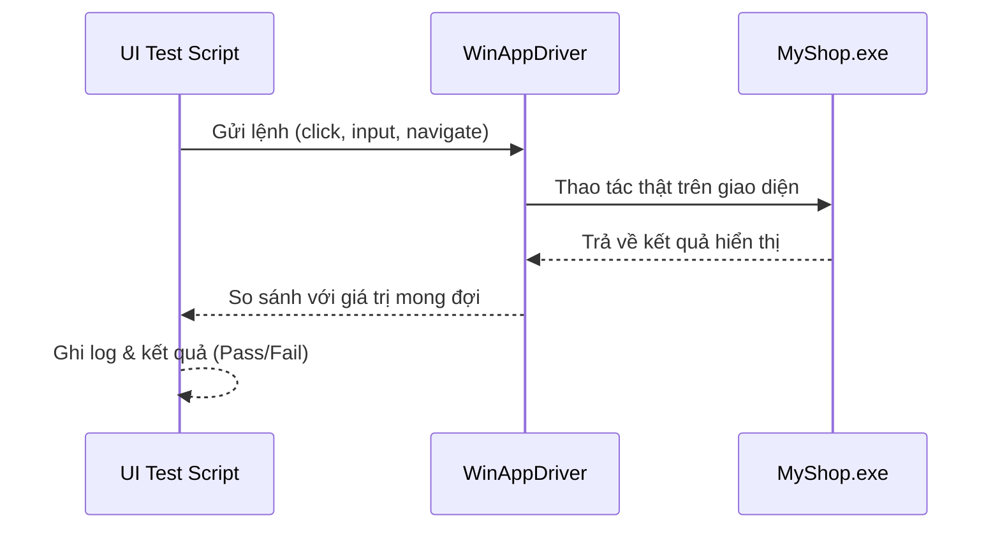

# 🧾 Project Report Template

## 0. Thông tin các thành viên

| STT | Họ và tên             | MSSV     | Nhiệm vụ chính | Ghi chú |
| --- | --------------------- | -------- | -------------- | ------- |
| 1   | Nguyễn Văn Bình Dương | 23120242 | BE             |         |
| 2   | Nguyễn Phúc Hậu       | 23120252 | FE             |         |
| 3   | Nguyễn Phúc Hoàng     | 23120264 | BE             |         |
| 4   | Nguyễn Khắc Vượng     | 23120409 | FE             |         |
| 5   | Trần Quốc Vỹ          | 23120410 | Lead           |         |

---

## 1. 🧩 Chức năng

- Liệt kê các chức năng chính của ứng dụng.

**Danh sách chức năng:**

- [ ] Chức năng 1: ...
- [ ] Chức năng 2: ...
- [ ] Chức năng 3: ...

---

## 2. 🎨 Giao diện (Prototype)

- Link Figma: [Figma Prototype](#)
- Mô tả ngắn gọn các luồng chức năng chính (VD: Màn hình đăng nhập → Trang chủ → Quản lý sản phẩm → Báo cáo doanh thu).

---

## 3. 👥 Làm việc nhóm

### 3.1 Phân công công việc

- Phân công và cập nhật công việc được thực hiện qua **Google Drive** (file `.xlsx` dùng để theo dõi tiến độ và nhiệm vụ của từng thành viên).

---

### 3.2 Công cụ quản lý & Chiến lược làm việc với Git

- **Theo dõi tiến độ & quản lý tài liệu:**

  - Nhóm sử dụng **2 repository trên GitHub**:
    - Repo 1: Lưu **tài liệu** (meeting notes, design, v.v.)
    - Repo 2: Lưu **mã nguồn dự án** (source code chính của ứng dụng)

- **Kênh liên lạc:** Zalo (trao đổi hằng ngày), Google Meet (họp nhóm định kỳ)

- **Chiến lược làm việc với Git:**
  - Nhánh chính: `main`
  - Nhánh Frontend: `vuong`, `hau`
  - Nhánh Backend: `hoang`, `duong`
  - **Quy trình làm việc:**
    1. Thành viên FE/BE làm việc và **push code lên nhánh cá nhân** tương ứng.
    2. **Lead sẽ review** nội dung trên GitHub.
    3. Sau khi kiểm tra và xác nhận ổn định, **Lead sẽ merge các nhánh vào `main`**.

---

## 4. 🧱 Kiến trúc phần mềm

### Cấu trúc Dự án (MVVM + 3-Layer Hybrid)

Dự án áp dụng mô hình **Clean Architecture**, kết hợp **3-Layer Architecture** và **MVVM** trong lớp Presentation.
Mục tiêu: đảm bảo **tách biệt hoàn toàn giữa các tầng** (UI – Logic – Data), **dễ mở rộng**, **dễ test**, và **bảo trì**.

---

#### 🧱 Cấu trúc tổng thể

```
MyShop.sln (Solution)
│
├── 📁 1. Core
│   └── 📦 MyShop.Domain (.NET Standard / .NET 6+)
│       └── 📁 Entities
│           ├── Product.cs
│           └── Order.cs
│
├── 📁 2. Application
│   └── 📦 MyShop.Application (.NET Standard / .NET 6+)
│       ├── 📁 Interfaces
│       │   ├── IProductRepository.cs
│       │   └── IEmailService.cs
│       ├── 📁 Services (or UseCases)
│       │   └── OrderProcessingService.cs
│       └── 📁 DTOs (Data Transfer Objects)
│           └── ProductDto.cs
│
├── 📁 3. Infrastructure
│   └── 📦 MyShop.Infrastructure (.NET 6+)
│       ├── 📁 Persistence (or DataAccess)
│       │   ├── AppDbContext.cs
│       │   └── Repositories
│       │       └── ProductRepository.cs  // Implements IProductRepository
│       └── 📁 ExternalServices
│           └── EmailService.cs         // Implements IEmailService
│
└── 📁 4. Presentation
    └── 📦 MyShop.Presentation.WinUI (WinUI Project)
        ├── 📁 Views
        │   └── ProductDetailPage.xaml
        ├── 📁 ViewModels
        │   └── ProductDetailViewModel.cs
        ├── 📁 Converters
        ├── 📁 Helpers
        └── App.xaml
```

---

### Vai trò và quy ước của từng Project

1. **📦 MyShop.Domain (Core Layer)**

   * **Trách nhiệm:** Chứa các đối tượng nghiệp vụ (Entities) — các class thuần tuý, chỉ có thuộc tính và logic nghiệp vụ cơ bản.
   * **Ví dụ:** `Product`, `Customer`, `Order`.
   * **Không phụ thuộc** vào bất kỳ lớp nào khác.

2. **📦 MyShop.Application (Use Case Layer)**

   * **Trách nhiệm:** Điều phối logic và luồng dữ liệu giữa Domain và các tầng khác.
   * `Interfaces`: Định nghĩa hợp đồng (contract) cho lớp Infrastructure.
   * `Services/UseCases`: Xử lý nghiệp vụ, điều phối logic.
   * `DTOs`: Truyền dữ liệu giữa Application và Presentation.
   * **Phụ thuộc:** `MyShop.Domain`.

3. **📦 MyShop.Infrastructure (Infrastructure Layer)**

   * **Trách nhiệm:** Triển khai các hợp đồng từ Application, chứa các chi tiết kỹ thuật (Database, Email, API).
   * `Persistence`: Làm việc với database, chứa DbContext, Repository.
   * `ExternalServices`: Tương tác với dịch vụ bên ngoài.
   * **Phụ thuộc:** `MyShop.Application`.

4. **📦 MyShop.Presentation.WinUI (Presentation Layer)**

   * **Trách nhiệm:** Xử lý giao diện và tương tác người dùng, theo mô hình **MVVM**.
   * `ViewModel` sẽ được **inject** các service từ `Application` để lấy dữ liệu và thao tác.
   * **Phụ thuộc:** `MyShop.Application`.

---

### Mối quan hệ giữa Clean Architecture – 3-Layer – MVVM

| Mô hình                         | Vai trò                                                             | Áp dụng trong dự án                                        |
| ------------------------------- | ------------------------------------------------------------------- | ---------------------------------------------------------- |
| **Clean Architecture**          | Giữ nguyên tắc “Dependency Rule” – chỉ phụ thuộc từ ngoài vào trong | Toàn bộ Solution                                           |
| **3-Layer Architecture**        | Phân tách logic theo tầng: Domain – Application – Infrastructure    | MyShop.Domain / MyShop.Application / MyShop.Infrastructure |
| **MVVM (Model–View–ViewModel)** | Tổ chức lớp giao diện, tách biệt View và ViewModel                  | MyShop.Presentation.WinUI                                  |

**Dependency Rule:**

> Chỉ được phụ thuộc “vào trong” — Presentation → Application → Domain
> Domain không phụ thuộc bất kỳ lớp nào khác.

---

## 5. 🧠 Design Patterns

Liệt kê các **Design Pattern** nhóm áp dụng (mỗi thành viên ít nhất 1 pattern, không tính Builder & Singleton).

| Pattern | Mục đích | Vị trí áp dụng trong dự án | Người thực hiện |
| ------- | -------- | -------------------------- | --------------- |
|         |          |                            |                 |
|         |          |                            |                 |

---

## 6. ✅ Đảm bảo chất lượng

### 6.1 Coding Convention

#### a. Quy ước cho C#

##### 1. **Naming Rules**

| Loại                | Quy tắc                   | Ví dụ                                 |
| ------------------- | ------------------------- | ------------------------------------- |
| Namespace           | PascalCase                | `MyApp.ViewModels`                    |
| Class, Struct, Enum | PascalCase                | `ProductViewModel`, `OrderStatus`     |
| Interface           | PascalCase, tiền tố **I** | `IProductService`                     |
| Method (public)     | PascalCase, động từ       | `CalculateTotalPrice()`               |
| Method (private)    | _camelCase                | `_validateInput()`                    |
| Property            | PascalCase                | `UserName`, `TotalAmount`             |
| Field (private)     | _camelCase                | `_userRepository`                     |
| Parameter           | camelCase                 | `void AddProduct(Product newProduct)` |
| Constant            | ALL_CAPS                  | `MAX_BUFFER_SIZE`                     |

**Lưu ý (Có dặn trên lớp):**

* Không dùng Hungarian notation (ví dụ: `btnSave`, `txtUser`).
* Hậu tố `Async` cho các hàm bất đồng bộ (ví dụ: `GetUserAsync()`).

---

##### 2. **Formatting & Layout**

* **Sử dụng `var` một cách thông minh:**
    - **NÊN** dùng `var` khi kiểu dữ liệu được thể hiện rõ ràng ở phía bên phải của phép gán. Điều này giúp code ngắn gọn hơn.
        
        ```csharp
        // Good
        var products = new List<Product>();
        var user = _userService.GetUserById(1);
        ```
        
    - **KHÔNG NÊN** dùng `var` cho các kiểu dữ liệu cơ bản (`int`, `string`, `bool`, `double`) hoặc khi kiểu dữ liệu không rõ ràng.
        
        ```csharp
        // Bad
        var count = 10; // Nên dùng: int count = 10;
        var result = GetResult(); // Kiểu của result là gì?
        ```
        
* **Braces `{}`:**
    - **Luôn luôn** sử dụng dấu ngoặc `{}` cho các khối lệnh `if`, `for`, `foreach`, `while`, ngay cả khi nó chỉ chứa một dòng lệnh. Điều này tránh các lỗi logic tiềm ẩn khi thêm code sau này.
        
        ```csharp
        // Good
        if (user != null)
        {
            ProcessUser(user);
        }
        
        // Bad - Rất nguy hiểm
        if (user != null)
            ProcessUser(user); // Nếu sau này thêm 1 dòng nữa mà quên ngoặc -> lỗi logic
        
        ```
        
    - Đặt dấu `{` ở một dòng riêng, không đặt cùng dòng với câu lệnh.
* **Thứ tự trong class (optional):**

  1. Fields
  2. Constructors
  3. Properties
  4. Public Methods
  5. Private Methods

**Ví dụ chuẩn:**

```csharp
public class ProductService
{
    private readonly IProductRepository _productRepository;

    public ProductService(IProductRepository productRepository)
    {
        _productRepository = productRepository;
    }

    public async Task<ProductDto> GetProductAsync(int id)
    {
        return await _productRepository.GetByIdAsync(id);
    }

    private bool _isValidId(int id) => id > 0;
}
```

---

##### 3. **Comment & Documentation**

* Nên comment trả lời **“Why?”** thay vì “What?”.
* Sử dụng XML comment cho các class và method public → Điều này giúp IntelliSense hiển thị thông tin gợi ý và có thể dùng để tự động tạo tài liệu sau này.

```csharp
/// <summary>
/// Calculates final price after discount.
/// </summary>
public decimal CalculateFinalPrice(Product product) => product.Price * 0.9m;
```

---

##### 4. **Nguyên tắc lập trình**

* **SRP (Single Responsibility):** Mỗi class chỉ làm một việc.
* **Async/Await:** Khi một phương thức thực hiện các tác vụ I/O (gọi API, truy vấn database, đọc file), nó **phải** là `async` và trả về `Task` hoặc `Task<T>`.
  - Đặt hậu tố `Async` cho tất cả các phương thức bất đồng bộ. Ví dụ: `GetUserAsync()`, `SaveProductAsync()`.
  - **Không bao giờ** dùng `.Result` hay `.Wait()` để chặn một tác vụ `async`. Nó có thể gây ra `deadlock`. Hãy `await` "all the way up".
* **LINQ:** Ưu tiên sử dụng cú pháp phương thức (Method Syntax) hơn là cú pháp truy vấn (Query Syntax) vì tính linh hoạt và phổ biến hơn.     
  ```csharp
  // Preferred (Method Syntax)
  var expensiveProducts = products.Where(p => p.Price > 100).ToList();

  // Less Preferred (Query Syntax)
  var expensiveProductsQuery = from p in products
                                where p.Price > 100
                                select p;
  ```
* **Readonly:** Dùng `readonly` cho field không thay đổi.
* **Expression-bodied members:** Sử dụng cho các properties hoặc methods chỉ có một dòng lệnh để code trông gọn gàng hơn.
  ```csharp
  // Thay vì viết thế này:
  public string FullName
  {
      get { return $"{FirstName} {LastName}"; }
  }

  // Hãy viết thế này:
  public string FullName => $"{FirstName} {LastName}";
  ```

---

#### b. Quy ước cho XAML

##### 1. **Đặt tên Controls**

| Loại                  | Quy tắc                               | Ví dụ                                       |
| --------------------- | ------------------------------------- | ------------------------------------------- |
| Control Name (x:Name) | PascalCase, `[Function][ControlType]` | `SaveOrderButton`, `UserNameTextBox`        |
| Event Handler         | `[ControlName]_[Event]`               | `SaveOrderButton_Click`                     |
| Resource Key          | PascalCase + hậu tố mô tả             | `PrimaryButtonStyle`, `TitleTextBlockStyle` |

❌ Sai: `btnSubmit`, `txtName`
✅ Đúng: `SubmitButton`, `UserNameTextBox`

---

##### 2. **Thứ tự thuộc tính (optional)**

1. **Định danh:** `x:Name`, `x:Key`
2. **Layout & Vị trí:** `Grid.Row`, `Grid.Column`, `Grid.ColumnSpan`, `Margin`, `Padding`, `HorizontalAlignment`, `VerticalAlignment`, `Width`, `Height`
3. **Nội dung & Dữ liệu:** `Content`, `Text`, `ItemsSource`, `DataContext`
4. **Binding & Commands:** `Text="{Binding UserName}"`, `Command="{Binding SaveCommand}"`
5. **Styling & Giao diện:** `Style`, `Background`, `Foreground`, `FontSize`, `FontWeight`
6. **Trạng thái & Hành vi:** `Visibility`, `IsEnabled`
7. **Accessibility:** `AutomationProperties.Name`

**Ví dụ:**

```xml
<Button
    x:Name="SaveButton"
    Grid.Row="2"
    Margin="8"
    HorizontalAlignment="Right"
    Content="Save"
    Command="{Binding SaveCommand}"
    Style="{StaticResource PrimaryButtonStyle}" />
```

---

##### 3. **Style & Resource**

- **Không bao giờ hard-code** các giá trị như màu sắc (`Background="#FF00A2E8"`), kích thước font, hay margin trực tiếp trên control.
- **Giải pháp: Định nghĩa chúng một lần** trong `ResourceDictionary` (ví dụ: `App.xaml` hoặc một file resource riêng) và tái sử dụng thông qua `"{StaticResource ...}"` hoặc `"{ThemeResource ...}"`.
    - `StaticResource`: Hiệu năng cao hơn, dùng cho các resource không thay đổi khi ứng dụng đang chạy.
    - `ThemeResource`: Dùng cho các resource cần thay đổi theo theme của hệ thống (Light/Dark mode).

```xml
<!-- Trong App.xaml -->
<Application.Resources>
    <ResourceDictionary>
        <SolidColorBrush x:Key="AppBrandBlueBrush" Color="#0078D4"/>
        <Style x:Key="PrimaryButtonStyle" TargetType="Button">
            <Setter Property="Background" Value="{ThemeResource AppBrandBlueBrush}"/>
            <Setter Property="Foreground" Value="White"/>
            <Setter Property="Padding" Value="12,4"/>
        </Style>
    </ResourceDictionary>
</Application.Resources>

<!-- Trong View -->
<!-- BAD -->
<Button Content="Save" Background="#0078D4" Foreground="White" Padding="12,4"/>

<!-- GOOD -->
<Button Content="Save" Style="{StaticResource PrimaryButtonStyle}"/>

```

#### c. Nguồn tham khảo Coding Convention:
1. Common C# code conventions: https://learn.microsoft.com/en-us/dotnet/csharp/fundamentals/coding-style/coding-conventions
2. C# identifier naming rules and conventions: https://learn.microsoft.com/en-us/dotnet/csharp/fundamentals/coding-style/identifier-names?utm_source=chatgpt.com
3. .NET code-style rule options: https://learn.microsoft.com/en-us/dotnet/fundamentals/code-analysis/code-style-rule-options?utm_source=chatgpt.com
4. Get started with Windows development using WinUI: https://learn.microsoft.com/en-us/windows/apps/get-started/start-here?utm_source=chatgpt.com&tabs=vs-2022-17-10
5. Style Coding có trong Slides Windows Programming của ThS. Trần Duy Quang

### 6.2 Testing

#### a. Triết lý Kiểm thử (Testing Philosophy)

Chúng ta áp dụng mô hình **Kim tự tháp kiểm thử (Test Pyramid)** – nhấn mạnh rằng:

* **Unit Test**: Nhiều nhất, nhanh, rẻ, kiểm thử logic cốt lõi.
* **Integration / UI Test**: Trung bình, kiểm thử sự phối hợp giữa các module.
* **Manual Test**: Ít hơn, tập trung vào trải nghiệm và kiểm thử giao diện người dùng.
---

#### b. **Unit Testing – Kiểm thử đơn vị (Cốt lõi của chất lượng)**

##### 1. Mục tiêu

* Xác minh từng thành phần hoạt động **độc lập, đúng logic**.
* Phát hiện lỗi sớm và hỗ trợ **refactor an toàn**.
* Tạo documentation cho logic nghiệp vụ thông qua test cases rõ ràng.

##### **2. Phạm vi & Công cụ**

| Thành phần            | Có kiểm thử | Ghi chú                                        |
| --------------------- | ----------- | ---------------------------------------------- |
| **ViewModels**        | ✅           | Kiểm tra Command, Validation, Property Binding |
| **Business Services** | ✅           | Tính toán, điều kiện nghiệp vụ                 |
| **Models / Entities** | ❌           | Chỉ là POCO chứa dữ liệu                       |
| **Repositories (EF)** | ❌           | Tin cậy vào EF Core                            |

**Công cụ sử dụng:**

* **xUnit** – framework kiểm thử hiện đại, mạnh mẽ.
* **Moq** – dùng để tạo mock cho các dependency (service, repository).

##### **3. Quy ước & Cấu trúc**

* Mỗi project logic có project test tương ứng:

  ```
  MyShop.Application  →  MyShop.Application.Tests
  MyShop.Presentation →  MyShop.Presentation.Tests
  ```
* **Tên test:** `[MethodName]_[Scenario]_[ExpectedResult]`
  Ví dụ: `CalculateTotal_WithValidDiscount_ReturnsCorrectDiscountedPrice`
* **Cấu trúc một bài test - Pattern AAA:**

  * **Arrange:** Chuẩn bị dữ liệu & mock.
  * **Act:** Thực thi hành động.
  * **Assert:** Kiểm tra kết quả.

##### **4. Ví dụ minh họa**

```csharp
// Trong project MyShop.UI.Tests

public class DashboardViewModelTests
{
    private readonly Mock<IOrderService> _mockOrderService;
    private readonly Mock<IProductService> _mockProductService;
    private readonly DashboardViewModel _viewModel;

    // Constructor này sẽ chạy trước mỗi bài test, thực hiện phần Arrange chung
    public DashboardViewModelTests()
    {
        _mockOrderService = new Mock<IOrderService>();
        _mockProductService = new Mock<IProductService>();
        _viewModel = new DashboardViewModel(_mockOrderService.Object, _mockProductService.Object);
    }

    [Fact] // Đánh dấu đây là một bài test của xUnit
    public async Task LoadDashboardData_WhenOrdersExist_CalculatesDailyRevenueCorrectly()
    {
        // Arrange - Sắp đặt kịch bản
        var todayOrders = new List<Order>
        {
            new Order { Id = 1, TotalAmount = 150000 },
            new Order { Id = 2, TotalAmount = 250000 }
        };
        _mockOrderService.Setup(s => s.GetOrdersForTodayAsync()).ReturnsAsync(todayOrders);
        _mockProductService.Setup(s => s.GetProductsLowOnStockAsync(5)).ReturnsAsync(new List<Product>()); // Giả lập trả về ds rỗng

        // Act - Thực thi hành động
        await _viewModel.LoadDashboardDataCommand.ExecuteAsync(null);

        // Assert - Xác nhận kết quả
        Assert.Equal(400000, _viewModel.DailyRevenue);
        Assert.Equal(2, _viewModel.DailyOrderCount);
    }

    [Fact]
    public async Task LoadDashboardData_WhenNoOrdersExist_RevenueAndOrderCountShouldBeZero()
    {
        // Arrange
        var emptyOrderList = new List<Order>();
        _mockOrderService.Setup(s => s.GetOrdersForTodayAsync()).ReturnsAsync(emptyOrderList);
        _mockProductService.Setup(s => s.GetProductsLowOnStockAsync(5)).ReturnsAsync(new List<Product>());

        // Act
        await _viewModel.LoadDashboardDataCommand.ExecuteAsync(null);

        // Assert
        Assert.Equal(0, _viewModel.DailyRevenue);
        Assert.Equal(0, _viewModel.DailyOrderCount);
    }
}

```

---

#### c. Manual Testing – Kiểm thử thủ công

##### **1. Mục tiêu**

* Đảm bảo giao diện, bố cục, luồng nghiệp vụ hoạt động đúng mong đợi.
* Kiểm tra **trải nghiệm người dùng (UX)** và **tính hoàn chỉnh của chức năng**.
* Phát hiện lỗi hiển thị, tương tác, hành vi không logic.

##### **2. Phương pháp thực hiện**

**a. Viết Test Case có cấu trúc rõ ràng:**

| ID         | Mô tả                    | Điều kiện tiên quyết                      | Bước thực hiện                                | Kết quả mong đợi                                                | Kết quả thực tế | Trạng thái |
| ---------- | ------------------------ | ----------------------------------------- | --------------------------------------------- | --------------------------------------------------------------- | --------------- | ---------- |
| TC-PROD-01 | Thêm sản phẩm hợp lệ     | Đăng nhập admin, ở màn "Quản lý sản phẩm" | Nhấn “Thêm mới” → nhập dữ liệu hợp lệ → “Lưu” | Thông báo “Thêm thành công”, sản phẩm xuất hiện trong danh sách |                 | Pass/Fail  |
| TC-PROD-02 | Thêm sản phẩm với giá âm | Như trên                                  | Nhập giá “-1000” → “Lưu”                      | Hiện cảnh báo “Giá phải là số dương”                            |                 | Pass/Fail  |

**b. Quy trình làm việc:**

1. Thành viên phát triển **viết Test Case** cho chức năng mình phụ trách.
2. Người khác trong nhóm **thực thi Test Case** (nguyên tắc 4-mắt).
3. Ghi lại kết quả và lỗi (bug) vào hệ thống quản lý (Excel, Notion, Jira…).
4. Chạy lại toàn bộ trước mỗi bản release (**Regression Test**).

---

#### d. UI Automation Testing – Kiểm thử giao diện tự động

##### **1. Mục tiêu**

* Tự động hóa **các luồng nghiệp vụ quan trọng, ổn định**.
* Giảm thời gian regression test thủ công.
* Đảm bảo các **"happy path"** chính luôn hoạt động ổn định qua mỗi lần build.

##### **2. Phạm vi**

Tự động hóa các luồng:
  1. Đăng nhập hệ thống.
  2. Tìm kiếm sản phẩm.
  3. Tạo đơn hàng hoàn chỉnh.
  4. Thêm khách hàng mới.

##### **3. Công cụ**

* **WinAppDriver** (Windows Application Driver)
* **Appium / xUnit** – chạy test script bằng C#.
* **CI/CD Integration:** Có thể tích hợp chạy test tự động trên GitHub Actions hoặc Azure Pipeline.

##### **4. Cấu trúc Test Automation Project**

```
MyShop.UI.Automation/
│
├── Tests/
│   ├── LoginTests.cs
│   ├── OrderTests.cs
│   └── CustomerTests.cs
│
├── Pages/            # Page Object Model
│   ├── LoginPage.cs
│   ├── OrderPage.cs
│   └── CustomerPage.cs
│
└── Utils/
    └── AppSessionHelper.cs
```

##### **5. Mô hình hoạt động**



##### **6. Ví dụ Kịch bản Tự động**

```csharp
[Fact]
public void CreateNewOrder_HappyPath()
{
    var session = LaunchAppAndLogin("admin", "123456");
    session.ClickButton("New Order");
    session.SelectItem("Laptop ABC");
    session.ClickButton("Add To Cart");
    session.SelectCustomer("Nguyen Van A");
    session.ClickButton("Save Order");
    Assert.True(session.FindElement("Success Message").Displayed);
}
```

---

## 7. 🚀 Nâng cao

Nhóm có **5** thành viên → cần **5** tính năng nâng cao.

| Tính năng nâng cao | Người thực hiện | Mô tả ngắn gọn |
| ------------------ | --------------- | -------------- |
|                    |                 |                |
|                    |                 |                |

---

## 8. 🗓️ Kế hoạch nháp ban đầu

- **Ý tưởng ban đầu:**  
  Phát triển ứng dụng **Windows (WinUI)** dành cho **chủ cửa hàng nhỏ** để quản lý sản phẩm, doanh thu và các báo cáo bán hàng.  
  Ứng dụng hướng đến người dùng đơn lẻ (1 user – chủ cửa hàng), giúp họ quản lý dữ liệu bán hàng trực tiếp trên máy tính mà không cần kết nối internet.

- **Phạm vi dự kiến:**

  - Quản lý danh sách sản phẩm (thêm, sửa, xóa, tìm kiếm).
  - Ghi nhận và quản lý hóa đơn bán hàng.
  - Quản lý doanh thu, báo cáo theo ngày/tháng.
  - Lưu trữ dữ liệu cục bộ (local database hoặc file).
  - Giao diện thân thiện, dễ thao tác với người dùng phổ thông.

- **Thời gian dự kiến thực hiện:**

  - Tổng thời gian đồ án: **8–10 tuần** (tùy theo kế hoạch của môn học).
  - Hiện tại đang trong giai đoạn **Proposal 1** với **deadline còn 2 tuần**.

- **Mốc tiến độ chính (dự kiến):**

  - **Tuần 1:**

    - Họp nhóm lần đầu: xác định đề tài, phân chia vai trò (Lead, 2 FE, 2 BE).
    - Thống nhất yêu cầu hệ thống và chuẩn bị nội dung **Proposal 1**.

  - **Tuần 2:**

    - Hoàn thiện tài liệu **Proposal 1** (chức năng, giao diện mẫu, kiến trúc tổng quan).
    - Lead tổng hợp và nộp proposal.

  - **Tuần 3:**

    - Bắt đầu thiết kế **UI chi tiết** (Figma).
    - Thiết kế cấu trúc thư mục và khởi tạo **repository mã nguồn**.
    - Backend bắt đầu tạo các model và service cơ bản.

  - **Tuần 4:**

    - FE triển khai các màn hình cơ bản (Dashboard, Product List).
    - BE hoàn thiện xử lý CRUD sản phẩm.

  - **Tuần 5:**

    - Kết nối FE – BE, hoàn thiện chức năng thêm/sửa/xóa sản phẩm.
    - Bắt đầu phần quản lý hóa đơn.

  - **Tuần 6:**

    - Hoàn thiện module báo cáo, doanh thu.
    - Bổ sung xử lý ngoại lệ và validation dữ liệu.

  - **Tuần 7:**

    - Viết Unit Test cho các chức năng chính.
    - Tinh chỉnh UI, fix bug.

  - **Tuần 8:**
    - Chuẩn bị demo và tài liệu báo cáo.
    - Lead tổng hợp, kiểm tra toàn bộ trước khi nộp.
