# 🧩 Task: Tài liệu định hướng Frontend – MyShop (WinUI 3)

**Người thực hiện:** Nguyễn Khắc Vượng, Nguyễn Phúc Hậu
**Ngày giao:** 21/10/2025
**Hạn hoàn thành:** 27/10/2025
**Trạng thái:** Hoàn thành


## 1. Giới thiệu

**🎯 Mục tiêu:**  
Frontend của **MyShop** là giao diện người dùng chính, cho phép chủ cửa hàng:
- Quản lý danh mục sản phẩm
- Theo dõi đơn hàng và trạng thái
- Quản lý kho hàng
- Xem báo cáo bán hàng và thống kê

Giao diện sẽ kết nối với Backend qua **API** để lấy và cập nhật dữ liệu theo thời gian thực, đảm bảo trải nghiệm mượt mà và trực quan.

**📌 Phạm vi:**
- Ứng dụng **Desktop Windows** sử dụng **WinUI 3** và **XAML**.
- Người dùng duy nhất: **quản trị viên** (Chủ cửa hàng).

---

## 2. Công nghệ & Kiến trúc

| Thành phần | Mô tả |
|------------|-------|
|IDE| Visual Studio 2022|
| 📝 Ngôn ngữ | C# |
| 🖼 Framework UI | WinUI 3 |
| 📄 Markup | XAML |
| 🏗 Kiến trúc | MVVM (Model-View-ViewModel) |
| 🔗 Data Binding | Liên kết dữ liệu giữa ViewModel và UI |
| 📦 Thư viện hỗ trợ | CommunityToolkit.Mvvm, WinUI 3 Controls |
| 📦 Ứng dụng hỗ trợ | WinUI3 Gallery|

**MVVM Pattern:**
- **Model:** định nghĩa dữ liệu như `Product`, 'Order', 'Inventory', 'Report'
- **ViewModel:** logic xử lý, bind dữ liệu với View
- **View:** giao diện XAML, tương tác với người chủ cửa hàng.

---

## 3. Màn hình chính

### 🌐 Config Screen
- Cấu hình địa chỉ server (API end point) mà ứng dụng sẽ kết nối.

### 🖥️ Login Screen
- Màn hình đăng nhập cho chủ cửa hàng
- Xác thực tài khoản khi đăng nhập.

### 🏠 Dashboard
- Tổng quan: số lượng sản phẩm, đơn hàng mới, doanh thu
- Biểu đồ bán hàng và báo cáo nhanh

### 📋 Product Screen
- Thêm, sửa, xóa sản phẩm
- Quản lý danh mục sản phẩm
- Upload hình ảnh, thiết lập giá, tồn kho

### 🛒 Order Screen
- Danh sách đơn hàng
- Xem chi tiết đơn hàng, trạng thái thanh toán, giao hàng
- Cập nhật trạng thái đơn hàng

### 📊 Reports Screen
- Báo cáo doanh thu theo ngày/tuần/tháng
- Top sản phẩm bán chạy
- Thống kê khách hàng (nếu có)

### ⚙️ Settings Scrreen
- Quản lý thông tin cá nhân
- Thay đổi mật khẩu, cài đặt


### Luồng màn hình chính

```mermaid
flowchart TD
    %% Các node chính
    A[🖥️ Login Screen] -->|Nhập thông tin| B{Đăng nhập thành công?}
    A --> C[🌐 Config Screen]
    B -->|Thành công| D[MainApp]
    B -->|Thất bại| A
    D -->|Đăng xuất| A

    subgraph MainScreens [Các màn hình chính]
        E[🛒 Order Screen]
        F[🏠 Dashboard]
        G[📋 Product Screen]
        H[📊 Reports Screen]
        I[⚙️ Settings Scrreen]
    end

    D --> E
    D --> F
    D --> G
    D --> H
    D --> I
...
```

---

## 4. Components / Controls chính

- **NavigationView:** menu chính và điều hướng  
- **ListView / GridView:** hiển thị sản phẩm, đơn hàng  
- **Data Templates:** hiển thị Product Card hoặc Order Card  
- **Buttons / TextBoxes / ComboBoxes:** thao tác và nhập liệu  
- **Charts (WinUI 3 Chart control hoặc third-party):** biểu đồ doanh thu, thống kê  
- **MessageDialog / ContentDialog:** thông báo lỗi, xác nhận hành động  

---

## 5. Tính năng UX nâng cao

- 🔔 Hiển thị thông báo khi thêm sản phẩm vào giỏ 
- ⚡ Cập nhật giỏ hàng theo thời gian thực  
- 🪟 Hỗ trợ resize window, layout tự điều chỉnh  
- ✨ Animation/Transition khi chuyển màn hình hoặc thêm sản phẩm  

---

## 6. Yêu cầu kỹ thuật

- 🔗 **Kết nối API Backend:** lấy danh sách sản phẩm, đặt hàng, quản lý tài khoản  
- ✅ **Validation input:** email, mật khẩu, số lượng sản phẩm  
- ⚠ **Error Handling:** thông báo lỗi khi API trả về lỗi  
- 🔄 **Data Binding:** tự động cập nhật giao diện khi dữ liệu thay đổi  

---

## 7. Tài liệu hóa UI

- 🎨 **Wireframes / Mockups:** vẽ sơ đồ giao diện từng màn hình  
- 🧩 **Component diagram:** liệt kê các component UI chính  
- 🔄 **Flowchart:** luồng thao tác chủ cửa hàng

---

## 8. Workflow đề xuất:
```
📦 MyShop.Frontend
│
├─ 📂 Models        # Định nghĩa dữ liệu (Data structures)
|
│
├─ 📂 Services      # Logic gọi API, xử lý dữ liệu cấp thấp
|
│
├─ 📂 ViewModels    # Logic nghiệp vụ, Command, Property
|
│
├─ 📂 Views         # Các trang XAML và User Controls
|
│
├─ 📂 Assets        # Hình ảnh, Icon, Styles
|
│
└─ 📂 Helpers       # Converter, Utility Functions

```

