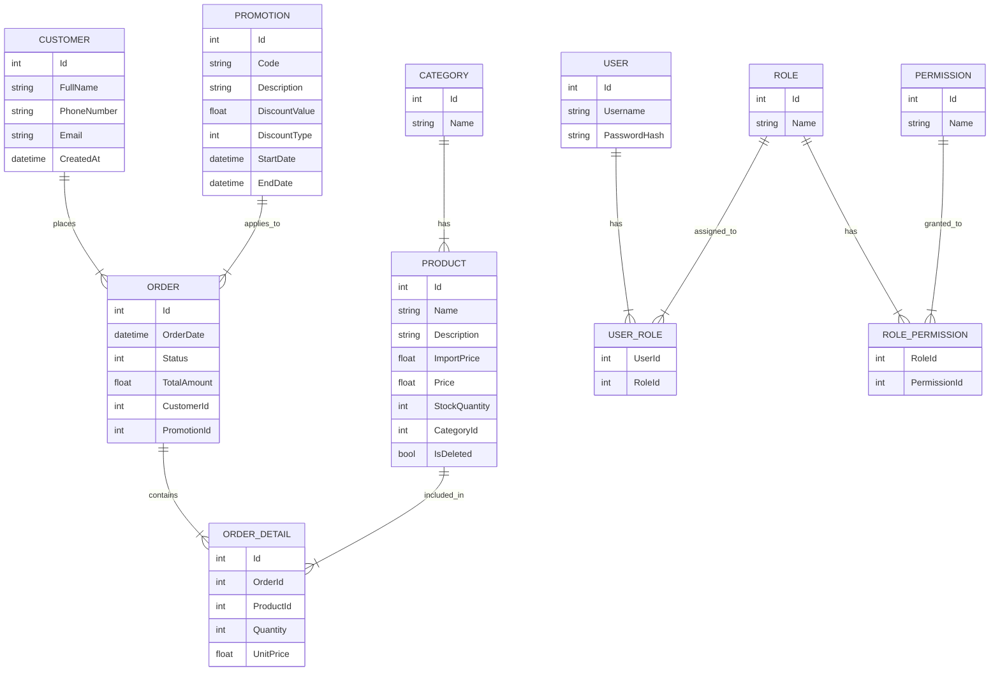
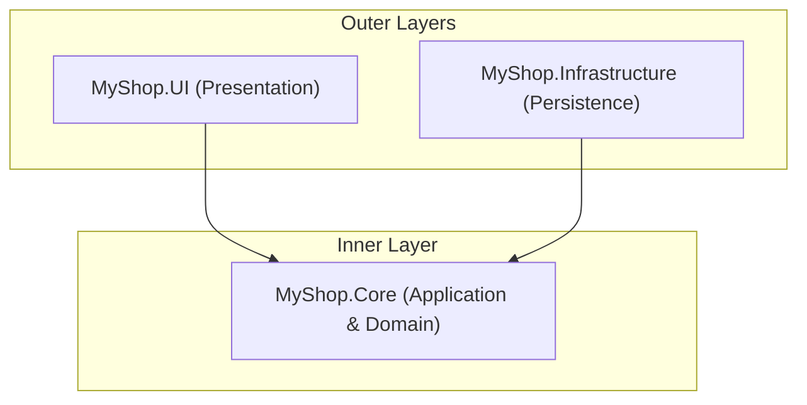
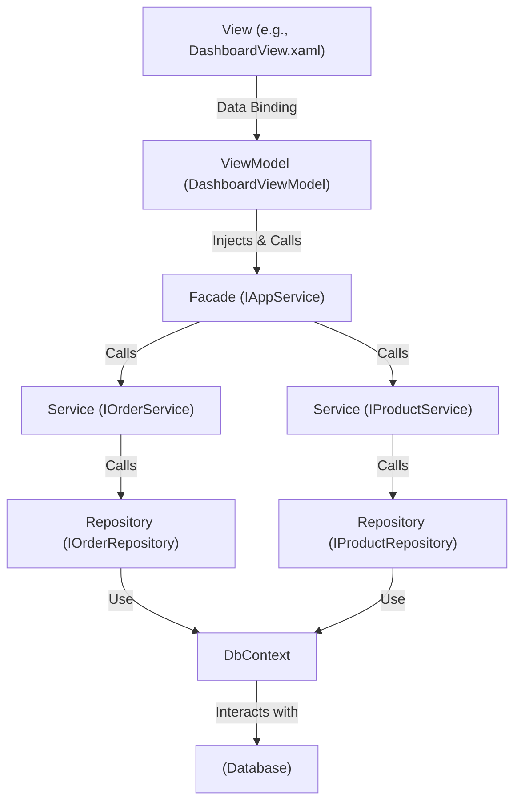
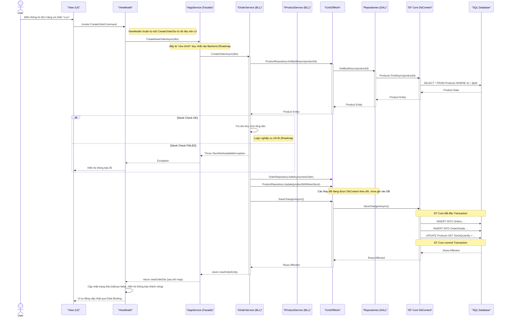

# 🧩 Task: Tài liệu định hướng Backend – MyShop

**Người thực hiện:** Nguyễn Phúc Hoàng, Nguyễn Văn Bình Duơng
**Ngày giao:** 21/10/2025
**Hạn hoàn thành:** 27/10/2025
**Trạng thái:** Đang feedback

---

## 🎯 Mục tiêu

Tài liệu CHI TIẾT Định hướng các công việc của Backend được chia theo từng giai đoạn và có code demo mẫu cho từng giai đoạn

**Lưu ý:** Tài liệu này mang tính định hướng và giúp người đọc hiểu được nhiệm vụ Backend sắp tới phải làm, chưa phải là tài liệu lựa chọn công nghệ

---

## 📋 Nội dung thực hiện:

### **Roadmap: Toàn cảnh Vai trò Backend Lead trong Dự án "MyShop"**

Đây là lộ trình tổng quan về các trách nhiệm và công việc mà bạn, trong vai trò Backend Lead, sẽ dẫn dắt và thực hiện.

**Giai đoạn 1: Thiết kế & Nền tảng (Architecture & Foundation)**

1. **Thiết kế Sơ đồ Cơ sở dữ liệu (Database Schema Design):**
    - Xác định các thực thể (Entities), thuộc tính và mối quan hệ giữa chúng.
    - Thiết kế các bảng, khóa chính (Primary Keys), khóa ngoại (Foreign Keys), và các ràng buộc (Constraints).
    - Quyết định chiến lược về chỉ mục (Indexing) để tối ưu hóa truy vấn.
2. **Thiết lập Kiến trúc Backend (Backend Architecture Setup):**
    - Hiện thực hóa cấu trúc project đã thảo luận: Clean Architecture + 3-Layer.
    - Tạo các project Class Library cho `Core/Application` và `Infrastructure`.
    - Định nghĩa các `Interfaces` cốt lõi (Repositories, Services) làm "hợp đồng" cho toàn bộ hệ thống.
3. **Cấu hình Lớp Truy cập Dữ liệu (Data Access Layer - DAL):**
    - Tích hợp Entity Framework Core vào project `Infrastructure`.
    - Cấu hình `DbContext`, chuỗi kết nối (Connection String).
    - Sử dụng EF Core Migrations để quản lý và phiên bản hóa sự thay đổi của schema CSDL.

**Giai đoạn 2: Xây dựng & Hiện thực hóa (Building & Implementation)**

1. **Hiện thực hóa các Repository (Repository Implementation):**
    - Viết các lớp `Repository` cụ thể (ví dụ: `ProductRepository`, `OrderRepository`) implement các interface đã định nghĩa ở Giai đoạn 1.
    - Xây dựng các phương thức truy vấn dữ liệu cơ bản (CRUD) và các phương thức truy vấn phức tạp hơn.
2. **Xây dựng Lớp Nghiệp vụ (Business Logic Layer - BLL):**
    - Viết các lớp `Service` (ví dụ: `ProductService`, `OrderService`) chứa toàn bộ logic nghiệp vụ của ứng dụng.
    - Đây là nơi xử lý validation, tính toán, và điều phối các hoạt động của Repository.
3. **Thiết kế và Hiện thực hóa API nội bộ (Internal API Design):**
    - Định nghĩa các DTOs (Data Transfer Objects) làm đầu vào và đầu ra cho các `Service`.
    - Xây dựng một "mặt tiền" (Facade) nhất quán mà lớp Presentation (ViewModels) sẽ tương tác, đảm bảo ViewModel không cần biết về sự phức tạp bên trong BLL hay DAL.

**Giai đoạn 3: Đảm bảo Chất lượng & Tối ưu hóa (QA & Optimization)**

1. **Viết Unit Test cho Backend:**
    - Viết Unit Test cho tất cả các logic quan trọng trong các lớp `Service`.
    - Sử dụng Mocking (với Moq) để cô lập `Service` khỏi `Repository` trong quá trình test.
2. **Tối ưu hóa Hiệu năng Truy vấn (Query Performance Tuning):**
    - Phân tích các câu truy vấn "nặng" (ví dụ: báo cáo, thống kê).
    - Sử dụng các kỹ thuật của EF Core như `AsNoTracking()`, `Include()`, `ThenInclude()`, và `Projection` (sử dụng `Select`) để tối ưu hóa.
    - Xem xét việc sử dụng SQL thô hoặc Dapper cho các truy vấn cực kỳ phức tạp.
3. **Quản lý Dữ liệu và Di chuyển (Data Seeding & Migration):**
    - Viết code để "gieo" (seed) dữ liệu mẫu vào CSDL, giúp cho việc test và demo trở nên dễ dàng.
    - Quản lý quy trình `migration` khi có sự thay đổi về CSDL để đảm bảo tất cả thành viên trong nhóm và người dùng cuối đều có schema CSDL nhất quán.

**Giai đoạn 4: Triển khai & Bảo trì (Deployment & Maintenance)**

1. **Xây dựng Kịch bản Backup và Restore:**
    - Hiện thực hóa chức năng sao lưu và phục hồi CSDL.
    - Viết tài liệu hướng dẫn cách thực hiện cho người dùng cuối.

---

# **1. Thiết kế Sơ đồ Cơ sở dữ liệu (Database Schema Design)**

### **Tại sao nó là bước đầu tiên và quan trọng nhất? (The "Why")**

Hãy tưởng tượng bạn đang xây một ngôi nhà. Sơ đồ CSDL chính là **bản thiết kế phần móng và khung sườn**.

- **Tính toàn vẹn (Integrity):** Móng có vững chắc không? Khung có chịu lực tốt không? Thiết kế CSDL đảm bảo dữ liệu của bạn luôn đúng đắn và nhất quán (ví dụ: một đơn hàng không thể tồn tại mà không có khách hàng).
- **Hiệu năng (Performance):** Các phòng được bố trí hợp lý để đi lại nhanh chóng? Thiết kế CSDL quyết định tốc độ truy vấn dữ liệu nhanh hay chậm.
- **Khả năng mở rộng (Scalability):** Có dễ dàng cơi nới, xây thêm tầng sau này không? Một thiết kế tốt cho phép bạn thêm các chức năng mới mà không phải đập đi xây lại toàn bộ hệ thống.

### **Quy trình thiết kế (The "How")**

Chúng ta sẽ đi qua 3 bước để hình thành nên sơ đồ:

1. **Xác định các Thực thể (Entities):** Tìm các "danh từ" chính trong yêu cầu của dự án. Đó sẽ là các bảng của chúng ta.
2. **Xác định các Thuộc tính (Attributes):** Với mỗi thực thể, nó có những thông tin gì? Đó sẽ là các cột trong bảng.
3. **Xác định các Mối quan hệ (Relationships):** Các thực thể này liên kết với nhau như thế nào? (Một-Một, Một-Nhiều, Nhiều-Nhiều).

### **Sơ đồ ERD (Entity-Relationship Diagram) đề xuất cho "MyShop"**

Dựa trên các chức năng bạn đã liệt kê, đây là sơ đồ quan hệ thực thể đề xuất. Sơ đồ này là ngôn ngữ chung để cả nhóm nhìn vào và hiểu cấu trúc dữ liệu của hệ thống.



### **Giải thích chi tiết các quyết định thiết kế (The "Why" behind the "What")**

- **Bảng `Products` và `Categories` (Quan hệ Một-Nhiều):**
    - Thay vì lưu tên danh mục ("Laptop", "Điện thoại") trực tiếp trong bảng `Products`, chúng ta tách nó ra bảng `Categories` và tham chiếu qua `CategoryId`.
    - **Lý do (Normalization):** Điều này tránh lặp lại dữ liệu và ngăn ngừa sai sót khi nhập liệu (ví dụ: "Laptop" vs "Loptop"). Khi muốn đổi tên một danh mục, bạn chỉ cần sửa ở một nơi duy nhất.
    - `IsDeleted (bool)`: Đây là kỹ thuật **Soft Delete**. Thay vì xóa vĩnh viễn một sản phẩm (`DELETE FROM ...`), chúng ta chỉ đánh dấu là nó đã bị xóa. Điều này giúp bảo toàn dữ liệu lịch sử cho các báo cáo sau này.
- **Bảng `Orders`, `Products` và `Order_Details` (Quan hệ Nhiều-Nhiều):**
    - Một đơn hàng có thể có nhiều sản phẩm, và một sản phẩm có thể nằm trong nhiều đơn hàng. Đây là mối quan hệ Nhiều-Nhiều.
    - **Nguyên tắc:** Mối quan hệ Nhiều-Nhiều luôn được hiện thực hóa bằng một **bảng trung gian** (junction table), ở đây là `Order_Details`.
    - **Cột `UnitPrice` trong `Order_Details`:** Đây là một chi tiết **cực kỳ quan trọng**. Chúng ta không thể chỉ lưu `ProductId` và `Quantity`. Tại sao? Vì giá của sản phẩm (`Price` trong bảng `Products`) có thể thay đổi trong tương lai. Chúng ta cần lưu lại **giá của sản phẩm tại thời điểm mua hàng** để đảm bảo hóa đơn trong quá khứ luôn chính xác.
- **Bảng `Users`, `Roles`, `Permissions` (Phân quyền động):**
    - Cấu trúc này cho phép bạn hiện thực hóa chức năng phân quyền một cách linh hoạt. Bạn có thể tạo ra các quyền rất chi tiết (ví dụ: `products.view_import_price`), gán chúng cho các vai trò, và gán vai trò cho người dùng ngay trong CSDL mà không cần sửa code.
- **Lựa chọn Kiểu dữ liệu:**
    - **`decimal(18, 2)` cho tiền tệ:** **Không bao giờ** dùng `float` hay `double` để lưu trữ tiền. Các kiểu dấu phẩy động không thể biểu diễn chính xác các giá trị thập phân, dẫn đến sai sót trong tính toán. `decimal` được thiết kế cho việc này.
    - **`nvarchar` cho chuỗi:** `n` ở đầu có nghĩa là hỗ trợ **Unicode**, cho phép bạn lưu trữ các ký tự có dấu như tiếng Việt một cách chính xác.
    - **`datetime2` thay vì `datetime`:** `datetime2` có độ chính xác cao hơn và dải giá trị rộng hơn so với kiểu `datetime` cũ.

---

**Thảo luận và Nhiệm vụ tiếp theo của bạn:**

Với vai trò Lead Backend, bạn cần xem xét bản thiết kế này và trả lời các câu hỏi:

1. Sơ đồ này đã bao quát hết các chức năng mà nhóm đã chọn chưa?
2. Đối với lĩnh vực thiết bị điện tử, chúng ta có cần thêm các thuộc tính đặc thù cho sản phẩm không? (Ví dụ: `SerialNumber`, `IMEI`, `WarrantyPeriodInMonths`). Nếu có, chúng ta nên thêm chúng vào bảng `Products` hay tạo một bảng riêng?

---

# **2. Thiết lập Kiến trúc Backend (Backend Architecture Setup)**

### **Tại sao phải chia thành nhiều Project? (The "Why")**

Nếu CSDL là bản thiết kế móng, thì kiến trúc backend là **bản thiết kế các tầng của ngôi nhà**. Chúng ta không xây một ngôi nhà chỉ có một phòng duy nhất chứa tất cả mọi thứ (phòng ngủ, bếp, toilet). Chúng ta chia thành các phòng riêng biệt, mỗi phòng có một chức năng rõ ràng.

Trong phần mềm, việc chia code thành các project (Class Library) riêng biệt giúp:

- **Phân tách Trách nhiệm (Separation of Concerns):** Mỗi project chỉ làm một việc và làm tốt việc đó. Project `Infrastructure` chỉ lo việc giao tiếp với database. Project `Core` chỉ chứa logic nghiệp vụ.
- **Tuân thủ Quy tắc Phụ thuộc (Dependency Rule):** Đây là trái tim của Clean Architecture. Chúng ta có thể kiểm soát chặt chẽ project nào được phép "thấy" project nào, đảm bảo các lớp bên ngoài (UI, Database) phải phụ thuộc vào lớp lõi (Core), chứ không phải ngược lại.
- **Dễ dàng Thay thế:** Nếu sau này bạn muốn đổi từ Entity Framework (trong `Infrastructure`) sang Dapper, bạn chỉ cần thay thế project `Infrastructure` mà không cần chạm đến một dòng code nào trong `Core` hay `UI`.
- **Tăng tốc Build:** Khi bạn chỉ thay đổi code trong một project, Visual Studio chỉ cần build lại project đó và các project phụ thuộc vào nó, thay vì build lại toàn bộ ứng dụng.

### **Cấu trúc Project trong Visual Studio (The "How")**

Đây là cách chúng ta sẽ hiện thực hóa kiến trúc đã thảo luận thành các project cụ thể trong Visual Studio.

```
MyShop.sln (Solution)
│
├── 📁 src/
│   │
│   ├── 🏢 MyShop.Core/ (Class Library) - TRÁI TIM CỦA ỨNG DỤNG
│   │   ├── 📁 Domain/
│   │   │   ├── Entities/ (Product.cs, Order.cs, ...)
│   │   │   └── Enums/ (OrderStatus.cs, ...)
│   │   ├── 📁 Application/
│   │   │   ├── Services/ (Interfaces: IProductService.cs, ...)
│   │   │   ├── Repositories/ (Interfaces: IProductRepository.cs, ...)
│   │   │   ├── DTOs/ (ProductDto.cs, ...)
│   │   │   └── Exceptions/ (ValidationException.cs, ...)
│   │
│   ├── 🏢 MyShop.Infrastructure/ (Class Library) - CÁC CHI TIẾT KỸ THUẬT
│   │   ├── 📁 Persistence/
│   │   │   ├── DbContext/ (MyShopDbContext.cs)
│   │   │   ├── Repositories/ (Implementations: ProductRepository.cs, ...)
│   │   │   └── Migrations/ (Folder do EF Core tự tạo)
│   │
│   └── 🖥️ MyShop.UI/ (WinUI 3 Project) - LỚP GIAO DIỆN
│       ├── 📁 Views/ (ProductListView.xaml, ...)
│       └── 📁 ViewModels/ (ProductListViewModel.cs, ...)
│
└── 📁 tests/
    │
    └── 🧪 MyShop.Core.Tests/ (xUnit Test Project) - KIỂM THỬ LOGIC

```

### **Giải thích vai trò của từng Project và Thư mục**

- **`MyShop.Core` (Class Library):**
    - **Mục đích:** Đây là project trung tâm, không phụ thuộc vào bất kỳ project nào khác. Nó chứa tất cả logic nghiệp vụ và các định nghĩa cốt lõi. Nó không biết gì về database, UI hay bất kỳ công nghệ cụ thể nào.
    - **`Domain/Entities`:** Chứa các class C# thuần túy (POCO) ánh xạ 1-1 với các bảng trong CSDL mà chúng ta vừa thiết kế.
    - **`Application/Interfaces` (Services & Repositories):** Đây là phần **cực kỳ quan trọng**. Nó định nghĩa các "hợp đồng" mà các lớp bên ngoài phải tuân theo. Ví dụ, `IProductRepository` định nghĩa "Tôi cần một ai đó có khả năng lấy tất cả sản phẩm", nhưng nó không quan tâm ai và làm điều đó như thế nào.
    - **`Application/DTOs`:** Các Data Transfer Objects. Đây là các class dùng để truyền dữ liệu giữa các lớp, đặc biệt là giữa BLL và Presentation. Nó giúp che giấu cấu trúc Entity thật khỏi lớp UI.
- **`MyShop.Infrastructure` (Class Library):**
    - **Mục đích:** Là nơi hiện thực hóa các chi tiết kỹ thuật. Nó **implement** các interface đã được định nghĩa trong `MyShop.Core`.
    - **`Persistence/DbContext`:** Chứa class `MyShopDbContext` kế thừa từ `DbContext` của Entity Framework. Đây là cầu nối chính đến CSDL.
    - **`Persistence/Repositories`:** Chứa các class `ProductRepository`, `OrderRepository`... **implement** các interface `IProductRepository`, `IOrderRepository` từ `Core`. Đây là nơi code Entity Framework thực sự được viết.
- **`MyShop.UI` (WinUI 3 Project):**
    - **Mục đích:** Chứa tất cả mọi thứ liên quan đến giao diện người dùng.
    - **`Views` & `ViewModels`:** Hiện thực hóa pattern MVVM. ViewModel sẽ gọi các `Service` từ `MyShop.Core`.

### **Sơ đồ Phụ thuộc (The Dependency Rule in Action)**

Đây là quy tắc vàng. Sơ đồ sau cho thấy project nào được phép tham chiếu (reference) đến project nào.



**Giải thích sơ đồ:**

- Mũi tên có nghĩa là "phụ thuộc vào" hoặc "tham chiếu đến".
- **`MyShop.UI`** tham chiếu đến **`MyShop.Core`** để có thể sử dụng các `IService` và `DTO`.
- **`MyShop.Infrastructure`** tham chiếu đến **`MyShop.Core`** để có thể implement các `IRepository` và sử dụng các `Entity`.
- **QUAN TRỌNG NHẤT:**
    - **`MyShop.Core` không tham chiếu đến bất kỳ ai.** Nó là trung tâm độc lập.
    - **`MyShop.UI` KHÔNG BAO GIỜ được tham chiếu đến `MyShop.Infrastructure`**. Lớp giao diện không được phép biết về sự tồn tại của Entity Framework hay cách bạn lưu trữ dữ liệu.

### **Các bước thực hiện trong Visual Studio**

Với vai trò Lead Backend, đây là các bước bạn sẽ thực hiện để khởi tạo nền tảng này:

1. **Tạo Solution:** Mở Visual Studio, tạo một Blank Solution tên là `MyShop`.
2. **Tạo các Project:**
    - Chuột phải vào Solution -> Add -> New Project -> Chọn **Class Library** -> Đặt tên `MyShop.Core`.
    - Làm tương tự để tạo `MyShop.Infrastructure`.
    - Chuột phải vào Solution -> Add -> New Project -> Chọn **Blank App, Packaged (WinUI 3 in Desktop)** -> Đặt tên `MyShop.UI`.
3. **Thiết lập Tham chiếu (Project References):**
    - Trong project `MyShop.UI`, chuột phải vào Dependencies -> Add Project Reference -> Check vào `MyShop.Core`.
    - Trong project `MyShop.Infrastructure`, chuột phải vào Dependencies -> Add Project Reference -> Check vào `MyShop.Core`.

Bạn đã hoàn thành việc xây dựng bộ khung kiến trúc. Đây là một nền tảng cực kỳ vững chắc và chuyên nghiệp.

---

**Thảo luận và Nhiệm vụ tiếp theo:**

1. Cấu trúc project và sơ đồ phụ thuộc này có rõ ràng với bạn không? Bạn có thấy nó hiện thực hóa Quy tắc Phụ thuộc của Clean Architecture một cách hoàn hảo như thế nào không?
2. Với vai trò Lead, làm thế nào bạn sẽ giải thích cho các thành viên trong nhóm (đặc biệt là các bạn làm Frontend) tại sao họ chỉ được phép "nói chuyện" với `MyShop.Core` mà không được "đụng" vào `MyShop.Infrastructure`?

---

# **3. Cấu hình Lớp Truy cập Dữ liệu (DAL)**

### **Vai trò của Entity Framework Core (The "Why")**

Chúng ta sẽ sử dụng **Entity Framework Core (EF Core)** làm công cụ ORM (Object-Relational Mapper) chính. Tại sao?

- **Trừu tượng hóa SQL:** Thay vì phải viết các câu lệnh SQL (`INSERT`, `UPDATE`, `SELECT`) bằng tay, EF Core cho phép chúng ta tương tác với database thông qua các đối tượng C# và LINQ (Language Integrated Query). Điều này giúp code an toàn hơn (chống SQL Injection), dễ đọc hơn và tăng năng suất.
- **Quản lý Schema (Migrations):** Đây là một trong những tính năng mạnh mẽ nhất. Khi bạn thay đổi model C# (ví dụ: thêm một cột mới vào class `Product`), EF Core có thể tự động tạo ra một file "migration" chứa các câu lệnh SQL cần thiết để cập nhật schema của database tương ứng. Điều này giúp quản lý sự thay đổi của CSDL một cách có hệ thống và dễ dàng chia sẻ trong team.
- **Tích hợp sâu với .NET:** Là sản phẩm của Microsoft, EF Core được tích hợp và hỗ trợ tốt nhất trong hệ sinh thái .NET.

### **Các bước cấu hình (The "How")**

Toàn bộ các thao tác sau đây sẽ được thực hiện trong project **`MyShop.Infrastructure`**.

**Bước 1: Cài đặt các gói NuGet cần thiết**

Mở **Package Manager Console** (Tools -> NuGet Package Manager -> Package Manager Console) hoặc dùng giao diện NuGet Package Manager. Chạy các lệnh sau cho project `MyShop.Infrastructure`:

```powershell
# Gói EF Core chính để làm việc với CSDL quan hệ
Install-Package Microsoft.EntityFrameworkCore.Relational

# Gói "provider" cho CSDL bạn chọn. Ví dụ dùng SQL Server:
Install-Package Microsoft.EntityFrameworkCore.SqlServer

# Gói công cụ để chạy các lệnh như 'add-migration', 'update-database'
Install-Package Microsoft.EntityFrameworkCore.Tools

```

**Bước 2: Tạo `DbContext`**

`DbContext` là một session làm việc với database. Nó đại diện cho kết nối và cho phép bạn truy vấn, lưu trữ các thực thể.

Trong project `MyShop.Infrastructure`, tạo thư mục `Persistence/DbContext` và tạo file `MyShopDbContext.cs`:

```csharp
// MyShop.Infrastructure/Persistence/DbContext/MyShopDbContext.cs
using Microsoft.EntityFrameworkCore;
using MyShop.Core.Domain.Entities; // Phải using project Core để thấy các Entity

namespace MyShop.Infrastructure.Persistence.DbContext
{
    public class MyShopDbContext : Microsoft.EntityFrameworkCore.DbContext
    {
        // Mỗi DbSet<T> đại diện cho một bảng trong CSDL
        public DbSet<Product> Products { get; set; }
        public DbSet<Category> Categories { get; set; }
        public DbSet<Order> Orders { get; set; }
        public DbSet<OrderDetail> OrderDetails { get; set; }
        public DbSet<Customer> Customers { get; set; }
        // ... thêm các DbSet cho các entity còn lại

        public MyShopDbContext(DbContextOptions<MyShopDbContext> options) : base(options)
        {
        }

        protected override void OnModelCreating(ModelBuilder modelBuilder)
        {
            base.OnModelCreating(modelBuilder);

            // Đây là nơi để cấu hình chi tiết (Fluent API) nếu cần
            // Ví dụ: định nghĩa khóa chính phức hợp cho bảng OrderDetails
            modelBuilder.Entity<OrderDetail>()
                .HasKey(od => new { od.OrderId, od.ProductId }); // Giả sử OrderDetail có khóa phức hợp

            // Ví dụ: cấu hình kiểu dữ liệu decimal cho các cột tiền tệ
            modelBuilder.Entity<Product>()
                .Property(p => p.Price)
                .HasColumnType("decimal(18, 2)");

            modelBuilder.Entity<Product>()
                .Property(p => p.ImportPrice)
                .HasColumnType("decimal(18, 2)");

            // Áp dụng tất cả các cấu hình từ assembly này
            modelBuilder.ApplyConfigurationsFromAssembly(typeof(MyShopDbContext).Assembly);
        }
    }
}
```

**Bước 3: Cấu hình Chuỗi kết nối (Connection String)**

Chuỗi kết nối chứa thông tin để ứng dụng tìm và kết nối đến server CSDL. Chúng ta sẽ quản lý nó trong project UI (`MyShop.UI`) vì đó là project khởi động.

Trong file `appsettings.json` của project `MyShop.UI` (nếu chưa có thì tạo mới):

```json
{
  "ConnectionStrings": {
    "DefaultConnection": "Server=(localdb)\\\\mssqllocaldb;Database=MyShopDb;Trusted_Connection=True;MultipleActiveResultSets=true"
  }
}
```

- `Server=(localdb)\\\\mssqllocaldb`: Sử dụng LocalDB của SQL Server, một phiên bản nhẹ rất tiện cho việc phát triển.
- `Database=MyShopDb`: Tên của CSDL sẽ được tạo.
- `Trusted_Connection=True`: Sử dụng xác thực Windows.

**Bước 4: Đăng ký `DbContext` với Dependency Injection Container**

Trong project `MyShop.UI`, mở file `App.xaml.cs` (hoặc một file startup riêng). Chúng ta cần "dạy" cho DI Container cách tạo ra một instance của `MyShopDbContext`.

```csharp
// MyShop.UI/App.xaml.cs
public partial class App : Application
{
    public static IHost AppHost { get; private set; }

    public App()
    {
        this.InitializeComponent();

        AppHost = Host.CreateDefaultBuilder()
            .ConfigureServices((context, services) =>
            {
                // Lấy chuỗi kết nối từ appsettings.json
                var connectionString = context.Configuration.GetConnectionString("DefaultConnection");

                // Đăng ký DbContext
                services.AddDbContext<MyShopDbContext>(options =>
                {
                    options.UseSqlServer(connectionString);
                });

                // Đăng ký các services và repositories
                // ... (sẽ làm ở các bước sau)
            })
            .Build();
    }
    // ...
}
```

**Bước 5: Tạo Migration đầu tiên**

Bây giờ, EF Core đã biết về các `Entity` của bạn (qua `DbSet`), biết cách kết nối đến CSDL (qua `ConnectionString`), và sẵn sàng tạo ra schema.

1. Trong Visual Studio, đảm bảo project **`MyShop.UI`** là **Startup Project**.
2. Trong **Package Manager Console**, đảm bảo **Default project** là **`MyShop.Infrastructure`**.
3. Chạy lệnh:
    
    ```powershell
    Add-Migration InitialCreate
    ```
    
4. Lệnh này sẽ phân tích `MyShopDbContext` của bạn, so sánh với CSDL hiện tại (chưa có gì), và tạo ra một folder `Migrations` trong `MyShop.Infrastructure` chứa một file C# mô tả tất cả các câu lệnh SQL cần thiết để tạo ra các bảng, cột, khóa chính, khóa ngoại...

**Bước 6: Áp dụng Migration vào CSDL**

Chạy lệnh sau trong **Package Manager Console**:

```powershell
Update-Database
```

Lệnh này sẽ đọc file migration mới nhất, kết nối đến CSDL và thực thi các câu lệnh SQL. Sau khi chạy xong, CSDL `MyShopDb` của bạn sẽ được tạo ra với đầy đủ các bảng như bạn đã thiết kế.

Bạn đã hoàn thành việc cấu hình lớp DAL. "Hệ thống đường ống" đã được lắp đặt và sẵn sàng để sử dụng.

---

**Thảo luận và Nhiệm vụ tiếp theo:**

1. Quy trình `Add-Migration` và `Update-Database` có ý nghĩa gì với bạn? Bạn có thấy nó giải quyết được vấn đề "làm sao để tất cả mọi người trong nhóm đều có cùng một cấu trúc CSDL" một cách hiệu quả không?
2. `OnModelCreating` và Fluent API là một công cụ rất mạnh để tinh chỉnh cách EF Core ánh xạ model ra CSDL. Bạn có nghĩ ra trường hợp nào khác trong dự án "MyShop" mà chúng ta cần dùng đến nó không? (Gợi ý: cấu hình cho mối quan hệ Nhiều-Nhiều, định nghĩa Index).

---

# **4. Hiện thực hóa các Repository (Repository Implementation)**

### **Tại sao cần Repository khi đã có DbContext? (The "Why")**

Đây là một câu hỏi rất hay và quan trọng. Về lý thuyết, bạn hoàn toàn có thể inject `MyShopDbContext` trực tiếp vào các lớp `Service` và sử dụng nó. Tuy nhiên, việc tạo ra một lớp Repository trung gian mang lại những lợi ích to lớn về mặt kiến trúc:

- **Tuân thủ Clean Architecture:** Lớp `Service` (thuộc `Core`) không được phép phụ thuộc vào các chi tiết kỹ thuật (`Infrastructure`). `DbContext` là một chi tiết kỹ thuật của EF Core. Bằng cách định nghĩa `IRepository` trong `Core` và implement nó trong `Infrastructure`, chúng ta đã đảo ngược sự phụ thuộc. `Service` chỉ biết về "hợp đồng" (`IRepository`), không phải "người thi công" (`DbContext`).
- **Tập trung hóa Logic Truy vấn:** Tất cả các câu lệnh LINQ để truy vấn một `Entity` cụ thể (ví dụ: `Product`) sẽ được gom về một nơi duy nhất là `ProductRepository`. Điều này tránh việc logic truy vấn bị rải rác khắp nơi trong các `Service`, giúp code dễ tìm, dễ bảo trì và tái sử dụng.
- **Tăng khả năng Test:** Khi Unit Test các `Service`, chúng ta có thể dễ dàng "mock" `IRepository` để trả về dữ liệu giả, thay vì phải mock cả một `DbContext` phức tạp.
- **Đơn giản hóa Lớp Service:** `Service` chỉ cần gọi các phương thức có tên rõ ràng như `_productRepository.GetProductsLowOnStockAsync()` thay vì phải tự mình viết một câu lệnh LINQ dài dòng.

### **Xây dựng một Repository cơ sở (Generic Repository - Optional but Recommended)**

Để tránh lặp lại code CRUD (Create, Read, Update, Delete) cho mỗi Entity, chúng ta có thể tạo một `Repository` chung.

**Bước 1: Định nghĩa Interface trong `MyShop.Core`**

```csharp
// MyShop.Core/Application/Repositories/IGenericRepository.cs
using MyShop.Core.Domain.Entities;
using System.Linq.Expressions;

namespace MyShop.Core.Application.Repositories
{
    // T phải là một class kế thừa từ BaseEntity (có thuộc tính Id)
    public interface IGenericRepository<T> where T : BaseEntity
    {
        Task<T> GetByIdAsync(int id);
        Task<IReadOnlyList<T>> GetAllAsync();
        Task AddAsync(T entity);
        void Update(T entity);
        void Delete(T entity);
    }

    // Tạo một BaseEntity để dùng chung
    // MyShop.Core/Domain/Entities/BaseEntity.cs
    public abstract class BaseEntity
    {
        public int Id { get; set; }
    }
}

```

*(Lưu ý: Bạn cần cho tất cả các Entity của mình kế thừa từ `BaseEntity`)*

**Bước 2: Implement Interface trong `MyShop.Infrastructure`**

```csharp
// MyShop.Infrastructure/Persistence/Repositories/GenericRepository.cs
using Microsoft.EntityFrameworkCore;
using MyShop.Core.Application.Repositories;
using MyShop.Core.Domain.Entities;
using MyShop.Infrastructure.Persistence.DbContext;

namespace MyShop.Infrastructure.Persistence.Repositories
{
    public class GenericRepository<T> : IGenericRepository<T> where T : BaseEntity
    {
        protected readonly MyShopDbContext _dbContext;

        public GenericRepository(MyShopDbContext dbContext)
        {
            _dbContext = dbContext;
        }

        public async Task<T> GetByIdAsync(int id)
        {
            return await _dbContext.Set<T>().FindAsync(id);
        }

        public async Task<IReadOnlyList<T>> GetAllAsync()
        {
            return await _dbContext.Set<T>().ToListAsync();
        }

        public async Task AddAsync(T entity)
        {
            await _dbContext.Set<T>().AddAsync(entity);
        }

        public void Update(T entity)
        {
            // EF Core tự động theo dõi thay đổi của entity, chỉ cần đánh dấu là nó đã bị sửa
            _dbContext.Entry(entity).State = EntityState.Modified;
        }

        public void Delete(T entity)
        {
            _dbContext.Set<T>().Remove(entity);
        }
    }
}

```

### **Hiện thực hóa Repository cụ thể (Specific Repository)**

Generic Repository rất tốt cho các thao tác CRUD, nhưng mỗi Entity thường có những nhu cầu truy vấn riêng. Đây là lúc chúng ta tạo các Repository cụ thể.

**Bước 1: Định nghĩa Interface trong `MyShop.Core`**

```csharp
// MyShop.Core/Application/Repositories/IProductRepository.cs
using MyShop.Core.Domain.Entities;

namespace MyShop.Core.Application.Repositories
{
    // Kế thừa từ IGenericRepository để có sẵn các phương thức CRUD
    public interface IProductRepository : IGenericRepository<Product>
    {
        // Định nghĩa các phương thức truy vấn đặc thù cho Product
        Task<IReadOnlyList<Product>> GetProductsByCategoryAsync(int categoryId);
        Task<IReadOnlyList<Product>> GetProductsLowOnStockAsync(int threshold);
    }
}

```

**Bước 2: Implement Interface trong `MyShop.Infrastructure`**

```csharp
// MyShop.Infrastructure/Persistence/Repositories/ProductRepository.cs
using Microsoft.EntityFrameworkCore;
using MyShop.Core.Application.Repositories;
using MyShop.Core.Domain.Entities;
using MyShop.Infrastructure.Persistence.DbContext;

namespace MyShop.Infrastructure.Persistence.Repositories
{
    // Kế thừa từ GenericRepository để tái sử dụng code CRUD
    public class ProductRepository : GenericRepository<Product>, IProductRepository
    {
        // DbContext được truyền từ lớp cha
        public ProductRepository(MyShopDbContext dbContext) : base(dbContext)
        {
        }

        public async Task<IReadOnlyList<Product>> GetProductsByCategoryAsync(int categoryId)
        {
            return await _dbContext.Products
                                   .Where(p => p.CategoryId == categoryId && !p.IsDeleted)
                                   .AsNoTracking() // Tối ưu hóa cho truy vấn chỉ đọc
                                   .ToListAsync();
        }

        public async Task<IReadOnlyList<Product>> GetProductsLowOnStockAsync(int threshold)
        {
            return await _dbContext.Products
                                   .Where(p => p.StockQuantity < threshold && !p.IsDeleted)
                                   .OrderBy(p => p.StockQuantity)
                                   .AsNoTracking()
                                   .ToListAsync();
        }
    }
}

```

- **`AsNoTracking()`:** Một kỹ thuật tối ưu hóa quan trọng. Khi bạn chỉ đọc dữ liệu và không có ý định sửa đổi nó, hãy dùng `AsNoTracking()`. Nó bảo EF Core không cần phải theo dõi các thay đổi của những entity này, giúp giảm bộ nhớ và tăng tốc độ truy vấn đáng kể.

### **Unit of Work Pattern (Tùy chọn nhưng rất quan trọng)**

**Vấn đề:** Một nghiệp vụ phức tạp có thể cần thay đổi nhiều Repository cùng lúc. Ví dụ: khi tạo một `Order`, bạn cần:

1. Thêm một record vào bảng `Orders` (`OrderRepository`).
2. Thêm nhiều record vào bảng `Order_Details` (`OrderDetailRepository`).
3. Cập nhật `StockQuantity` trong bảng `Products` (`ProductRepository`).

Cả 3 thao tác này phải **thành công hoặc thất bại cùng nhau** (nguyên tắc **Atomicity**). Nếu bước 3 thất bại, bước 1 và 2 phải được hoàn tác (rollback).

**Giải pháp:** Unit of Work Pattern. Nó đóng gói một `DbContext` và cung cấp một phương thức `SaveChangesAsync()` duy nhất. Tất cả các Repository sẽ chia sẻ chung một instance `DbContext` này.

**Bước 1: Định nghĩa Interface trong `MyShop.Core`**

```csharp
// MyShop.Core/Application/Repositories/IUnitOfWork.cs
namespace MyShop.Core.Application.Repositories
{
    public interface IUnitOfWork : IDisposable
    {
        IProductRepository ProductRepository { get; }
        IOrderRepository OrderRepository { get; }
        // ... các repository khác

        Task<int> SaveChangesAsync();
    }
}
```

**Bước 2: Implement Interface trong `MyShop.Infrastructure`**

```csharp
// MyShop.Infrastructure/Persistence/Repositories/UnitOfWork.cs
public class UnitOfWork : IUnitOfWork
{
    private readonly MyShopDbContext _dbContext;
    public IProductRepository ProductRepository { get; }
    public IOrderRepository OrderRepository { get; }

    public UnitOfWork(MyShopDbContext dbContext)
    {
        _dbContext = dbContext;
        ProductRepository = new ProductRepository(_dbContext);
        OrderRepository = new OrderRepository(_dbContext);
    }

    public Task<int> SaveChangesAsync()
    {
        return _dbContext.SaveChangesAsync();
    }

    public void Dispose()
    {
        _dbContext.Dispose();
    }
}
```

**Cách sử dụng trong Service:** Thay vì inject từng Repository, giờ bạn chỉ cần inject `IUnitOfWork`.

```csharp
// Trong OrderService
public async Task CreateOrderAsync(Order order)
{
    // ... logic
    await _unitOfWork.OrderRepository.AddAsync(order);
    // ... cập nhật stock sản phẩm qua _unitOfWork.ProductRepository

    // Chỉ gọi SaveChangesAsync một lần duy nhất ở cuối
    await _unitOfWork.SaveChangesAsync(); // EF Core sẽ tự động bọc tất cả các thay đổi trong một transaction
}
```

---

**Nhiệm vụ tiếp theo của bạn:**

1. Dựa trên các ví dụ trên, hãy định nghĩa các interface và implement các repository còn lại (`OrderRepository`, `CustomerRepository`, ...).
2. Bạn có thấy sức mạnh của việc kết hợp Generic Repository, Specific Repository và Unit of Work không? Nó tạo ra một lớp DAL rất sạch sẽ, có cấu trúc, dễ test và tái sử dụng.

---

# **5. Xây dựng Lớp Nghiệp vụ (Business Logic Layer - BLL)**

### **Vai trò của Lớp Nghiệp vụ (The "Why")**

Tại sao chúng ta không gọi trực tiếp Repository từ ViewModel?

- **Tách biệt trách nhiệm:** ViewModel chỉ nên lo việc hiển thị dữ liệu cho View. Nó không nên biết về các quy tắc nghiệp vụ phức tạp (ví dụ: "Chỉ được phép hủy đơn hàng khi nó chưa được thanh toán").
- **Tái sử dụng:** Một quy tắc nghiệp vụ có thể được sử dụng bởi nhiều ViewModel khác nhau (ví dụ: cả `OrderListViewModel` và `OrderDetailViewModel` đều cần chức năng "Hủy đơn hàng"). Nếu viết logic này trong ViewModel, bạn sẽ phải lặp lại code.
- **Bảo vệ tính toàn vẹn dữ liệu:** BLL là chốt chặn cuối cùng trước khi dữ liệu được ghi xuống DB. Nó đảm bảo mọi dữ liệu đi vào hệ thống đều hợp lệ và tuân thủ các quy tắc kinh doanh.

### **Thành phần của BLL (The "What")**

BLL trong kiến trúc của chúng ta bao gồm 3 thành phần chính nằm trong project **`MyShop.Core`**:

1. **Services:** Các class chứa logic nghiệp vụ (ví dụ: `ProductService`, `OrderService`).
2. **DTOs (Data Transfer Objects):** Các class đơn giản dùng để truyền dữ liệu ra/vào Service.
3. **Validators:** Các class dùng để kiểm tra tính hợp lệ của dữ liệu đầu vào.

### **Quy trình xây dựng (The "How")**

Chúng ta sẽ lấy ví dụ xây dựng chức năng "Tạo đơn hàng mới" để minh họa.

**Bước 1: Định nghĩa DTOs**

Chúng ta không muốn ViewModel gửi trực tiếp `Entity` xuống Service, vì `Entity` có thể chứa nhiều thông tin nhạy cảm hoặc không cần thiết cho một thao tác cụ thể. DTO giúp chúng ta kiểm soát chính xác những gì được gửi đi và nhận về.

```csharp
// MyShop.Core/Application/DTOs/CreateOrderDto.cs
public class CreateOrderDto
{
    public int CustomerId { get; set; }
    public List<CreateOrderDetailDto> Details { get; set; } = new();
    public string? PromotionCode { get; set; }
}

public class CreateOrderDetailDto
{
    public int ProductId { get; set; }
    public int Quantity { get; set; }
}
```

**Bước 2: Định nghĩa Interface cho Service**

```csharp
// MyShop.Core/Application/Services/IOrderService.cs
using MyShop.Core.Application.DTOs;
using MyShop.Core.Domain.Entities;

namespace MyShop.Core.Application.Services
{
    public interface IOrderService
    {
        Task<Order> CreateOrderAsync(CreateOrderDto orderDto);
        Task CancelOrderAsync(int orderId);
        // ... các phương thức khác
    }
}
```

**Bước 3: Hiện thực hóa Service**

Đây là nơi "ma thuật" thực sự diễn ra.

```cpp
// MyShop.Core/Application/Services/OrderService.cs
using MyShop.Core.Application.DTOs;
using MyShop.Core.Application.Repositories;
using MyShop.Core.Domain.Entities;
using MyShop.Core.Domain.Enums;
using System;

namespace MyShop.Core.Application.Services
{
    public class OrderService : IOrderService
    {
        private readonly IUnitOfWork _unitOfWork;

        // Inject UnitOfWork để có thể thao tác với nhiều Repository cùng lúc
        public OrderService(IUnitOfWork unitOfWork)
        {
            _unitOfWork = unitOfWork;
        }

        public async Task<Order> CreateOrderAsync(CreateOrderDto orderDto)
        {
            // 1. VALIDATION (Kiểm tra đầu vào)
            if (orderDto.Details == null || !orderDto.Details.Any())
                throw new ArgumentException("Đơn hàng phải có ít nhất một sản phẩm.");

            var newOrder = new Order
            {
                CustomerId = orderDto.CustomerId,
                OrderDate = DateTime.UtcNow,
                Status = OrderStatus.Created,
                OrderDetails = new List<OrderDetail>()
            };

            decimal totalAmount = 0;

            // 2. BUSINESS LOGIC (Xử lý nghiệp vụ)
            foreach (var item in orderDto.Details)
            {
                var product = await _unitOfWork.ProductRepository.GetByIdAsync(item.ProductId);
                if (product == null)
                    throw new Exception($"Sản phẩm với ID {item.ProductId} không tồn tại.");

                // Kiểm tra tồn kho
                if (product.StockQuantity < item.Quantity)
                    throw new Exception($"Sản phẩm {product.Name} không đủ số lượng tồn kho (còn {product.StockQuantity}).");

                // Trừ tồn kho
                product.StockQuantity -= item.Quantity;
                _unitOfWork.ProductRepository.Update(product);

                // Tạo chi tiết đơn hàng
                var orderDetail = new OrderDetail
                {
                    ProductId = product.Id,
                    Quantity = item.Quantity,
                    UnitPrice = product.Price // LƯU Ý QUAN TRỌNG: Lấy giá tại thời điểm hiện tại
                };
                newOrder.OrderDetails.Add(orderDetail);

                totalAmount += orderDetail.Quantity * orderDetail.UnitPrice;
            }

            newOrder.TotalAmount = totalAmount;

            // 3. PERSISTENCE (Lưu xuống DB)
            await _unitOfWork.OrderRepository.AddAsync(newOrder);
            await _unitOfWork.SaveChangesAsync(); // Tất cả thay đổi (Order, OrderDetails, Product Stock) được lưu trong 1 transaction

            return newOrder;
        }

        public async Task CancelOrderAsync(int orderId)
        {
             var order = await _unitOfWork.OrderRepository.GetByIdAsync(orderId);
             if (order == null) throw new Exception("Đơn hàng không tồn tại.");

             // Quy tắc nghiệp vụ: Chỉ được hủy đơn hàng Mới tạo
             if (order.Status != OrderStatus.Created)
                 throw new Exception("Chỉ có thể hủy đơn hàng ở trạng thái 'Mới tạo'.");

             order.Status = OrderStatus.Cancelled;

             // Logic hoàn trả tồn kho (nếu cần)
             // ...

             _unitOfWork.OrderRepository.Update(order);
             await _unitOfWork.SaveChangesAsync();
        }
    }
}

```

### **Sử dụng AutoMapper (Tùy chọn nhưng rất hữu ích)**

Bạn sẽ thấy việc chuyển đổi dữ liệu thủ công giữa `DTO` và `Entity` (ví dụ: `newOrder.CustomerId = orderDto.CustomerId`) rất nhàm chán và dễ sai sót. **AutoMapper** là một thư viện giúp tự động hóa việc này.

1. Cài đặt gói `AutoMapper` vào project `Core`.
2. Tạo các `Profile` để định nghĩa cách ánh xạ:
    
    ```csharp
    public class MappingProfile : Profile
    {
        public MappingProfile()
        {
            CreateMap<Product, ProductDto>();
            CreateMap<CreateProductDto, Product>();
            // ...
        }
    }
    ```
    
3. Inject `IMapper` vào Service và sử dụng: `var productDto = _mapper.Map<ProductDto>(productEntity);`

---

**Thảo luận và Nhiệm vụ tiếp theo:**

1. Bạn có thấy sự khác biệt rõ ràng giữa code trong `OrderService` (đầy ắp các quy tắc nghiệp vụ) và code trong `OrderRepository` (chỉ đơn thuần là lấy/lưu dữ liệu) không?
2. Việc sử dụng `IUnitOfWork` trong `CreateOrderAsync` đảm bảo rằng nếu có lỗi xảy ra ở bất kỳ bước nào (ví dụ: sản phẩm thứ 2 bị hết hàng), thì **không có gì** được lưu xuống DB cả. Đây chính là tính toàn vẹn dữ liệu mà chúng ta hướng tới.

---

# **6. Thiết kế và Hiện thực hóa API nội bộ (Internal API Design)**

### **Tại sao lại cần một lớp API nội bộ nữa? (The "Why")**

Hãy sử dụng phép loại suy về một nhà hàng sang trọng:

- **Repositories (DAL):** Là những người nhân viên trong kho, chỉ biết lấy nguyên liệu theo yêu cầu.
- **Services (BLL):** Là các đầu bếp chuyên môn (bếp trưởng, bếp phó, đầu bếp salad...). Mỗi người chịu trách nhiệm một mảng nghiệp vụ phức tạp.
- **ViewModels (Presentation):** Là người bồi bàn, nhận yêu cầu từ khách hàng.

Nếu người bồi bàn (ViewModel) phải chạy vào bếp và nói chuyện riêng với từng đầu bếp (Service) để hoàn thành một đơn hàng, nhà bếp sẽ trở nên hỗn loạn. Thay vào đó, họ chỉ nói chuyện với một người duy nhất: **Bếp trưởng điều hành (The Executive Chef)**. Người này sẽ nhận yêu cầu và điều phối tất cả các đầu bếp khác.

Lớp "API nội bộ" của chúng ta chính là người **Bếp trưởng điều hành** đó. Trong kỹ thuật phần mềm, pattern này được gọi là **Facade Pattern**.

**Lợi ích chính:**

1. **Đơn giản hóa cho Frontend:** ViewModel chỉ cần biết và inject **một service duy nhất** (`IAppService`) thay vì 5-6 services khác nhau. Điều này làm cho code ViewModel gọn gàng và tập trung hơn vào logic UI.
2. **Tách biệt hoàn toàn Frontend và Backend:** Frontend chỉ biết về "mặt tiền" (Facade). Cấu trúc bên trong của backend (bạn có 5 hay 10 services) có thể thay đổi thoải mái mà không ảnh hưởng gì đến Frontend, miễn là "mặt tiền" không thay đổi.
3. **Điều phối các nghiệp vụ phức tạp:** Nếu có một hành động đòi hỏi phải gọi đến nhiều service khác nhau, logic điều phối đó sẽ nằm trong Facade, giữ cho code được tập trung và dễ quản lý.

### **Hiện thực hóa bằng Facade Pattern (The "How")**

Chúng ta sẽ tạo ra một cặp `IAppService` / `AppService` đóng vai trò là Facade.

**Bước 1: Định nghĩa Interface `IAppService` trong `MyShop.Core`**

Interface này sẽ định nghĩa tất cả các hành động cấp cao mà Frontend có thể thực hiện. Tên của các phương thức nên mang tính nghiệp vụ, hướng về người dùng.

```csharp
// MyShop.Core/Application/Services/IAppService.cs
using MyShop.Core.Application.DTOs;

namespace MyShop.Core.Application.Services
{
    // Đây là "cửa chính" duy nhất mà lớp UI sẽ tương tác
    public interface IAppService
    {
        // Product related methods
        Task<ProductDto> GetProductByIdAsync(int id);
        Task<IReadOnlyList<ProductDto>> GetAllProductsAsync();
        Task CreateProductAsync(CreateProductDto productDto);
        Task UpdateProductAsync(UpdateProductDto productDto);

        // Order related methods
        Task<OrderDto> CreateNewOrderAsync(CreateOrderDto orderDto);
        Task CancelOrderAsync(int orderId);

        // Dashboard related methods
        Task<DashboardDto> GetDashboardDataAsync();

        // ... các phương pháp cấp cao khác
    }
}
```

**Bước 2: Implement `AppService` trong `MyShop.Core`**

Class này sẽ là người "Bếp trưởng điều hành". Nó sẽ inject tất cả các "đầu bếp chuyên môn" (các services khác) và điều phối công việc.

```csharp
// MyShop.Core/Application/Services/AppService.cs
using AutoMapper; // Sử dụng AutoMapper để chuyển đổi giữa Entity và DTO

namespace MyShop.Core.Application.Services
{
    public class AppService : IAppService
    {
        private readonly IProductService _productService;
        private readonly IOrderService _orderService;
        private readonly IMapper _mapper;

        public AppService(
            IProductService productService,
            IOrderService orderService,
            IMapper mapper)
        {
            _productService = productService;
            _orderService = orderService;
            _mapper = mapper;
        }

        // --- Ví dụ về một phương thức đơn giản (chỉ chuyển tiếp) ---
        public async Task<OrderDto> CreateNewOrderAsync(CreateOrderDto orderDto)
        {
            var newOrderEntity = await _orderService.CreateOrderAsync(orderDto);
            return _mapper.Map<OrderDto>(newOrderEntity);
        }

        // --- Ví dụ về một phương thức phức tạp (điều phối nhiều service) ---
        public async Task<DashboardDto> GetDashboardDataAsync()
        {
            // Gọi nhiều service khác nhau để thu thập dữ liệu
            var todayOrders = await _orderService.GetOrdersForTodayAsync();
            var lowStockProducts = await _productService.GetProductsLowOnStockAsync(5);
            var bestSellingProducts = await _productService.GetBestSellingProductsAsync(5);

            // Tổng hợp dữ liệu vào một DTO duy nhất cho Dashboard
            var dashboardDto = new DashboardDto
            {
                DailyOrderCount = todayOrders.Count,
                DailyRevenue = todayOrders.Sum(o => o.TotalAmount),
                LowOnStockProducts = _mapper.Map<IReadOnlyList<ProductDto>>(lowStockProducts),
                BestSellingProducts = _mapper.Map<IReadOnlyList<ProductDto>>(bestSellingProducts)
            };

            return dashboardDto;
        }

        // ... implement các phương thức còn lại
    }
}
```

**Bước 3: Đăng ký với DI Container trong `MyShop.UI`**

Bây giờ, chúng ta cần cập nhật file `App.xaml.cs` để "dạy" cho DI Container cách tạo ra `AppService` và các dependency của nó.

```csharp
// MyShop.UI/App.xaml.cs
// ... trong ConfigureServices
services.AddDbContext<MyShopDbContext>(...);

// Đăng ký Unit of Work và các Repository cụ thể
services.AddScoped<IUnitOfWork, UnitOfWork>();
services.AddScoped<IProductRepository, ProductRepository>(); // Có thể không cần nếu UoW đã expose
services.AddScoped<IOrderRepository, OrderRepository>();

// Đăng ký các Service nghiệp vụ
services.AddScoped<IProductService, ProductService>();
services.AddScoped<IOrderService, OrderService>();

// Đăng ký AutoMapper
services.AddAutoMapper(typeof(MappingProfile)); // Giả sử MappingProfile ở Core

// ĐĂNG KÝ FACADE - ĐIỂM MẤU CHỐT
services.AddScoped<IAppService, AppService>();

// Đăng ký các ViewModel
services.AddTransient<ProductListViewModel>();
services.AddTransient<DashboardViewModel>();
```

### **Luồng hoạt động hoàn chỉnh**

Bây giờ, luồng dữ liệu sẽ trông như sau:



Khi `DashboardViewModel` cần dữ liệu, nó chỉ cần thực hiện một cuộc gọi duy nhất: `await _appService.GetDashboardDataAsync()`. Mọi sự phức tạp về việc phải gọi những service nào, kết hợp dữ liệu ra sao đều được che giấu hoàn toàn bên trong `AppService`.

---

**Thảo luận và Nhiệm vụ tiếp theo:**

1. Bạn có thấy Facade Pattern đã làm cho ranh giới giữa Frontend và Backend trở nên rõ ràng và sạch sẽ hơn rất nhiều không?
2. Với vai trò Lead Backend, `IAppService` chính là bản hợp đồng cuối cùng bạn "bàn giao" cho đội Frontend. Mọi thứ họ cần đều phải có trong interface này.

---

# **7. Viết Unit Test cho Backend**

### **Mục tiêu của Unit Test Backend (The "Why")**

Với vai trò Backend Lead, bạn cần hiểu rằng Unit Test không phải là một công việc "làm cho có". Nó là một mạng lưới an toàn và là một công cụ thiết kế.

- **Xác minh Logic Nghiệp vụ:** Đây là mục tiêu chính. Chúng ta cần đảm bảo các quy tắc trong `Service` (ví dụ: "không cho phép tạo đơn hàng nếu sản phẩm hết tồn kho") hoạt động chính xác trong mọi trường hợp.
- **Tạo sự Tự tin để Thay đổi:** Trong tương lai, khi bạn cần tối ưu hóa một phương thức trong `OrderService`, làm sao bạn biết mình không vô tình làm hỏng một logic nào đó? Bằng cách chạy lại bộ Unit Test. Nếu tất cả đều "xanh", bạn có thể tự tin rằng mình chưa phá vỡ gì cả.
- **Phản hồi về Thiết kế:** Một quy tắc vàng: **Nếu một class khó để viết Unit Test, thì class đó có thiết kế tồi**. Việc cố gắng viết test sẽ buộc bạn phải viết code tốt hơn, tuân thủ các nguyên tắc như Single Responsibility và Dependency Inversion.
- **Cô lập Lỗi:** Khi một Unit Test thất bại, bạn biết chính xác "đơn vị" code nào đang bị lỗi, giúp việc debug nhanh hơn rất nhiều so với việc tìm lỗi trên toàn hệ thống.

### **Phạm vi Kiểm thử: Test cái gì và không test cái gì (The "What")**

Dựa trên kim tự tháp kiểm thử, chúng ta sẽ tập trung vào nơi chứa nhiều logic nhất và dễ cô lập nhất.

- **✅ NÊN TEST:**
    - **Các lớp `Service` (BLL):** Đây là mục tiêu chính. Toàn bộ logic nghiệp vụ, các câu lệnh `if/else`, các vòng lặp, các phép tính toán đều nằm ở đây.
    - **Các lớp `Validator` (nếu có):** Nếu bạn dùng FluentValidation, bạn sẽ viết test cho các quy tắc validation của mình.
- **❌ KHÔNG CẦN TEST:**
    - **Các lớp `Repository`:** Chúng chỉ là một lớp mỏng trên `DbContext`. Việc test chúng chẳng khác nào test xem phương thức `ToList()` của EF Core có hoạt động không. Chúng ta tin tưởng vào Microsoft.
    - **`DbContext`:** Đây là một thành phần hạ tầng phức tạp.
    - **Các `Entity` và `DTO`:** Chúng chỉ là các túi chứa dữ liệu, không có logic để test.

### **Kỹ thuật Cốt lõi: Mocking (The "How")**

Làm thế nào chúng ta có thể test `OrderService` mà không cần kết nối đến database thật? Câu trả lời là **Mocking**.

- **Phép loại suy:** Tưởng tượng bạn muốn kiểm tra động cơ của một chiếc xe hơi. Bạn không cần phải lắp nó vào một chiếc xe hoàn chỉnh và lái ra đường. Bạn chỉ cần đặt nó lên một **bệ thử (test bench)**. Bệ thử này sẽ **giả lập** các thành phần khác của xe: nó cung cấp xăng giả, đọc tín hiệu giả từ cảm biến, v.v.
- Trong Unit Test, **Mock Object** chính là "bệ thử" đó. Khi test `OrderService`, nó phụ thuộc vào `IUnitOfWork`. Chúng ta sẽ không dùng `UnitOfWork` thật, mà sẽ tạo ra một `IUnitOfWork` "giả" (mock). Cái "bệ thử" này cho phép chúng ta kiểm soát hoàn toàn hành vi của nó. Chúng ta có thể ra lệnh: "Khi phương thức `GetByIdAsync(1)` được gọi, hãy giả vờ trả về đối tượng Order này nhé!".

**Công cụ:** Chúng ta sẽ sử dụng **Moq**, thư viện mocking phổ biến và mạnh mẽ nhất cho .NET.

### **Quy trình và Ví dụ chi tiết**

**Bước 1: Thiết lập Project Test**

1. Tạo một project mới trong solution: **xUnit Test Project**, đặt tên là **`MyShop.Core.Tests`**.
2. Trong `MyShop.Core.Tests`, thêm tham chiếu đến project `MyShop.Core`.
3. Cài đặt các gói NuGet cần thiết cho `MyShop.Core.Tests`:
    
    ```powershell
    Install-Package Moq
    Install-Package AutoFixture # Thư viện giúp tạo dữ liệu test ngẫu nhiên, rất hữu ích
    ```
    

**Bước 2: Viết Test cho `OrderService`**

Chúng ta sẽ test phương thức `CancelOrderAsync` vì nó có logic nghiệp vụ rõ ràng.

```csharp
// MyShop.Core.Tests/Services/OrderServiceTests.cs
using Moq;
using MyShop.Core.Application.Repositories;
using MyShop.Core.Application.Services;
using MyShop.Core.Domain.Entities;
using MyShop.Core.Domain.Enums;
using System;
using System.Threading.Tasks;
using Xunit;

public class OrderServiceTests
{
    private readonly Mock<IUnitOfWork> _mockUnitOfWork;
    private readonly Mock<IOrderRepository> _mockOrderRepository;
    private readonly OrderService _orderService;

    public OrderServiceTests()
    {
        // Arrange (phần chung)
        _mockOrderRepository = new Mock<IOrderRepository>();
        _mockUnitOfWork = new Mock<IUnitOfWork>();

        // Dạy cho mock UnitOfWork rằng khi ai đó hỏi OrderRepository, hãy trả về mock OrderRepository
        _mockUnitOfWork.Setup(uow => uow.OrderRepository).Returns(_mockOrderRepository.Object);

        // Tạo instance của service cần test, inject các dependency đã được mock
        _orderService = new OrderService(_mockUnitOfWork.Object);
    }

    [Fact] // Đánh dấu đây là một bài test
    public async Task CancelOrderAsync_WithValidCreatedOrder_ShouldChangeStatusToCancelledAndSaveChanges()
    {
        // Arrange - Sắp đặt kịch bản "happy path"
        var orderId = 1;
        var existingOrder = new Order { Id = orderId, Status = OrderStatus.Created };

        // Dạy cho mock repository: "Khi GetByIdAsync được gọi với id=1, hãy trả về existingOrder"
        _mockOrderRepository.Setup(repo => repo.GetByIdAsync(orderId)).ReturnsAsync(existingOrder);

        // Act - Thực thi phương thức cần test
        await _orderService.CancelOrderAsync(orderId);

        // Assert - Xác nhận kết quả
        // 1. Kiểm tra xem trạng thái của đối tượng order đã được thay đổi đúng chưa
        Assert.Equal(OrderStatus.Cancelled, existingOrder.Status);

        // 2. Kiểm tra xem các phương thức tương tác với DB có được gọi đúng số lần không
        // Xác nhận rằng phương thức Update đã được gọi đúng 1 lần với đúng đối tượng order đó
        _mockOrderRepository.Verify(repo => repo.Update(existingOrder), Times.Once);

        // Xác nhận rằng SaveChangesAsync đã được gọi đúng 1 lần. Rất quan trọng!
        _mockUnitOfWork.Verify(uow => uow.SaveChangesAsync(), Times.Once);
    }

    [Fact]
    public async Task CancelOrderAsync_WithAlreadyPaidOrder_ShouldThrowException()
    {
        // Arrange - Sắp đặt kịch bản vi phạm quy tắc nghiệp vụ
        var orderId = 2;
        var existingOrder = new Order { Id = orderId, Status = OrderStatus.Paid };

        _mockOrderRepository.Setup(repo => repo.GetByIdAsync(orderId)).ReturnsAsync(existingOrder);

        // Act & Assert - Kiểm tra xem một Exception có được ném ra đúng như mong đợi không
        var exception = await Assert.ThrowsAsync<Exception>(() => _orderService.CancelOrderAsync(orderId));

        // (Optional) Kiểm tra nội dung của Exception message
        Assert.Equal("Chỉ có thể hủy đơn hàng ở trạng thái 'Mới tạo'.", exception.Message);

        // Đảm bảo rằng không có gì được lưu xuống DB trong trường hợp lỗi
        _mockUnitOfWork.Verify(uow => uow.SaveChangesAsync(), Times.Never);
    }
}
```

---

**Nhiệm vụ của bạn với vai trò Lead Backend:**

1. **Thiết lập môi trường:** Tạo project test, cài đặt các thư viện cần thiết cho cả nhóm.
2. **Viết các bài test mẫu:** Viết một vài test case hoàn chỉnh như trên để làm ví dụ cho các thành viên khác.
3. **Đặt ra quy chuẩn:** Yêu cầu mọi người khi submit một Pull Request/Merge Request cho một chức năng mới, phải đi kèm với Unit Test cho logic nghiệp vụ của chức năng đó.
4. **Tích hợp vào CI/CD (Nâng cao):** Cấu hình để bộ Unit Test được tự động chạy mỗi khi có code mới được đẩy lên repository. Nếu có bất kỳ test nào thất bại, build sẽ bị lỗi và không cho phép merge.

---

# **8. Tối ưu hóa Hiệu năng Truy vấn (Query Performance Tuning)**

### **Tại sao cần tối ưu? (The "Why")**

Khi bạn phát triển trên máy của mình với vài chục dòng dữ liệu mẫu, mọi truy vấn đều có vẻ nhanh. Nhưng hãy tưởng tượng sau một năm, ứng dụng "MyShop" có:

- 10,000 sản phẩm
- 50,000 đơn hàng
- 200,000 chi tiết đơn hàng

Lúc này, một câu truy vấn được viết không tốt có thể mất vài giây, thậm chí vài chục giây để thực thi, làm cho giao diện người dùng bị "treo" (freeze) và gây ra trải nghiệm cực kỳ tồi tệ. Tối ưu hóa giúp chúng ta chuẩn bị cho sự tăng trưởng này.

### **Nguyên tắc cốt lõi: Giảm thiểu dữ liệu và số lần giao tiếp với DB**

Mọi kỹ thuật tối ưu hóa đều xoay quanh hai nguyên tắc vàng:

1. **Chỉ lấy những dữ liệu bạn thực sự cần:** Đừng bao giờ `SELECT *` khi bạn chỉ cần 2 cột.
2. **Hạn chế số lần "đi lại" giữa ứng dụng và database:** Mỗi một truy vấn là một chuyến đi khứ hồi tốn kém. Cố gắng lấy tất cả dữ liệu cần thiết trong một chuyến đi duy nhất.

### **Các kỹ thuật tối ưu hóa trong EF Core (The "How")**

Đây là bộ công cụ bạn cần nắm vững để tối ưu hóa các truy vấn trong `Repository`.

**1. `AsNoTracking()` - Kỹ thuật cơ bản nhất**

- **Vấn đề:** Mặc định, khi bạn truy vấn dữ liệu, `DbContext` sẽ giữ một "bản sao" của các đối tượng đó trong bộ nhớ để theo dõi các thay đổi (Change Tracking). Việc này tốn bộ nhớ và thời gian xử lý.
- **Giải pháp:** Nếu bạn chỉ đọc dữ liệu để hiển thị và không có ý định cập nhật nó, hãy luôn luôn sử dụng `.AsNoTracking()`.
- **Ví dụ:**
    
    ```csharp
    // Trong ProductRepository
    public async Task<IReadOnlyList<ProductDto>> GetAllProductsForDisplayAsync()
    {
        return await _dbContext.Products
                               .AsNoTracking() // Báo cho EF Core: "Đừng theo dõi những đối tượng này"
                               .Select(p => new ProductDto { ... })
                               .ToListAsync();
    }
    
    ```
    

**2. Projection (`.Select()`) - Chỉ lấy những cột bạn cần**

- **Vấn đề:** Khi bạn thực thi `_dbContext.Products.ToListAsync()`, EF Core sẽ sinh ra câu lệnh `SELECT [Id], [Name], [Description], [Price], ... FROM [Products]`, lấy về tất cả các cột, kể cả những cột nặng như `Description` (nvarchar(MAX)) mà bạn có thể không cần cho màn hình danh sách.
- **Giải pháp:** Luôn sử dụng `.Select()` để tạo ra một DTO hoặc một Anonymous Type chỉ chứa các thuộc tính bạn cần. EF Core đủ thông minh để chỉ sinh ra câu lệnh SQL lấy đúng những cột đó.
- **Ví dụ:**
    
    ```csharp
    // Lấy danh sách sản phẩm chỉ với Tên và Giá để hiển thị
    public async Task<IReadOnlyList<ProductSummaryDto>> GetProductSummariesAsync()
    {
        return await _dbContext.Products
                               .AsNoTracking()
                               .Select(p => new ProductSummaryDto // Projection
                               {
                                   Id = p.Id,
                                   Name = p.Name,
                                   Price = p.Price
                               })
                               .ToListAsync();
    }
    // SQL được sinh ra sẽ là: SELECT [Id], [Name], [Price] FROM [Products]
    
    ```
    

**3. Eager Loading (`.Include()` và `.ThenInclude()`) - Tránh vấn đề N+1**

- **Vấn đề (N+1 Query Problem):** Đây là lỗi hiệu năng phổ biến và nghiêm trọng nhất. Hãy xem xét kịch bản sau:
    
    ```csharp
    // CODE TỆ - GÂY RA LỖI N+1
    var products = await _dbContext.Products.ToListAsync(); // 1 câu query
    foreach (var product in products)
    {
        // Với mỗi sản phẩm, EF Core sẽ chạy thêm 1 câu query nữa để lấy Category
        Console.WriteLine($"Product: {product.Name}, Category: {product.Category.Name}");
    }
    // Nếu có N sản phẩm, bạn sẽ thực thi tổng cộng N+1 câu query!
    
    ```
    
- **Giải pháp (Eager Loading):** Sử dụng `.Include()` để báo cho EF Core: "Khi lấy danh sách sản phẩm, hãy lấy luôn dữ liệu của bảng `Category` liên quan trong cùng một câu lệnh SQL (sử dụng `LEFT JOIN`)".
- **Ví dụ:**
    
    ```csharp
    public async Task<IReadOnlyList<Product>> GetProductsWithCategoryAsync()
    {
        return await _dbContext.Products
                               .AsNoTracking()
                               .Include(p => p.Category) // Eager load Category
                               .ToListAsync();
    }
    // SQL được sinh ra sẽ chỉ là 1 câu query duy nhất có LEFT JOIN.
    
    ```
    
- **Với quan hệ sâu hơn (Order -> OrderDetails -> Product):**
    
    ```csharp
    var order = await _dbContext.Orders
                                .Include(o => o.OrderDetails) // Lấy các chi tiết đơn hàng
                                    .ThenInclude(od => od.Product) // Với mỗi chi tiết, lấy luôn sản phẩm
                                .SingleOrDefaultAsync(o => o.Id == orderId);
    
    ```
    

**4. Lọc dữ liệu ở phía Database (`.Where()`)**

- **Vấn đề:** Lấy toàn bộ dữ liệu về phía ứng dụng rồi mới lọc là một cách làm cực kỳ tồi tệ.
    
    ```csharp
    // CODE RẤT TỆ
    var allProducts = await _dbContext.Products.ToListAsync(); // Kéo 10,000 sản phẩm về RAM
    var cheapLaptops = allProducts.Where(p => p.Category.Name == "Laptop" && p.Price < 1000); // Lọc trong RAM
    
    ```
    
- **Giải pháp:** Luôn đặt các mệnh đề `.Where()` trước `.ToListAsync()` hoặc các toán tử thực thi khác. EF Core sẽ dịch các điều kiện này thành mệnh đề `WHERE` trong câu lệnh SQL, để cho database làm công việc mà nó giỏi nhất: lọc dữ liệu.
- **Ví dụ:**
    
    ```csharp
    // CODE TỐT
    var cheapLaptops = await _dbContext.Products
                                       .Where(p => p.Category.Name == "Laptop" && p.Price < 1000) // Lọc trên DB
                                       .ToListAsync(); // Chỉ kéo về những sản phẩm thỏa mãn điều kiện
    
    ```
    

**5. Phân trang (Pagination)**

- **Vấn đề:** Hiển thị 10,000 sản phẩm cùng lúc trên một `ListView` sẽ làm ứng dụng bị treo.
- **Giải pháp:** Chỉ lấy một "trang" dữ liệu mỗi lần (ví dụ: 20 sản phẩm). Sử dụng `.Skip()` và `.Take()`.
- **Ví dụ:**
    
    ```csharp
    public async Task<PagedResult<ProductDto>> GetProductsPagedAsync(int pageNumber, int pageSize)
    {
        var query = _dbContext.Products.AsNoTracking();
    
        var totalCount = await query.CountAsync(); // Lấy tổng số record
    
        var items = await query.Skip((pageNumber - 1) * pageSize) // Bỏ qua các trang trước
                               .Take(pageSize) // Lấy số lượng record của trang hiện tại
                               .Select(p => new ProductDto { ... })
                               .ToListAsync();
    
        return new PagedResult<ProductDto> { Items = items, TotalCount = totalCount };
    }
    
    ```
    

**Công cụ để chẩn đoán**

Làm sao bạn biết EF Core đang sinh ra câu lệnh SQL nào?

- **Logging:** Cấu hình EF Core để ghi log tất cả các câu lệnh SQL mà nó tạo ra ra cửa sổ Console hoặc Debug. Đây là cách đơn giản và hiệu quả nhất để "thấy" những gì đang thực sự xảy ra.
    
    ```csharp
    // Trong App.xaml.cs, khi cấu hình DbContext
    services.AddDbContext<MyShopDbContext>(options =>
    {
        options.UseSqlServer(connectionString);
        options.LogTo(Console.WriteLine, LogLevel.Information); // Log SQL ra Console
    });
    
    ```
    

---

**Nhiệm vụ của bạn với vai trò Lead Backend:**

1. **Review Code:** Khi review code của các thành viên, hãy đặc biệt chú ý đến các truy vấn EF Core. Tìm kiếm các dấu hiệu của lỗi N+1, thiếu `.AsNoTracking()`, hoặc lọc dữ liệu trên client.
2. **Xác định các "Hot Path":** Tìm ra những truy vấn được gọi thường xuyên nhất hoặc xử lý lượng dữ liệu lớn nhất (ví dụ: màn hình danh sách sản phẩm, dashboard, báo cáo). Đây là những nơi cần được ưu tiên tối ưu hóa.
3. **Thiết lập Logging:** Bật tính năng logging của EF Core trong môi trường development để cả nhóm có thể thấy và học hỏi từ các câu lệnh SQL được sinh ra.

---

# **9. Quản lý Dữ liệu và Di chuyển (Data Seeding & Migration)**

### **Phần 1: Data Seeding (Gieo dữ liệu)**

**Tại sao cần Data Seeding? (The "Why")**

Hãy tưởng tượng một thành viên mới tham gia dự án. Sau khi lấy code về, họ chạy lệnh `Update-Database` và có một CSDL hoàn toàn trống rỗng. Làm thế nào để họ có thể đăng nhập? Làm thế nào họ có thể thấy danh sách sản phẩm để bắt đầu làm việc trên giao diện?

Data Seeding là quá trình tự động chèn một bộ dữ liệu ban đầu vào CSDL ngay sau khi nó được tạo. Lợi ích:

- **Thiết lập môi trường nhanh chóng:** Mọi người trong nhóm (và cả hệ thống CI/CD) đều có thể tạo ra một môi trường phát triển nhất quán với dữ liệu mẫu chỉ bằng một lệnh.
- **Dữ liệu cơ bản cần thiết:** Cung cấp các dữ liệu tối thiểu để ứng dụng có thể hoạt động, ví dụ: tài khoản `admin`, các `Role` và `Permission` mặc định, các `Category` cơ bản.
- **Hỗ trợ Demo và Test:** Cung cấp một bộ dữ liệu mẫu phong phú để việc demo và kiểm thử thủ công trở nên dễ dàng hơn.

**Cách hiện thực hóa trong EF Core (The "How")**

EF Core cung cấp một cách rất gọn gàng để "gieo" dữ liệu bằng phương thức `HasData` trong `OnModelCreating`.

```csharp
// MyShop.Infrastructure/Persistence/DbContext/MyShopDbContext.cs

protected override void OnModelCreating(ModelBuilder modelBuilder)
{
    base.OnModelCreating(modelBuilder);

    // ... các cấu hình Fluent API khác

    // Bắt đầu Data Seeding
    SeedData(modelBuilder);
}

private void SeedData(ModelBuilder modelBuilder)
{
    // 1. Seed Categories
    modelBuilder.Entity<Category>().HasData(
        new Category { Id = 1, Name = "Laptop" },
        new Category { Id = 2, Name = "Điện thoại" },
        new Category { Id = 3, Name = "Phụ kiện" }
    );

    // 2. Seed Roles
    modelBuilder.Entity<Role>().HasData(
        new Role { Id = 1, Name = "Admin" },
        new Role { Id = 2, Name = "Sale" }
    );

    // 3. Seed Admin User
    // LƯU Ý: Trong thực tế, bạn cần một cơ chế hash mật khẩu an toàn.
    // Đây chỉ là ví dụ.
    var passwordHasher = new MyPasswordHasher(); // Một class helper bạn tự viết
    modelBuilder.Entity<User>().HasData(
        new User
        {
            Id = 1,
            Username = "admin",
            PasswordHash = passwordHasher.Hash("admin123")
        }
    );

    // Gán Role "Admin" cho User "admin"
    modelBuilder.Entity<UserRole>().HasData(
        new UserRole { UserId = 1, RoleId = 1 }
    );

    // (Tùy chọn) Seed một vài sản phẩm mẫu
    modelBuilder.Entity<Product>().HasData(
        new Product
        {
            Id = 1,
            Name = "Laptop Dell XPS 15",
            Description = "Mẫu laptop cao cấp cho doanh nhân",
            ImportPrice = 25000000,
            Price = 30000000,
            StockQuantity = 50,
            CategoryId = 1, // Foreign Key đến Category "Laptop"
            IsDeleted = false
        },
        new Product
        {
            Id = 2,
            Name = "iPhone 15 Pro Max",
            Description = "Flagship mới nhất từ Apple",
            ImportPrice = 28000000,
            Price = 32000000,
            StockQuantity = 100,
            CategoryId = 2, // Foreign Key đến Category "Điện thoại"
            IsDeleted = false
        }
    );
}

```

**Quy trình hoạt động:**

1. Sau khi bạn thêm code `HasData`, bạn sẽ tạo một migration mới: `Add-Migration SeedInitialData`.
2. EF Core sẽ so sánh dữ liệu bạn định nghĩa trong `HasData` với dữ liệu trong DB. Nó sẽ tự động sinh ra các câu lệnh `INSERT`, `UPDATE`, hoặc `DELETE` cần thiết trong file migration để đưa CSDL về đúng trạng thái bạn đã định nghĩa.
3. Khi bạn chạy `Update-Database`, dữ liệu này sẽ được chèn vào.

---

### **Phần 2: Quản lý Migrations**

**Tại sao cần quản lý Migrations? (The "Why")**

Migrations là "lịch sử" thay đổi CSDL của bạn. Mỗi file migration là một bước tiến trong quá trình phát triển. Việc quản lý chúng tốt giúp:

- **Làm việc nhóm hiệu quả:** Khi thành viên A thêm một cột mới và tạo migration, thành viên B chỉ cần lấy code mới về và chạy `Update-Database` để CSDL của mình được cập nhật tương ứng.
- **Triển khai an toàn:** Khi bạn triển khai phiên bản mới của ứng dụng, bạn có thể chạy các migration trên CSDL production để nâng cấp schema một cách an toàn.
- **Khả năng quay lại (Rollback):** Nếu một migration gây ra lỗi, bạn có thể quay lại phiên bản trước đó bằng lệnh `Update-Database [Tên_Migration_Trước_Đó]`.

**Các thực hành tốt nhất (Best Practices)**

Với vai trò Lead Backend, bạn cần đảm bảo cả nhóm tuân thủ các quy tắc sau:

1. **Mỗi Migration phải nhỏ và có mục đích duy nhất:**
    - **Tệ:** Một migration khổng lồ tên là `UpdateFeaturesForSprint5` vừa thêm bảng `Promotions`, vừa sửa bảng `Products`, vừa xóa cột trong bảng `Customers`.
    - **Tốt:** Ba migration riêng biệt: `AddPromotionsTable`, `AddImageUrlToProducts`, `RemoveAddressFromCustomers`. Điều này giúp dễ dàng xác định và rollback khi có lỗi.
2. **Luôn đặt tên Migration một cách rõ ràng:** Tên phải mô tả chính xác sự thay đổi.
3. **Không bao giờ chỉnh sửa một file Migration đã được commit và chia sẻ:**
    - Một khi file migration đã được đẩy lên repository chung, nó được coi là "bất biến". Nếu bạn cần thay đổi thêm, hãy tạo một migration mới.
    - **Lý do:** Các thành viên khác có thể đã áp dụng migration đó vào CSDL của họ. Việc bạn sửa đổi nó sẽ gây ra xung đột và không nhất quán.
4. **Giải quyết xung đột Migration (Merge Conflicts):**
    - Đây là tình huống khó khăn nhất. Nó xảy ra khi hai người cùng tạo migration trên cùng một nhánh và sau đó cố gắng hợp nhất (merge).
    - **Giải pháp tốt nhất là phòng ngừa:** Giao tiếp tốt trong team. Nếu bạn và một người khác cùng làm việc trên các chức năng liên quan đến CSDL, hãy thống nhất ai sẽ tạo migration trước.
    - **Khi xung đột xảy ra:** Thường cách giải quyết an toàn nhất là:
        1. Hoàn tác (revert) migration của bạn.
        2. Lấy code mới nhất (bao gồm migration của người kia) về.
        3. Áp dụng migration của người kia vào CSDL của bạn (`Update-Database`).
        4. Tạo lại migration của bạn từ đầu. Lần này nó sẽ được tạo dựa trên schema mới nhất.
5. **Tạo Script SQL từ Migrations:**
    - Trong môi trường production, DBA (Quản trị CSDL) có thể không cho phép ứng dụng tự ý thay đổi schema.
    - Bạn có thể tạo ra một file script SQL từ các migration để DBA review và tự chạy:
        
        ```powershell
        Script-Migration -From [Migration_Bắt_Đầu] -To [Migration_Kết_Thúc] -Output "update_script.sql"
        ```
        

---

**Nhiệm vụ của bạn với vai trò Lead Backend:**

1. **Định nghĩa dữ liệu seed ban đầu:** Làm việc với nhóm để quyết định những dữ liệu cơ bản nào cần được seed.
2. **Thiết lập quy trình làm việc với Migrations:** Hướng dẫn và đảm bảo cả nhóm tuân thủ các quy tắc về đặt tên, kích thước và giải quyết xung đột.

---

# **10. Xây dựng Kịch bản Backup và Restore**

### **Tại sao đây là một chức năng quan trọng? (The "Why")**

Đối với người chủ cửa hàng, dữ liệu về sản phẩm, đơn hàng, khách hàng là huyết mạch của việc kinh doanh. Điều gì sẽ xảy ra nếu:

- Ổ cứng máy tính bị hỏng?
- Người dùng vô tình xóa nhầm một loạt sản phẩm quan trọng?
- Máy tính bị nhiễm virus và toàn bộ dữ liệu bị mã hóa?

Nếu không có bản sao lưu (backup), toàn bộ lịch sử kinh doanh có thể mất trắng. Chức năng Backup/Restore mang lại sự **an tâm** và là một lớp bảo vệ tối quan trọng. Việc cung cấp một công cụ dễ sử dụng ngay trong ứng dụng cho thấy sự chuyên nghiệp và quan tâm đến người dùng cuối.

### **Phương pháp tiếp cận (The "How")**

Chúng ta sẽ không "phát minh lại bánh xe". Hầu hết các hệ quản trị CSDL quan hệ (như SQL Server, PostgreSQL) đều cung cấp các câu lệnh mạnh mẽ để thực hiện việc này. Nhiệm vụ của chúng ta là gọi các câu lệnh đó từ ứng dụng C# của mình.

**Lưu ý quan trọng về quyền hạn:** Việc thực thi các lệnh `BACKUP DATABASE` và `RESTORE DATABASE` đòi hỏi quyền hạn khá cao trên SQL Server. Khi triển khai thực tế, bạn cần đảm bảo user của chuỗi kết nối có đủ quyền (ví dụ: thành viên của role `db_backupoperator` hoặc `sysadmin`).

**Bước 1: Xây dựng Service cho việc Backup/Restore**

Chúng ta sẽ tạo một service mới, tách biệt với các logic nghiệp vụ khác.

**1.1. Định nghĩa Interface trong `MyShop.Core`**

```csharp
// MyShop.Core/Application/Services/IDatabaseManagementService.cs
namespace MyShop.Core.Application.Services
{
    public interface IDatabaseManagementService
    {
        /// <summary>
        /// Sao lưu toàn bộ cơ sở dữ liệu ra một file .bak.
        /// </summary>
        /// <param name="destinationFilePath">Đường dẫn đầy đủ của file .bak để lưu.</param>
        Task BackupDatabaseAsync(string destinationFilePath);

        /// <summary>
        /// Phục hồi cơ sở dữ liệu từ một file .bak.
        /// CẢNH BÁO: Thao tác này sẽ ghi đè toàn bộ dữ liệu hiện tại.
        /// </summary>
        /// <param name="sourceFilePath">Đường dẫn của file .bak nguồn.</param>
        Task RestoreDatabaseAsync(string sourceFilePath);
    }
}

```

**1.2. Implement Service trong `MyShop.Infrastructure`**

Đây là nơi chúng ta sẽ làm việc trực tiếp với EF Core và SQL.

```csharp
// MyShop.Infrastructure/Services/DatabaseManagementService.cs
using Microsoft.Data.SqlClient;
using Microsoft.EntityFrameworkCore;
using MyShop.Core.Application.Services;
using MyShop.Infrastructure.Persistence.DbContext;

namespace MyShop.Infrastructure.Services
{
    public class DatabaseManagementService : IDatabaseManagementService
    {
        private readonly MyShopDbContext _dbContext;

        public DatabaseManagementService(MyShopDbContext dbContext)
        {
            _dbContext = dbContext;
        }

        public async Task BackupDatabaseAsync(string destinationFilePath)
        {
            // Lấy chuỗi kết nối từ DbContext
            var connection = _dbContext.Database.GetDbConnection();

            // Lấy tên database từ chuỗi kết nối
            var dbName = connection.Database;

            // Câu lệnh SQL để backup
            // Dùng @dbName và @destinationFilePath để tránh SQL Injection
            var sql = "BACKUP DATABASE @dbName TO DISK = @destinationFilePath";

            // Sử dụng ExecuteSqlRawAsync để chạy câu lệnh SQL thô
            await _dbContext.Database.ExecuteSqlRawAsync(sql,
                new SqlParameter("@dbName", dbName),
                new SqlParameter("@destinationFilePath", destinationFilePath));
        }

        public async Task RestoreDatabaseAsync(string sourceFilePath)
        {
            var connection = _dbContext.Database.GetDbConnection();
            var dbName = connection.Database;

            // Khi restore, cần đảm bảo không còn kết nối nào khác đến CSDL.
            // Cách an toàn nhất là chuyển CSDL về chế độ SINGLE_USER.
            var singleUserSql = $"ALTER DATABASE [{dbName}] SET SINGLE_USER WITH ROLLBACK IMMEDIATE";
            await _dbContext.Database.ExecuteSqlRawAsync(singleUserSql);

            // Câu lệnh SQL để restore
            var restoreSql = "USE master; RESTORE DATABASE @dbName FROM DISK = @sourceFilePath WITH REPLACE";
            await _dbContext.Database.ExecuteSqlRawAsync(restoreSql,
                new SqlParameter("@dbName", dbName),
                new SqlParameter("@sourceFilePath", sourceFilePath));

            // Sau khi restore xong, chuyển CSDL về lại chế độ MULTI_USER
            var multiUserSql = $"ALTER DATABASE [{dbName}] SET MULTI_USER";
            await _dbContext.Database.ExecuteSqlRawAsync(multiUserSql);
        }
    }
}

```

**Bước 2: Tích hợp vào Giao diện người dùng**

Bây giờ, đội Frontend có thể sử dụng service này trong một ViewModel dành cho màn hình Cấu hình/Bảo trì.

```csharp
// MyShop.UI/ViewModels/SettingsViewModel.cs
public class SettingsViewModel : ObservableObject
{
    private readonly IDatabaseManagementService _dbService;

    public ICommand BackupCommand { get; }
    public ICommand RestoreCommand { get; }

    public SettingsViewModel(IDatabaseManagementService dbService)
    {
        _dbService = dbService;

        BackupCommand = new RelayCommand(async () => await ExecuteBackup());
        RestoreCommand = new RelayCommand(async () => await ExecuteRestore());
    }

    private async Task ExecuteBackup()
    {
        // Sử dụng một dialog để người dùng chọn nơi lưu file
        var savePicker = new FileSavePicker();
        // ... (code cấu hình savePicker)

        var file = await savePicker.PickSaveFileAsync();
        if (file != null)
        {
            try
            {
                await _dbService.BackupDatabaseAsync(file.Path);
                // Hiển thị thông báo thành công
            }
            catch (Exception ex)
            {
                // Hiển thị thông báo lỗi
            }
        }
    }

    private async Task ExecuteRestore()
    {
        // Hiển thị một thông báo CẢNH BÁO thật lớn cho người dùng
        // "Hành động này sẽ XÓA TOÀN BỘ DỮ LIỆU HIỆN TẠI và thay thế bằng dữ liệu từ file sao lưu. Bạn có chắc chắn muốn tiếp tục?"
        // Nếu người dùng đồng ý...

        var openPicker = new FileOpenPicker();
        // ... (code cấu hình openPicker)

        var file = await openPicker.PickSingleFileAsync();
        if (file != null)
        {
            try
            {
                await _dbService.RestoreDatabaseAsync(file.Path);
                // Hiển thị thông báo thành công và có thể yêu cầu khởi động lại ứng dụng
            }
            catch (Exception ex)
            {
                // Hiển thị thông báo lỗi
            }
        }
    }
}

```

---

### **Tổng kết vai trò Backend Lead**

Đến đây, bạn đã hoàn thành toàn bộ roadmap trách nhiệm của một Backend Lead trong dự án này. Hãy cùng nhìn lại:

1. **Bạn đã thiết kế nền móng (Database Schema)**, đảm bảo dữ liệu có cấu trúc và toàn vẹn.
2. **Bạn đã xây dựng khung kiến trúc (Project Structure)**, đảm bảo code được tổ chức sạch sẽ, dễ bảo trì và tuân thủ Clean Architecture.
3. **Bạn đã lắp đặt hệ thống ống nước (DAL & EF Core)**, tạo ra một lớp truy cập dữ liệu mạnh mẽ và an toàn.
4. **Bạn đã hiện thực hóa các vòi nước (Repositories & Unit of Work)**, cung cấp các điểm truy cập dữ liệu có kiểm soát.
5. **Bạn đã lắp đặt bộ não (BLL - Services)**, nơi chứa đựng toàn bộ trí tuệ và quy tắc nghiệp vụ của ứng dụng.
6. **Bạn đã tạo ra cửa chính (Facade - AppService)**, một giao diện gọn gàng cho đội Frontend tương tác.
7. **Bạn đã lắp đặt hệ thống báo cháy (Unit Tests)**, đảm bảo logic của bạn hoạt động đúng và an toàn khi có thay đổi.
8. **Bạn đã tinh chỉnh hiệu năng (Performance Tuning)**, đảm bảo hệ thống chạy mượt mà khi dữ liệu lớn lên.
9. **Bạn đã quản lý việc xây dựng và sửa chữa (Migrations & Seeding)**, đảm bảo CSDL luôn được cập nhật nhất quán.
10. **Và cuối cùng, bạn đã trang bị bình cứu hỏa (Backup/Restore)**, lớp bảo vệ cuối cùng cho tài sản quý giá nhất của người dùng.

---

# Kịch bản đầy đủ

### Chức năng:  **Người dùng tạo một đơn hàng mới**.

Sơ đồ này sẽ cho bạn thấy chính xác dữ liệu chảy qua từng lớp, từng thành phần trong kiến trúc backend mà bạn đã thiết kế như thế nào, và liên kết nó với 10 điểm trong roadmap của bạn.

---

### **Sơ đồ Luồng Chi tiết: "Tạo Đơn hàng Mới"**



---

### **Giải thích Chi tiết Luồng và Liên kết với Roadmap của Backend Lead**

Sơ đồ trên mô tả một hành trình hoàn chỉnh. Đây là cách 10 điểm trong roadmap của bạn được thể hiện trong luồng này:

- **1. Thiết kế Sơ đồ Cơ sở dữ liệu:**
    - **Thể hiện ở đâu:** Toàn bộ cấu trúc của `Database` và các `Entity` (Product, Order) mà `DbContext` làm việc cùng đều là kết quả trực tiếp của bước thiết kế này. Mối quan hệ giữa các bảng quyết định cách các câu `INSERT`/`UPDATE` được thực thi.
- **2. Thiết lập Kiến trúc Backend:**
    - **Thể hiện ở đâu:** Cấu trúc của chính sơ đồ này là minh chứng rõ nhất. Bạn có thể thấy sự phân tách rõ ràng giữa các lớp: `ViewModel` (UI) -> `AppService` (Facade) -> `Services` (BLL) -> `Repositories` (DAL). Các mũi tên chỉ đi theo một chiều, tuân thủ Quy tắc Phụ thuộc.
- **3. Cấu hình Lớp Truy cập Dữ liệu (DAL):**
    - **Thể hiện ở đâu:** Participant `DbContext` và khả năng nó có thể gửi lệnh SQL đến `Database` là kết quả của việc cấu hình EF Core, `ConnectionString`, và đăng ký `DbContext` với DI container.
- **4. Hiện thực hóa các Repository:**
    - **Thể hiện ở đâu:** Khi `OrderService` cần dữ liệu, nó không gọi `DbContext` trực tiếp. Nó gọi đến `UnitOfWork` và `Repositories`. Các phương thức như `GetByIdAsync`, `AddAsync` chính là những gì bạn đã implement trong lớp Repository.
- **5. Xây dựng Lớp Nghiệp vụ (BLL):**
    - **Thể hiện ở đâu:** Đây là phần "bộ não" trong participant `OrderService`. Các hành động như "Kiểm tra tồn kho", "Trừ tồn kho", "Tính tổng tiền" là logic nghiệp vụ thuần túy, không dính dáng gì đến UI hay chi tiết DB.
- **6. Thiết kế API nội bộ (Facade):**
    - **Thể hiện ở đâu:** Participant `AppService (Facade)` là điểm mấu chốt. `ViewModel` chỉ cần biết đến một "cửa" duy nhất này. Nó không cần biết rằng để tạo một đơn hàng, hệ thống phải gọi đến cả `OrderService` và `ProductService`.
- **7. Viết Unit Test cho Backend:**
    - **Thể hiện ở đâu:** Sơ đồ này mô tả luồng chạy thực tế. Unit Test không nằm trong luồng này, nhưng nó là công cụ để **đảm bảo** luồng này chạy đúng. Khi test `OrderService`, bạn sẽ **mock** `IUnitOfWork` và dạy cho nó cách hành xử (ví dụ: "khi `ProductRepository.GetByIdAsync` được gọi, hãy trả về sản phẩm X"). Sau đó bạn kiểm tra xem `OrderService` có gọi `Update` và `SaveChangesAsync` đúng như mong đợi không.
- **8. Tối ưu hóa Hiệu năng Truy vấn:**
    - **Thể hiện ở đâu:** Khi `DbContext` gửi lệnh `SELECT` đến `Database`. Một truy vấn được tối ưu (ví dụ dùng `AsNoTracking` nếu chỉ đọc) sẽ chạy nhanh hơn. Mặc dù không thể hiện rõ trong sơ đồ, nhưng nó ảnh hưởng trực tiếp đến thời gian phản hồi của mũi tên `Database -->> DbContext`.
- **9. Quản lý Dữ liệu và Di chuyển (Migration):**
    - **Thể hiện ở đâu:** Giống như Unit Test, đây là một hoạt động ở thời điểm phát triển. Cấu trúc của các bảng `Orders`, `Products`... trong `Database` mà `DbContext` tương tác được tạo ra và quản lý bởi các file Migration bạn đã tạo.
- **10. Xây dựng Kịch bản Backup và Restore:**
    - **Thể hiện ở đâu:** Đây là một luồng nghiệp vụ hoàn toàn riêng biệt, không nằm trong sơ đồ "Tạo đơn hàng". Nó sẽ có một sơ đồ tương tự, bắt đầu từ một `BackupViewModel`, gọi đến một `IDatabaseManagementService`, và service đó sẽ thực thi các lệnh SQL thô (`BACKUP DATABASE`) trực tiếp lên `Database`.