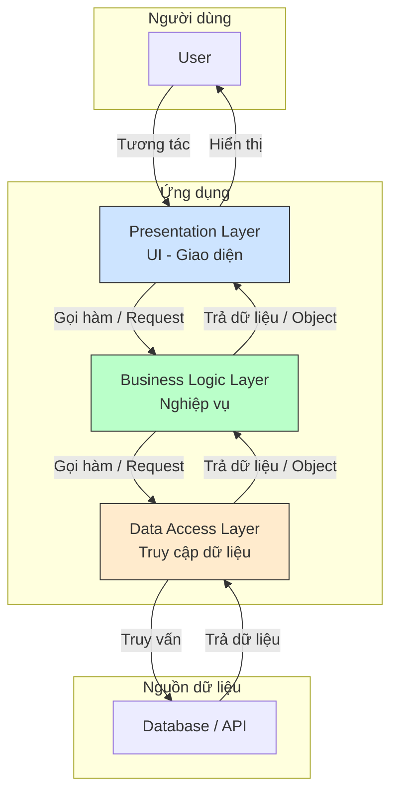
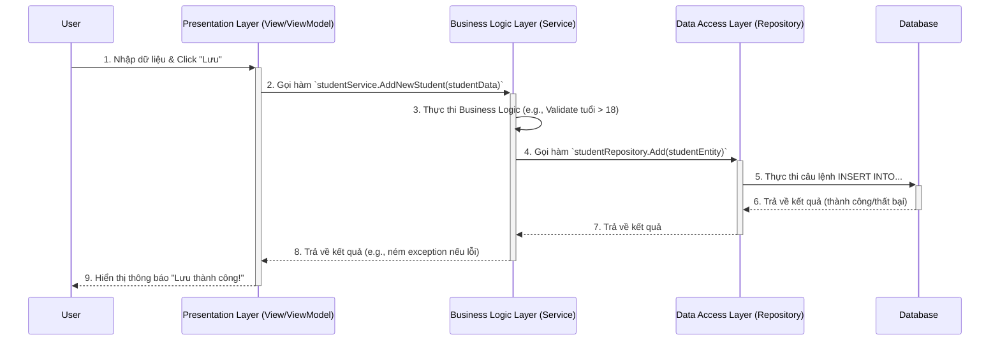
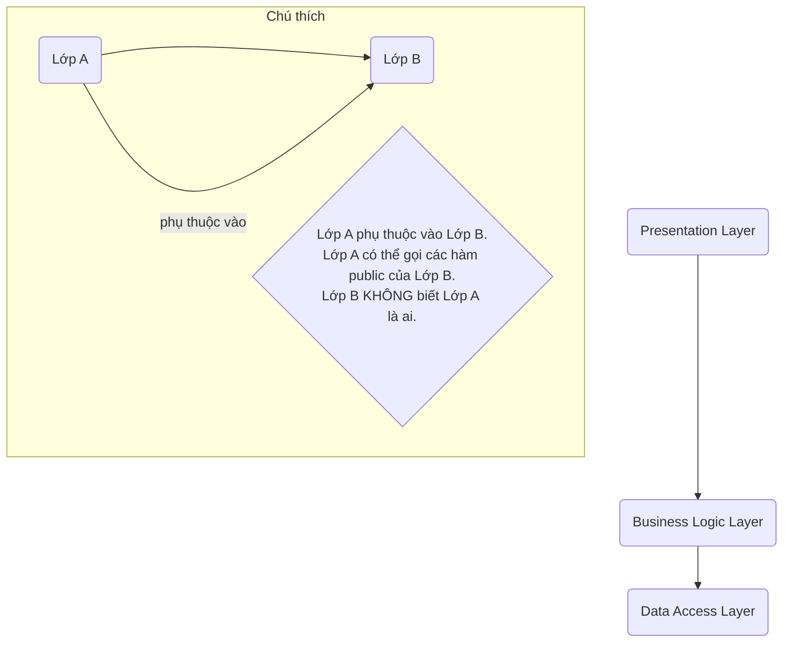
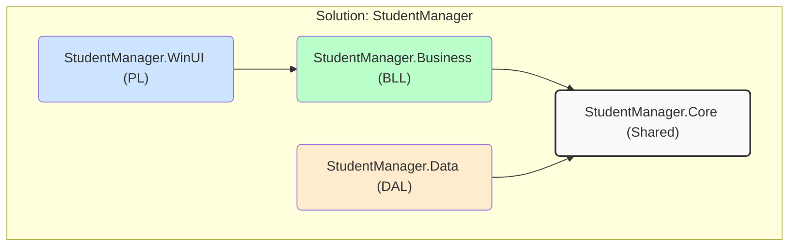

# TÀI LIỆU 3-LAYER ARCHITECTURE

# Mục lục

- [Phần 1: Tổng quan và Nguyên tắc cốt lõi (The "Why")](#phần-1-tổng-quan-và-nguyên-tắc-cốt-lõi-the-why)
  - [1.1. Vấn đề của các ứng dụng "nguyên khối" (Monolithic)](#11-vấn-đề-của-các-ứng-dụng-nguyên-khối-monolithic)
  - [1.2. Nguyên tắc nền tảng: Separation of Concerns (SoC)](#12-nguyên-tắc-nền-tảng-separation-of-concerns-soc)
  - [1.3. Kiến trúc 3 lớp là gì? (Tổng quan)](#13-kiến-trúc-3-lớp-là-gì-tổng-quan)

- [Phần 2: Phân tích chi tiết từng Layer (The "What")](#phần-2-phân-tích-chi-tiết-từng-layer-the-what)
  - [2.1. Presentation Layer (PL) - Lớp Giao diện](#21-presentation-layer-pl---lớp-giao-diện)
  - [2.2. Business Logic Layer (BLL) - Lớp Nghiệp vụ](#22-business-logic-layer-bll---lớp-nghiệp-vụ)
  - [2.3. Data Access Layer (DAL) - Lớp Truy cập Dữ liệu](#23-data-access-layer-dal---lớp-truy-cập-dữ-liệu)
  - [Bảng tóm tắt (Layer vs Concern vs Components)](#bảng-tóm-tắt-layer-vs-concern-vs-components)

- [Phần 3: Luồng dữ liệu và Quy tắc phụ thuộc (The "How")](#phần-3-luồng-dữ-liệu-và-quy-tắc-phụ-thuộc-the-how)
  - [3.1. Luồng dữ liệu: Một hành trình Request/Response](#31-luồng-dữ-liệu-một-hành-trình-requestresponse)
  - [3.2. The Dependency Rule: Quy tắc phụ thuộc một chiều](#32-the-dependency-rule-quy-tắc-phụ-thuộc-một-chiều)
  - [3.3. Các đối tượng truyền dữ liệu: Entities, Domain Models, và DTOs](#33-các-đối-tượng-truyền-dữ-liệu-entities-domain-models-và-dtos)

- [Case Study: Ứng dụng "Quản lý Sinh viên" với WinUI 3 và C#](#case-study-ứng-dụng-quản-lý-sinh-viên-với-winui-3-và-c)
  - [A. Cấu trúc Project trong Visual Studio](#a-cấu-trúc-project-trong-visual-studio)
  - [B. Triển khai Data Access Layer (DAL)](#b-triển-khai-data-access-layer-dal)
  - [C. Triển khai Business Logic Layer (BLL)](#c-triển-khai-business-logic-layer-bll)
  - [D. Triển khai Presentation Layer (PL) - MVVM](#d-triển-khai-presentation-layer-pl---mvvm)
    - [1. View (XAML)](#1-view-xaml)
    - [2. ViewModel (StudentListViewModel)](#2-viewmodel-studentlistviewmodel)
  - [E. Kết nối tất cả (Gluing it all together) - Dependency Injection (DI)](#e-kết-nối-tất-cả-gluing-it-all-together---dependency-injection-di)
  - [Tổng kết Case Study](#tổng-kết-case-study)

- [Phần 5: Ưu điểm, Nhược điểm và Các biến thể](#phần-5-ưu-điểm-nhược-điểm-và-các-biến-thể)
  - [5.1. Ưu điểm (Advantages)](#51-ưu-điểm-advantages)
  - [5.2. Nhược điểm (Disadvantages)](#52-nhược-điểm-disadvantages)
  - [5.3. Các biến thể và kiến trúc liên quan](#53-các-biến-thể-và-kiến-trúc-liên-quan)

- [Kết luận](#kết-luận)


# **Phần 1: Tổng quan và Nguyên tắc cốt lõi (The "Why")**.

---

### 1.1. Vấn đề của các ứng dụng "nguyên khối" (Monolithic)

Trước khi có các kiến trúc rõ ràng, hầu hết chúng ta (và cả ngành công nghiệp phần mềm) đều bắt đầu bằng cách xây dựng ứng dụng theo kiểu "nguyên khối". Hãy tưởng tượng một dự án WinUI 3 đơn giản bạn có thể đã từng làm:

Trong file code-behind của một cửa sổ (ví dụ MainWindow.xaml.cs), bạn viết một hàm xử lý sự kiện click chuột vào một nút "Lưu":

```csharp
// Ví dụ về code trong một ứng dụng Monolithic
private void SaveButton_Click(object sender, RoutedEventArgs e)
{
    // 1. Lấy dữ liệu trực tiếp từ các control trên UI
    string studentName = NameTextBox.Text;
    string studentEmail = EmailTextBox.Text;

    // 2. Kiểm tra logic nghiệp vụ ngay tại đây
    if (string.IsNullOrEmpty(studentName) || !studentEmail.Contains("@"))
    {
        // Hiển thị thông báo lỗi trên UI
        ErrorTextBlock.Text = "Tên và email không hợp lệ!";
        return;
    }

    // 3. Viết câu lệnh SQL và tương tác trực tiếp với database
    string connectionString = "Server=myServerAddress;Database=myDataBase;User Id=myUsername;Password=myPassword;";
    using (SqlConnection connection = new SqlConnection(connectionString))
    {
        string sql = "INSERT INTO Students (Name, Email) VALUES (@Name, @Email)";
        SqlCommand command = new SqlCommand(sql, connection);
        command.Parameters.AddWithValue("@Name", studentName);
        command.Parameters.AddWithValue("@Email", studentEmail);
        
        try
        {
            connection.Open();
            command.ExecuteNonQuery();
            // 4. Cập nhật lại UI sau khi thành công
            StatusTextBlock.Text = "Lưu sinh viên thành công!";
        }
        catch (Exception ex)
        {
            // Hiển thị lỗi trên UI
            ErrorTextBlock.Text = "Lỗi khi kết nối CSDL: " + ex.Message;
        }
    }
}
```

Nhìn qua thì đoạn code này chạy được, nhưng nó giống như một **căn bếp bừa bộn**: mọi thứ—dao thớt, gia vị, nồi niêu, nguyên liệu—đều bị vứt chung vào một chỗ. Khi ứng dụng lớn dần lên, cách tiếp cận này sẽ gây ra hàng loạt vấn đề nghiêm trọng:

- **Khó bảo trì (Hard to Maintain):** Logic giao diện (UI), logic nghiệp vụ (business rules), và logic truy cập dữ liệu (data access) bị trộn lẫn vào nhau. Một thay đổi nhỏ ở giao diện có thể vô tình làm hỏng logic nghiệp vụ hoặc cách truy vấn CSDL. Người ta gọi đây là **"spaghetti code"**.
- **Khó tái sử dụng (Hard to Reuse):** Giả sử bạn muốn thêm tính năng "Lưu sinh viên" từ một màn hình khác, hoặc từ một API. Bạn không thể tái sử dụng đoạn logic kiểm tra email hay logic lưu vào CSDL ở trên, vì nó bị "dính chặt" vào sự kiện `SaveButton_Click`.
- **Khó kiểm thử (Hard to Test):** Làm sao bạn có thể viết unit test cho logic "kiểm tra email hợp lệ" mà không cần phải tạo ra một giao diện người dùng, một `TextBox`, và một `TextBlock`? Gần như là không thể. Bạn phải test toàn bộ chức năng một cách thủ công.
- **Hạn chế về công nghệ (Technology Lock-in):** Vì mọi thứ dính chặt vào nhau, việc thay đổi một thành phần trở nên cực kỳ khó khăn. Ví dụ, bạn muốn đổi từ CSDL SQL Server sang SQLite? Bạn sẽ phải đi tìm và sửa lại MỌI nơi trong code có chứa chuỗi kết nối và câu lệnh SQL.

### 1.2. Nguyên tắc nền tảng: Separation of Concerns (SoC)

Để giải quyết mớ hỗn độn của ứng dụng nguyên khối, các kỹ sư phần mềm đã đưa ra một nguyên tắc thiết kế cốt lõi, một kim chỉ nam: **Separation of Concerns (SoC) - Phân tách các mối quan tâm**.

> Định nghĩa: SoC là nguyên tắc thiết kế phần mềm, chủ trương chia một chương trình máy tính thành các phần riêng biệt. Mỗi phần giải quyết một "mối quan tâm" (concern) riêng lẻ. Một "mối quan tâm" ở đây là một tập hợp các thông tin ảnh hưởng đến chương trình (ví dụ: logic hiển thị, logic nghiệp vụ, logic lưu trữ).
> 

**Phép loại suy (Analogy): Một nhà hàng chuyên nghiệp.**

Hãy so sánh SoC với cách một nhà hàng vận hành:

- **Người phục vụ (Waiter):** Mối quan tâm duy nhất của họ là tương tác với khách hàng, ghi nhận yêu cầu (order) và bưng món ăn ra. Họ không cần biết công thức nấu ăn hay nguyên liệu được lấy từ đâu.
- **Đầu bếp (Chef):** Mối quan tâm của họ là nhận yêu cầu từ phục vụ, áp dụng công thức (business rules) để chế biến món ăn. Họ không nói chuyện trực tiếp với khách hàng và cũng không tự đi vào kho lấy nguyên liệu.
- **Người quản lý kho (Stock Manager):** Mối quan tâm của họ là quản lý kho nguyên liệu (database), biết chính xác nguyên liệu nào ở đâu và làm thế nào để lấy ra một cách hiệu quả nhất khi đầu bếp yêu cầu.

Nếu một người phải làm cả 3 việc, nhà hàng đó sẽ cực kỳ hỗn loạn và không thể phát triển. Bằng cách **phân tách rõ ràng các mối quan tâm**, mỗi bộ phận có thể chuyên môn hóa, hoạt động độc lập và hiệu quả. Khi cần thay đổi công thức (business logic), chỉ có đầu bếp bị ảnh hưởng. Khi muốn thay đổi cách bài trí bàn ăn (UI), chỉ có khu vực phục vụ thay đổi.

**SoC chính là triết lý nền tảng để chống lại "spaghetti code".**

### 1.3. Kiến trúc 3 lớp là gì? Một cái nhìn tổng quan

**Kiến trúc 3 lớp (3-Layer Architecture)** chính là một trong những cách triển khai cụ thể và phổ biến nhất của nguyên tắc SoC. Nó chia ứng dụng thành 3 lớp (layer) logic chính:

1. **Presentation Layer (PL):** Lớp Trình bày/Giao diện.
    - **Mối quan tâm:** Hiển thị thông tin cho người dùng và tiếp nhận các tương tác từ họ (click, nhập liệu...).
    - **Tương đương trong nhà hàng:** Người phục vụ.
    - **Trong ứng dụng WinUI 3:** Đây là các cửa sổ XAML, các controls (Button, TextBox...), và code-behind xử lý các sự kiện UI cơ bản.
2. **Business Logic Layer (BLL):** Lớp Nghiệp vụ.
    - **Mối quan tâm:** Xử lý các quy tắc, tính toán, xác thực và quy trình nghiệp vụ cốt lõi của ứng dụng. Đây là "bộ não" của hệ thống.
    - **Tương đương trong nhà hàng:** Đầu bếp và các công thức nấu ăn.
    - **Trong ứng dụng WinUI 3/C#:** Đây thường là các class C# thuần túy (POCO - Plain Old C# Object), không chứa bất kỳ code nào liên quan đến UI hay CSDL. Ví dụ: `StudentService`, `ValidationRules`.
3. **Data Access Layer (DAL):** Lớp Truy cập Dữ liệu.
    - **Mối quan tâm:** Giao tiếp với nguồn lưu trữ dữ liệu (CSDL, file, API...). Nó chịu trách nhiệm đọc, ghi, cập nhật, xóa dữ liệu.
    - **Tương đương trong nhà hàng:** Người quản lý kho.
    - **Trong ứng dụng WinUI 3/C#:** Đây là các class chịu trách nhiệm thực thi các câu lệnh SQL, sử dụng một ORM như Entity Framework Core, hoặc gọi các API bên ngoài.

Sơ đồ trực quan về mối quan hệ giữa các lớp sẽ trông như sau:



**Quy tắc quan trọng nhất:** Luồng giao tiếp chỉ đi theo **một chiều**: PL -> BLL -> DAL. Lớp trên chỉ được "nói chuyện" với lớp ngay dưới nó.

---

# **Phần 2: Phân tích chi tiết từng Layer (The "What")**

Mỗi lớp có một ranh giới và trách nhiệm được xác định rõ ràng. Việc tuân thủ nghiêm ngặt các ranh giới này là chìa khóa để có một kiến trúc thành công.

### 2.1. Presentation Layer (PL) - Lớp Giao diện

Đây là lớp "bề mặt" của ứng dụng, là thứ duy nhất mà người dùng cuối nhìn thấy và tương tác.

- **Mối quan tâm chính (Core Concern):**
    - Hiển thị dữ liệu cho người dùng một cách trực quan.
    - Thu thập thông tin đầu vào từ người dùng (nhập liệu, click chuột, cử chỉ...).
    - Nó **KHÔNG** được chứa logic nghiệp vụ. Ví dụ: PL có thể kiểm tra xem `TextBox` có bị bỏ trống không (một validation ở mức UI), nhưng nó **KHÔNG** được quyết định xem email của sinh viên có hợp lệ theo quy tắc của nhà trường hay không (đó là logic nghiệp vụ).
- **Các thành phần tiêu biểu trong dự án WinUI 3/C#:**
    - **Views (Các file `.xaml`):** Đây là nơi bạn định nghĩa cấu trúc và giao diện của các cửa sổ, trang, và user controls. Bạn sử dụng các thẻ XAML như `<Window>`, `<Page>`, `<Button>`, `<TextBox>`, `<ListView>` để xây dựng "bộ xương" cho giao diện.
        
        ```xml
        <!-- Ví dụ: StudentView.xaml -->
        <StackPanel>
            <TextBox x:Name="NameTextBox" Header="Tên sinh viên"/>
            <TextBox x:Name="EmailTextBox" Header="Email"/>
            <Button Content="Lưu"/>
        </StackPanel>
        ```
        
    - **Code-Behind (Các file `.xaml.cs`):** Mỗi file XAML có một file code-behind tương ứng. Lý tưởng nhất, file này chỉ nên chứa code xử lý các vấn đề thuần túy của UI mà khó có thể làm bằng XAML, ví dụ như các hiệu ứng (animations) phức tạp hoặc xử lý sự kiện cho các control đặc thù. Trong kiến trúc hiện đại (sử dụng MVVM), chúng ta cố gắng giữ cho file này **trống rỗng nhất có thể**.
    - **ViewModels (Trong mô hình MVVM):** Đây là một khái niệm cực kỳ quan trọng trong các ứng dụng XAML (WPF, UWP, WinUI). ViewModel đóng vai trò là "bộ não" cho View. Nó chứa dữ liệu cần hiển thị (qua data binding) và các lệnh (Commands) để xử lý hành động của người dùng. View sẽ "nói chuyện" với ViewModel, và ViewModel sẽ gọi đến Business Logic Layer để thực hiện các tác vụ. Chúng ta sẽ đi sâu vào MVVM ở Phần 4.

### 2.2. Business Logic Layer (BLL) - Lớp Nghiệp vụ

Đây là "trái tim" và "bộ não" của ứng dụng. Nó thực thi các quy tắc, quy trình và logic cốt lõi quyết định cách ứng dụng hoạt động.

- **Mối quan tâm chính (Core Concern):**
    - Thực thi các quy tắc nghiệp vụ (business rules). Ví dụ: "Sinh viên phải đủ 18 tuổi", "Điểm trung bình phải nằm trong khoảng từ 0 đến 10".
    - Thực hiện các tính toán và xử lý dữ liệu. Ví dụ: Tính điểm trung bình tích lũy (GPA) cho sinh viên.
    - Điều phối các tác vụ, có thể liên quan đến việc gọi nhiều phương thức từ Data Access Layer. Ví dụ: quy trình "Thêm sinh viên mới" có thể bao gồm các bước: kiểm tra email tồn tại, tạo mã sinh viên, sau đó mới lưu vào CSDL.
    - Lớp này **hoàn toàn độc lập** với giao diện (PL) và cách lưu trữ dữ liệu (DAL). Nó không "biết" đến sự tồn tại của `Button` hay `TextBox`. Nó cũng không "biết" dữ liệu được lưu trong SQL Server hay file JSON. Nó chỉ làm việc với các đối tượng C# thuần túy.
- **Các thành phần tiêu biểu trong dự án C#:**
    - **Services:** Đây là cách tổ chức BLL phổ biến nhất. Mỗi `Service` class sẽ nhóm các hoạt động liên quan đến một thực thể hoặc một quy trình nghiệp vụ.
        
        ```csharp
        // Ví dụ: IStudentService.cs (Interface định nghĩa các chức năng)
        public interface IStudentService
        {
            List<Student> GetAllStudents();
            void AddNewStudent(Student student);
        }
        
        // Ví dụ: StudentService.cs (Class triển khai logic)
        public class StudentService : IStudentService
        {
            // (Service này sẽ phụ thuộc vào DAL, chúng ta sẽ tìm hiểu ở Phần 3)
        
            public void AddNewStudent(Student student)
            {
                // 1. Business Validation
                if (student.Age < 18)
                {
                    throw new Exception("Sinh viên phải đủ 18 tuổi.");
                }
                // (logic kiểm tra email, etc...)
        
                // 2. Call Data Access Layer to save
                // _studentRepository.Add(student);
            }
            // ... các phương thức khác
        }
        ```
        
    - **Business Objects / Domain Models:** Là các lớp C# thuần túy (POCO - Plain Old C# Object) đại diện cho các khái niệm cốt lõi của ứng dụng. Ví dụ: `Student`, `Course`, `Grade`. Chúng không có bất kỳ sự phụ thuộc nào vào các framework bên ngoài.

### 2.3. Data Access Layer (DAL) - Lớp Truy cập Dữ liệu

Lớp này là cầu nối duy nhất giữa ứng dụng và nguồn lưu trữ dữ liệu.

- **Mối quan tâm chính (Core Concern):**
    - Trừu tượng hóa việc lưu trữ và truy xuất dữ liệu. BLL không cần quan tâm dữ liệu đến từ đâu (SQL Server, SQLite, file XML, một Web API...).
    - Thực hiện các thao tác CRUD (Create, Read, Update, Delete) trên nguồn dữ liệu.
    - Nó **KHÔNG** được chứa bất kỳ logic nghiệp vụ nào. Ví dụ: DAL chỉ có nhiệm vụ lưu đối tượng `Student` vào database, nó không chịu trách nhiệm kiểm tra tuổi của sinh viên đó có hợp lệ hay không.
- **Các thành phần tiêu biểu trong dự án C#:**
    - **Repositories:** Đây là một Design Pattern cực kỳ phổ biến cho DAL. Mỗi `Repository` quản lý việc truy xuất dữ liệu cho một loại đối tượng (ví dụ `StudentRepository`). Nó cung cấp một giao diện giống như một bộ sưu tập trong bộ nhớ.
        
        ```csharp
        // Ví dụ: IStudentRepository.cs (Interface)
        public interface IStudentRepository
        {
            Student GetById(int id);
            IEnumerable<Student> GetAll();
            void Add(Student student);
            void Update(Student student);
            void Delete(int id);
        }
        
        // Ví dụ: StudentRepository.cs (Triển khai cụ thể dùng EF Core)
        public class StudentRepository : IStudentRepository
        {
            private readonly MyDbContext _context; // Đây là DbContext của Entity Framework Core
        
            public StudentRepository(MyDbContext context)
            {
                _context = context;
            }
        
            public void Add(Student student)
            {
                _context.Students.Add(student);
                _context.SaveChanges();
            }
            // ... triển khai các phương thức khác
        }
        
        ```
        
    - **ORM (Object-Relational Mapper):** Công cụ như **Entity Framework Core (EF Core)** là trái tim của DAL trong các ứng dụng .NET hiện đại. Nó giúp bạn ánh xạ các C# class (như `Student`) thành các bảng trong CSDL và cho phép bạn truy vấn CSDL bằng C# (LINQ) thay vì viết các chuỗi SQL thủ công.

### Bảng tóm tắt

| Layer | Mối quan tâm chính (Core Concern) | Thành phần tiêu biểu (WinUI 3/C#) | Phép loại suy (Analogy) |
| --- | --- | --- | --- |
| **Presentation (PL)** | Hiển thị dữ liệu và nhận tương tác người dùng. | Views (`.xaml`), Code-Behind (`.xaml.cs`), ViewModels (MVVM) | **Người phục vụ** |
| **Business Logic (BLL)** | Thực thi các quy tắc, tính toán, quy trình nghiệp vụ. | Services, Business/Domain Objects (POCOs) | **Đầu bếp** |
| **Data Access (DAL)** | Giao tiếp với nguồn lưu trữ dữ liệu (CRUD). | Repositories, ORM (Entity Framework Core), `DbContext` | **Người quản lý kho** |

---

# **Phần 3: Luồng dữ liệu và Quy tắc phụ thuộc (The "How")**

### 3.1. Luồng dữ liệu: Một hành trình Request/Response

Hãy hình dung một kịch bản phổ biến: người dùng nhập thông tin sinh viên mới và nhấn nút "Lưu". Dữ liệu sẽ bắt đầu một cuộc hành trình đi qua các lớp.

**Phép loại suy (Analogy): Quy trình trong nhà hàng**

1. **Khách hàng (User)** gọi món.
2. **Người phục vụ (PL)** ghi lại yêu cầu vào một phiếu order.
3. **Người phục vụ (PL)** chuyển phiếu order cho **Đầu bếp (BLL)**.
4. **Đầu bếp (BLL)** đọc phiếu order, kiểm tra xem nhà hàng có đủ nguyên liệu không (logic nghiệp vụ), và bắt đầu chế biến theo công thức.
5. Để có nguyên liệu, **Đầu bếp (BLL)** yêu cầu **Người quản lý kho (DAL)** lấy nguyên liệu từ kho.
6. **Người quản lý kho (DAL)** vào kho (Database), lấy đúng nguyên liệu và đưa cho đầu bếp.
7. **Đầu bếp (BLL)** nấu xong món ăn, đưa lại cho **Người phục vụ (PL)**.
8. **Người phục vụ (PL)** bưng món ăn ra cho **Khách hàng (User)**.

Đây là một luồng đi xuống (request) và đi lên (response) rất rõ ràng. Trong ứng dụng của chúng ta, nó diễn ra như sau:



**Điểm mấu chốt:**

- **Request (Yêu cầu):** Luồng đi từ trên xuống: `PL -> BLL -> DAL`.
- **Response (Phản hồi):** Luồng đi ngược từ dưới lên: `DAL -> BLL -> PL`.
- Mỗi lớp chỉ "nói chuyện" với lớp liền kề nó. PL không bao giờ được phép gọi trực tiếp DAL.

### 3.2. The Dependency Rule: Quy tắc phụ thuộc một chiều

Đây là quy tắc **bất di bất dịch** và là nền tảng của kiến trúc này.

> Quy tắc: Các phụ thuộc trong mã nguồn chỉ được phép trỏ vào trong (từ lớp trên xuống lớp dưới). Lớp dưới KHÔNG được biết bất cứ điều gì về lớp trên nó.
> 



**Điều này được thực thi như thế nào trong Visual Studio?**

Khi bạn cấu trúc dự án (chúng ta sẽ làm điều này ở Phần 4), bạn sẽ tạo các project riêng biệt cho mỗi lớp (ví dụ: `StudentManager.UI`, `StudentManager.Business`, `StudentManager.Data`). Bạn sẽ thiết lập các **Project References** như sau:

- Project `StudentManager.UI` sẽ có một reference đến `StudentManager.Business`.
- Project `StudentManager.Business` sẽ có một reference đến `StudentManager.Data`.
- Project `StudentManager.Data` sẽ **KHÔNG** có bất kỳ reference nào đến 2 project kia.

Nếu bạn cố gắng `using StudentManager.UI;` bên trong một file của BLL, Visual Studio sẽ báo lỗi ngay lập tức. Đây là cách chúng ta dùng công cụ để ép buộc tuân thủ kiến trúc.

**Tại sao quy tắc này lại quan trọng đến vậy?**

- **Tính thay thế (Replaceability):** Bạn có thể thay thế hoàn toàn DAL mà không ảnh hưởng đến BLL và PL. Ví dụ, ban đầu bạn dùng EF Core để làm việc với SQL Server. Sau này, bạn muốn chuyển sang dùng một Web API để lấy dữ liệu. Bạn chỉ cần viết một DAL mới implement cùng các interface mà BLL đang dùng, sau đó "cắm" nó vào. BLL và PL không cần thay đổi một dòng code nào.
- **Tính tái sử dụng (Reusability):** Vì BLL không biết gì về UI, bạn có thể tái sử dụng toàn bộ logic nghiệp vụ này cho các giao diện khác nhau. Hôm nay là ứng dụng WinUI, ngày mai bạn có thể tạo một dự án Web API (ví dụ: [ASP.NET](http://asp.net/) Core) và cũng gọi đến BLL này để phục vụ cho ứng dụng web hoặc mobile.
- **Tính kiểm thử (Testability):** Bạn có thể kiểm thử BLL một cách độc lập mà không cần đến UI hay một CSDL thực sự. Bạn có thể tạo một "DAL giả" (mock object) để cung cấp dữ liệu giả cho BLL trong quá trình unit test.

### 3.3. Các đối tượng truyền dữ liệu: Entities, Domain Models, và DTOs

Một câu hỏi quan trọng là: "Dữ liệu được chứa trong cái gì khi nó di chuyển giữa các lớp?". Chúng ta không thể chỉ truyền các chuỗi và số nguyên một cách riêng lẻ. Chúng ta cần các đối tượng để đóng gói dữ liệu. Tuy nhiên, việc dùng **CHUNG MỘT** class (ví dụ `Student`) cho cả 3 lớp thường là một ý tưởng tồi, vì mỗi lớp có những "mối quan tâm" khác nhau đối với dữ liệu.

Do đó, chúng ta thường phân biệt 3 loại đối tượng:

1. **Entity:**
    - **Nơi ở:** Data Access Layer (DAL).
    - **Mục đích:** Đại diện cho cấu trúc của một bảng trong CSDL. Các thuộc tính của nó thường ánh xạ 1-1 với các cột của bảng. Nó có thể chứa các annotation của ORM (ví dụ: `[Key]`, `[TableName]`).
    - **Ví dụ:**
        
        ```csharp
        // Trong project DAL
        public class StudentEntity
        {
            public int Id { get; set; } // Primary Key
            public string FirstName { get; set; }
            public string LastName { get; set; }
            public DateTime DateOfBirth { get; set; }
        }
        ```
        
2. **Domain Model / Business Object:**
    - **Nơi ở:** Business Logic Layer (BLL).
    - **Mục đích:** Đại diện cho một khái niệm trong thế giới thực của bài toán. Đây là đối tượng "thuần túy" nhất, chứa cả dữ liệu và các hành vi (phương thức) liên quan đến nghiệp vụ. Nó không chứa bất kỳ chi tiết nào về CSDL hay UI.
    - **Ví dụ:**
        
        ```csharp
        // Trong project BLL
        public class Student
        {
            public int Id { get; private set; }
            public string FirstName { get; private set; }
            public string LastName { get; private set; }
            public DateTime DateOfBirth { get; private set; }
        
            public int Age => DateTime.Now.Year - DateOfBirth.Year; // Logic nghiệp vụ
        
            public string GetFullName() // Hành vi nghiệp vụ
            {
                return $"{FirstName} {LastName}";
            }
        }
        ```
        
3. **DTO (Data Transfer Object) / ViewModel:**
    - **Nơi ở:** Thường được định nghĩa ở BLL (để trả về cho PL) hoặc chính PL.
    - **Mục đích:** Là một "thùng chứa" dữ liệu đơn giản, được "cắt tỉa" đặc biệt để phục vụ cho một View cụ thể. Nó không chứa logic nghiệp vụ. Mục đích của nó là giảm thiểu việc truyền dữ liệu không cần thiết và định hình dữ liệu sao cho View dễ dàng sử dụng nhất.
    - **Ví dụ:**
        
        ```csharp
        // Dùng cho màn hình danh sách sinh viên
        public class StudentListItemViewModel
        {
            public int Id { get; set; }
            public string FullName { get; set; } // Dữ liệu đã được định dạng sẵn
            public int Age { get; set; }
        }
        
        ```
        

**Luồng Mapping dữ liệu:**
Khi dữ liệu di chuyển, nó sẽ được "biến hình" (mapping) từ loại này sang loại khác ở ranh giới các lớp:

`DAL (Repository)` lấy `StudentEntity` từ CSDL -> Map thành `Student` (Domain Model) -> Trả về cho `BLL (Service)`.
`BLL (Service)` xử lý `Student` (Domain Model) -> Map thành `StudentListItemViewModel` (DTO/ViewModel) -> Trả về cho `PL (ViewModel)`.

Việc mapping này có thể được làm thủ công hoặc dùng các thư viện như **AutoMapper** để tự động hóa.

---

# **Case Study: Ứng dụng "Quản lý Sinh viên" với WinUI 3 và C#**

### A. Cấu trúc Project trong Visual Studio

Bước đầu tiên và quan trọng nhất là tạo ra một cấu trúc project phản ánh đúng kiến trúc 3 lớp. Việc chia thành các project riêng biệt không chỉ để cho đẹp, mà nó chính là cách chúng ta **dùng công cụ để ép buộc tuân thủ Quy tắc Phụ thuộc (Dependency Rule)**.

Trong Visual Studio, chúng ta sẽ tạo một Solution và bao gồm các project sau:

1. **`StudentManager.Core` (Class Library):**
    - **Mục đích:** Đây là project "lõi". Nó sẽ chứa những thứ cần được chia sẻ giữa các project khác mà không tạo ra phụ thuộc vòng tròn. Nó sẽ chứa các Domain Model (ví dụ: class `Student`) và các Interfaces của Repository (ví dụ: `IStudentRepository`).
    - **Phụ thuộc:** Không phụ thuộc vào bất kỳ project nào khác trong solution. Đây là project độc lập nhất.
2. **`StudentManager.Data` (Class Library):**
    - **Mục đích:** Triển khai **Data Access Layer (DAL)**. Chứa các class triển khai Repository (`StudentRepository`), DbContext của Entity Framework.
    - **Phụ thuộc:** Sẽ reference đến `StudentManager.Core`.
3. **`StudentManager.Business` (Class Library):**
    - **Mục đích:** Triển khai **Business Logic Layer (BLL)**. Chứa các class Service (`StudentService`).
    - **Phụ thuộc:** Sẽ reference đến `StudentManager.Core`.
4. **`StudentManager.WinUI` (Blank App, Packaged (WinUI 3 in Desktop)):**
    - **Mục đích:** Triển khai **Presentation Layer (PL)**. Chứa các View (XAML), ViewModel.
    - **Phụ thuộc:** Sẽ reference đến `StudentManager.Business` và `StudentManager.Core`.

Sơ đồ phụ thuộc giữa các project sẽ trông như thế này:



*Lưu ý: BLL không reference trực tiếp đến DAL. Chúng ta sẽ kết nối chúng lại với nhau bằng Dependency Injection ở bước E.*

---

### B. Triển khai Data Access Layer (DAL) - Project `StudentManager.Data`

Chúng ta sẽ dùng **Entity Framework Core (EF Core)** làm ORM.

1. **Định nghĩa Entity (`StudentEntity.cs` trong `StudentManager.Data`):**
Đây là class đại diện cho bảng `Students` trong CSDL.
    
    ```csharp
    // StudentManager.Data/Entities/StudentEntity.cs
    public class StudentEntity
    {
        public int Id { get; set; } // Primary Key
        public string FirstName { get; set; }
        public string LastName { get; set; }
        public DateTime DateOfBirth { get; set; }
    }
    ```
    
2. **Định nghĩa DbContext (`StudentDbContext.cs` trong `StudentManager.Data`):**
Đây là "cầu nối" đến CSDL.
    
    ```csharp
    // StudentManager.Data/StudentDbContext.cs
    using Microsoft.EntityFrameworkCore;
    using StudentManager.Data.Entities;
    
    public class StudentDbContext : DbContext
    {
        public DbSet<StudentEntity> Students { get; set; }
    
        protected override void OnConfiguring(DbContextOptionsBuilder optionsBuilder)
        {
            // Cấu hình sử dụng CSDL SQLite cho đơn giản
            optionsBuilder.UseSqlite("Data Source=students.db");
        }
    }
    ```
    
3. **Định nghĩa Interface Repository (`IStudentRepository.cs` trong `StudentManager.Core`):**
Interface này thuộc về Core vì BLL cần "biết" về nó để sử dụng.
    
    ```csharp
    // StudentManager.Core/Interfaces/IStudentRepository.cs
    using StudentManager.Core.Models; // Sẽ tạo class Student ở bước C
    
    public interface IStudentRepository
    {
        IEnumerable<Student> GetAll();
        void Add(Student student);
    }
    ```
    
4. **Triển khai Repository (`StudentRepository.cs` trong `StudentManager.Data`):**
Class này triển khai interface trên và thực sự làm việc với EF Core.
    
    ```csharp
    // StudentManager.Data/Repositories/StudentRepository.cs
    using StudentManager.Core.Interfaces;
    using StudentManager.Core.Models;
    using StudentManager.Data.Entities; // Cần entity để làm việc với DB
    
    public class StudentRepository : IStudentRepository
    {
        public void Add(Student student)
        {
            using var context = new StudentDbContext();
            // Mapping từ Domain Model -> Entity
            var studentEntity = new StudentEntity
            {
                FirstName = student.FirstName,
                LastName = student.LastName,
                DateOfBirth = student.DateOfBirth
            };
            context.Students.Add(studentEntity);
            context.SaveChanges();
        }
    
        public IEnumerable<Student> GetAll()
        {
            using var context = new StudentDbContext();
            // Mapping từ Entity -> Domain Model
            return context.Students.Select(e => new Student(e.Id, e.FirstName, e.LastName, e.DateOfBirth)).ToList();
        }
    }
    
    ```
    

---

### C. Triển khai Business Logic Layer (BLL) - Project `StudentManager.Business`

1. **Định nghĩa Domain Model (`Student.cs` trong `StudentManager.Core`):**
Đây là đối tượng nghiệp vụ thuần túy.
    
    ```csharp
    // StudentManager.Core/Models/Student.cs
    public class Student
    {
        public int Id { get; }
        public string FirstName { get; }
        public string LastName { get; }
        public DateTime DateOfBirth { get; }
    
        // Constructor
        public Student(int id, string firstName, string lastName, DateTime dateOfBirth)
        {
            Id = id;
            FirstName = firstName;
            LastName = lastName;
            DateOfBirth = dateOfBirth;
        }
    
        // Logic nghiệp vụ bên trong model
        public string FullName => $"{FirstName} {LastName}";
        public int Age => DateTime.Now.Year - DateOfBirth.Year;
    }
    ```
    
2. **Triển khai Service (`StudentService.cs` trong `StudentManager.Business`):**
Đây là "bộ não" điều phối. Nó sử dụng `IStudentRepository` mà không cần biết ai triển khai nó.
    
    ```csharp
    // StudentManager.Business/StudentService.cs
    using StudentManager.Core.Interfaces;
    using StudentManager.Core.Models;
    
    public class StudentService
    {
        private readonly IStudentRepository _studentRepository;
    
        // Nhận dependency qua constructor (Dependency Injection)
        public StudentService(IStudentRepository studentRepository)
        {
            _studentRepository = studentRepository;
        }
    
        public IEnumerable<Student> GetAllStudents()
        {
            return _studentRepository.GetAll();
        }
    
        public void AddNewStudent(string firstName, string lastName, DateTime dateOfBirth)
        {
            // **Đây là Business Logic**
            if (string.IsNullOrWhiteSpace(firstName) || string.IsNullOrWhiteSpace(lastName))
            {
                throw new ArgumentException("Tên không được để trống.");
            }
    
            var newStudent = new Student(0, firstName, lastName, dateOfBirth); // Id = 0 vì DB sẽ tự gán
            _studentRepository.Add(newStudent);
        }
    }
    
    ```
    

---

### D. Triển khai Presentation Layer (PL) - Project `StudentManager.WinUI`

Chúng ta sẽ sử dụng mô hình **MVVM (Model-View-ViewModel)**.

1. **View (`StudentListPage.xaml`):**
Giao diện chỉ chứa các control XAML và thực hiện binding dữ liệu tới ViewModel.
    
    ```xml
    <!-- StudentManager.WinUI/StudentListPage.xaml -->
    <Page ...>
        <StackPanel Margin="20">
            <ListView ItemsSource="{x:Bind ViewModel.Students}">
                <ListView.ItemTemplate>
                    <DataTemplate>
                        <StackPanel Orientation="Horizontal">
                            <TextBlock Text="{Binding FullName}"/>
                            <TextBlock Text=" - Tuổi: "/>
                            <TextBlock Text="{Binding Age}"/>
                        </StackPanel>
                    </DataTemplate>
                </ListView.ItemTemplate>
            </ListView>
            <Button Content="Load Students" Command="{x:Bind ViewModel.LoadStudentsCommand}"/>
        </StackPanel>
    </Page>
    ```
    
2. **ViewModel (`StudentListViewModel.cs`):**
"Bộ não" của View. Nó gọi đến BLL để lấy dữ liệu và chuẩn bị dữ liệu cho View hiển thị.
    
    ```csharp
    // StudentManager.WinUI/ViewModels/StudentListViewModel.cs
    using CommunityToolkit.Mvvm.ComponentModel; // Cần cài nuget CommunityToolkit.Mvvm
    using CommunityToolkit.Mvvm.Input;
    using StudentManager.Business;
    using StudentManager.Core.Models;
    using System.Collections.ObjectModel;
    using System.Threading.Tasks;
    
    public partial class StudentListViewModel : ObservableObject
    {
        private readonly StudentService _studentService;
    
        [ObservableProperty] // Tự động tạo property Students và INotifyPropertyChanged
        private ObservableCollection<Student> _students;
    
        public StudentListViewModel(StudentService studentService)
        {
            _studentService = studentService;
            Students = new ObservableCollection<Student>();
        }
    
        [RelayCommand] // Tự động tạo ICommand tên là LoadStudentsCommand
        private async Task LoadStudents()
        {
            var studentList = _studentService.GetAllStudents();
            Students.Clear();
            foreach (var student in studentList)
            {
                Students.Add(student);
            }
        }
    }
    ```
    

---

### E. Kết nối tất cả (Gluing it all together) - Dependency Injection (DI)

Câu hỏi cuối cùng: Làm sao `StudentListViewModel` nhận được một `StudentService`, và làm sao `StudentService` nhận được một `StudentRepository`? Chúng ta sẽ không dùng từ khóa `new`. Thay vào đó, chúng ta dùng một **DI Container**.

Trong file `App.xaml.cs` của project WinUI, chúng ta sẽ cấu hình các "dịch vụ" này.

1. **Cài đặt Nuget Package:**
Trong project `StudentManager.WinUI`, cài đặt `Microsoft.Extensions.DependencyInjection`.
2. **Cấu hình trong `App.xaml.cs`:**
    
    ```csharp
    // StudentManager.WinUI/App.xaml.cs
    using Microsoft.Extensions.DependencyInjection;
    using Microsoft.UI.Xaml;
    using StudentManager.Business;
    using StudentManager.Core.Interfaces;
    using StudentManager.Data.Repositories;
    using StudentManager.WinUI.ViewModels;
    
    public partial class App : Application
    {
        public static Window MainWindow { get; private set; }
        public IServiceProvider Services { get; }
    
        public App()
        {
            Services = ConfigureServices();
            this.InitializeComponent();
        }
    
        private static IServiceProvider ConfigureServices()
        {
            var services = new ServiceCollection();
    
            // Đăng ký các lớp từ các Layer
            // Khi ai đó yêu cầu IStudentRepository, hãy cung cấp một StudentRepository
            services.AddSingleton<IStudentRepository, StudentRepository>();
    
            // Khi ai đó yêu cầu StudentService, hãy tạo một instance mới
            services.AddTransient<StudentService>();
    
            // Đăng ký ViewModel
            services.AddTransient<StudentListViewModel>();
    
            return services.BuildServiceProvider();
        }
    
        protected override void OnLaunched(LaunchActivatedEventArgs args)
        {
            MainWindow = new MainWindow();
            // Lấy trang đầu tiên từ DI container và hiển thị nó
            MainWindow.Content = new StudentListPage(Services.GetRequiredService<StudentListViewModel>());
            MainWindow.Activate();
        }
    }
    ```
    
    *Lưu ý: Code khởi tạo trang trong `OnLaunched` cần được điều chỉnh cho phù hợp với cách bạn điều hướng trang trong ứng dụng WinUI 3 thực tế.*
    

---

**Tổng kết Case Study:**

Chúng ta đã xây dựng thành công một ứng dụng nhỏ theo kiến trúc 3 lớp:

- **DAL (`StudentManager.Data`)** chỉ biết cách nói chuyện với CSDL thông qua EF Core.
- **BLL (`StudentManager.Business`)** chứa logic nghiệp vụ và chỉ phụ thuộc vào các interface, không biết gì về CSDL hay UI.
- **PL (`StudentManager.WinUI`)** chỉ tập trung vào việc hiển thị, sử dụng MVVM và nói chuyện với BLL.
- **DI Container** đóng vai trò là "người ghép nối", tự động cung cấp các dependency cần thiết cho mỗi lớp mà không tạo ra sự phụ thuộc cứng.

Đây là nền tảng cực kỳ vững chắc. Từ đây, bạn có thể dễ dàng thay đổi CSDL, tái sử dụng BLL cho một dự án web, và kiểm thử từng phần một cách độc lập.

---

# **Phần 5: Ưu điểm, Nhược điểm và Các biến thể**

### 5.1. Ưu điểm (Advantages)

Những lợi ích này chủ yếu đến từ nguyên tắc cốt lõi **Separation of Concerns (SoC)** mà chúng ta đã thảo luận.

1. **Dễ bảo trì và sửa đổi (Maintainability & Modifiability):**
    - **Tại sao?** Vì các lớp được tách biệt, một thay đổi trong một lớp ít có khả năng ảnh hưởng đến các lớp khác. Bạn muốn thay đổi giao diện từ WinUI sang web? Chỉ cần viết lại Presentation Layer. Bạn muốn đổi CSDL từ SQLite sang SQL Server? Chỉ cần viết lại Data Access Layer. Việc sửa lỗi cũng dễ dàng hơn vì bạn có thể khoanh vùng vấn đề trong một layer cụ thể.
    - **Phép loại suy:** Giống như sửa một chiếc xe hơi hiện đại. Nếu hỏng phanh, bạn chỉ cần đến khu vực hệ thống phanh để sửa, không cần phải tháo dỡ toàn bộ động cơ.
2. **Tăng khả năng tái sử dụng (Reusability):**
    - **Tại sao?** Business Logic Layer (BLL) là tài sản quý giá nhất. Vì nó không phụ thuộc vào UI hay CSDL, bạn có thể tái sử dụng toàn bộ BLL cho nhiều ứng dụng khác nhau. Ví dụ, `StudentService` của chúng ta có thể được sử dụng bởi:
        - Ứng dụng desktop WinUI (như case study).
        - Một trang web [ASP.NET](http://asp.net/) Core.
        - Một ứng dụng console để chạy các tác vụ hàng loạt.
        - Một Web API để cung cấp dữ liệu cho ứng dụng di động.
3. **Tăng khả năng kiểm thử (Testability):**
    - **Tại sao?** Bạn có thể viết các bài kiểm thử đơn vị (unit test) cho BLL và DAL một cách độc lập. Để test `StudentService`, bạn không cần một CSDL thực sự. Bạn có thể tạo một `MockStudentRepository` (một repository giả) trả về dữ liệu cứng để kiểm tra xem logic nghiệp vụ của bạn có chạy đúng hay không. Điều này làm cho việc phát hiện lỗi sớm trở nên dễ dàng và đáng tin cậy.
4. **Phát triển song song (Parallel Development):**
    - **Tại sao?** Sau khi các `interface` (hợp đồng) giữa các lớp được định nghĩa rõ ràng (ví dụ: `IStudentRepository`), các nhóm khác nhau có thể làm việc song song. Team front-end có thể xây dựng UI dựa trên các interface giả, trong khi team back-end triển khai BLL và team database làm việc với DAL. Điều này giúp đẩy nhanh tiến độ dự án.
5. **Đơn giản và dễ học (Relatively Simple):**
    - **Tại sao?** So với các kiến trúc phức tạp hơn như Clean Architecture hay Microservices, kiến trúc 3 lớp có khái niệm rõ ràng, tuyến tính và dễ nắm bắt. Nó là một bước khởi đầu tuyệt vời để làm quen với tư duy thiết kế theo lớp.

### 5.2. Nhược điểm (Disadvantages)

Không có kiến trúc nào là viên đạn bạc. Kiến trúc 3 lớp cũng có những hạn chế.

1. **Phức tạp không cần thiết cho các dự án nhỏ (Over-engineering):**
    - **Tại sao?** Đối với một ứng dụng rất nhỏ, ví dụ một công cụ chỉ có một màn hình và vài chức năng đơn giản, việc tạo ra 3-4 project, định nghĩa interfaces, DTOs... có thể là quá cồng kềnh và tốn thời gian. Trong trường hợp này, một cấu trúc đơn giản hơn có thể hiệu quả hơn.
    - **Phép loại suy:** Giống như dùng một dàn máy công nghiệp chỉ để nướng một lát bánh mì.
2. **Phát sinh nhiều mã "lót đường" (Boilerplate Code):**
    - **Tại sao?** Đối với các chức năng CRUD (Create, Read, Update, Delete) đơn giản, dữ liệu đôi khi chỉ đi thẳng từ PL qua BLL xuống DAL mà không có logic nghiệp vụ nào ở giữa. Trong những trường hợp này, việc phải tạo các phương thức trong cả 3 lớp và mapping dữ liệu giữa chúng có thể cảm thấy dư thừa.
3. **BLL có nguy cơ trở thành một "God Object":**
    - **Tại sao?** Nếu không được thiết kế cẩn thận, BLL có thể trở nên quá lớn và ôm đồm quá nhiều trách nhiệm, trở thành một lớp nguyên khối mới ở giữa ứng dụng. Điều này làm giảm các lợi ích về bảo trì.

### 5.3. Các biến thể và kiến trúc liên quan

Kiến trúc 3 lớp là nền tảng cho nhiều ý tưởng kiến trúc khác.

1. **Kiến trúc N-Tier (N-Tier Architecture):**
    - Đây là khái niệm thường bị nhầm lẫn với N-Layer.
    - **Layer (Lớp):** Là sự phân chia **logic** trong mã nguồn. Một ứng dụng 3 lớp có thể chạy hoàn toàn trên một máy tính duy nhất.
    - **Tier (Tầng):** Là sự phân chia **vật lý** trên các máy chủ khác nhau.
    - Một ứng dụng web 3-tier điển hình có thể là:
        - **Presentation Tier:** Trình duyệt web của người dùng.
        - **Application Tier:** Máy chủ web chạy code PL ([ASP.NET](http://asp.net/)) và BLL.
        - **Data Tier:** Máy chủ CSDL (SQL Server).
    - Kiến trúc 3-layer có thể được triển khai thành kiến trúc 3-tier.
    
    ```mermaid
    graph TD
        subgraph Tier 1: Client Machine
            Browser(Web Browser - PL)
        end
        subgraph Tier 2: Application Server
            WebServer(Web Server - BLL)
        end
        subgraph Tier 3: Database Server
            DBServer(Database - DAL's Target)
        end
        Browser -- HTTP Request --> WebServer
        WebServer -- DB Connection --> DBServer
    
    ```
    
2. **Clean Architecture / Onion Architecture:**
    - Đây là sự tiến hóa của kiến trúc 3 lớp, giải quyết một số nhược điểm của nó, đặc biệt là quy tắc phụ thuộc.
    - **Nguyên tắc cốt lõi:** **Dependency Inversion Principle**. Thay vì các lớp trên phụ thuộc vào lớp dưới (`PL -> BLL -> DAL`), tất cả các lớp sẽ phụ thuộc vào một "lõi" (core) trung tâm.
    - **Cấu trúc:** Giống như một củ hành tây (onion), với các lớp bao bọc lẫn nhau.
        - **Lõi (Core):** Chứa các `Entities` (Domain Models) và `Use Cases` (tương tự BLL interfaces). Lớp này **không phụ thuộc vào bất cứ thứ gì**.
        - **Lớp ngoài:** Chứa các triển khai cụ thể như Database (DAL), UI (PL), Web Frameworks.
    - **Quy tắc phụ thuộc:** Mọi sự phụ thuộc đều hướng **vào trong**. Lớp Database sẽ phụ thuộc vào interface Repository được định nghĩa ở lõi, chứ không phải ngược lại.
    
    ```mermaid
    graph TD
        subgraph "Frameworks & Drivers (Outer Layer)"
            UI
            Database
            API
        end
        subgraph "Interface Adapters"
            Controllers
            Presenters
            Gateways(DAL Implementation)
        end
        subgraph "Use Cases (Application Business Rules)"
            Interactors(BLL Implementation)
        end
        subgraph "Entities (Enterprise Business Rules)"
            DomainModels
        end
    
        UI -- "implements/calls" --> Interactors
        Controllers -- "implements/calls" --> Interactors
        Interactors -- "references" --> DomainModels
        Gateways -- "references" --> DomainModels
        Interactors -- "uses" --> Gateways
    
    ```
    
    - **So với 3-Layer:** Clean Architecture còn tách bạch và độc lập hơn nữa. Nó đảm bảo rằng logic nghiệp vụ cốt lõi của bạn hoàn toàn không bị "ô nhiễm" bởi bất kỳ chi tiết kỹ thuật nào về CSDL, framework hay UI. Đây là một chủ đề nâng cao rất đáng để bạn tìm hiểu sau khi đã thành thạo kiến trúc 3 lớp.

---

**Kết luận:**

Kiến trúc 3 lớp là một công cụ mạnh mẽ, một khái niệm nền tảng trong kho vũ khí của bất kỳ kỹ sư phần mềm nào. Nó không phải là giải pháp cho mọi vấn đề, nhưng nó cung cấp một cấu trúc vững chắc cho phần lớn các ứng dụng doanh nghiệp, từ desktop đến web.

Hiểu rõ ưu, nhược điểm và vị trí của nó so với các kiến trúc khác sẽ giúp bạn đưa ra những quyết định thiết kế sáng suốt cho các dự án trong tương lai.