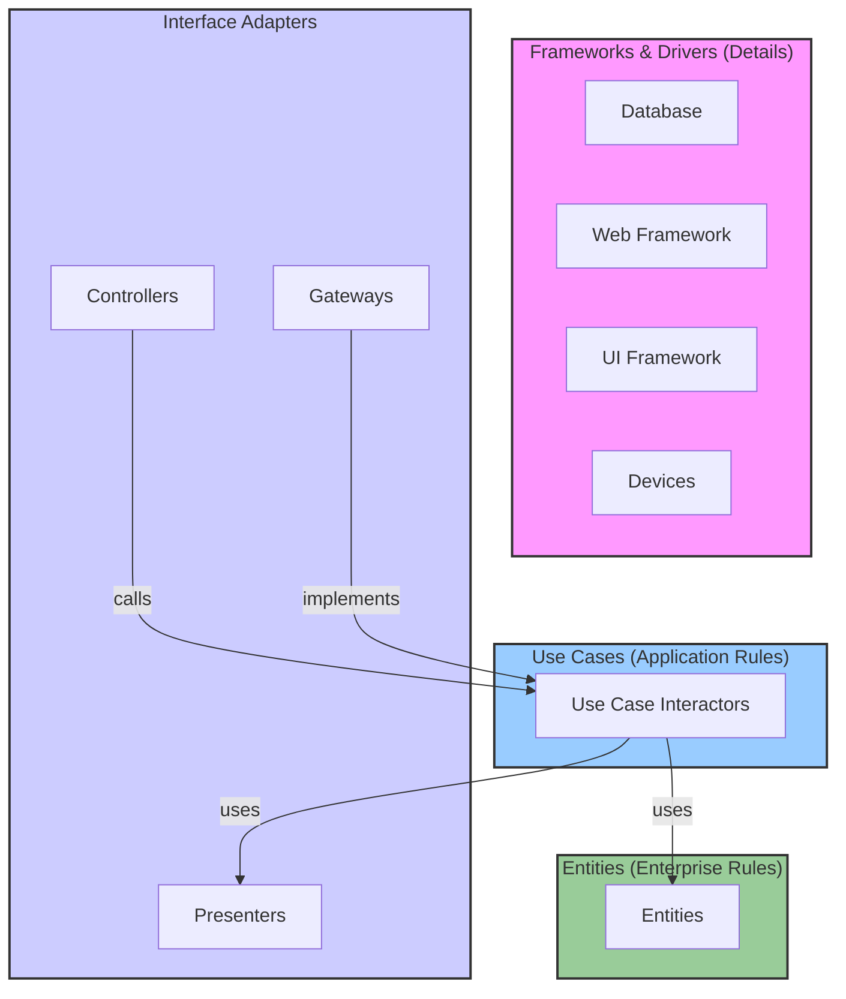
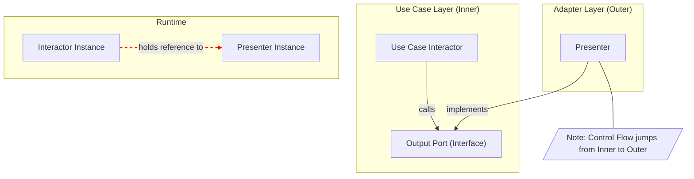
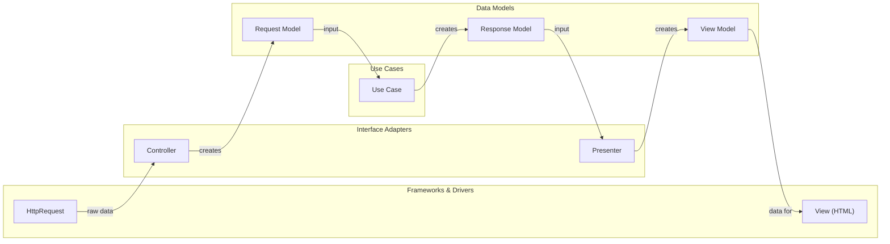
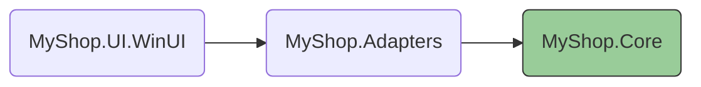

# TÀI LIỆU CLEAN ARCHITECTURE

# Mục lục
- [Phần 3: Bức tranh Toàn cảnh: The Clean Architecture (Sơ đồ Củ hành)](#phần-3-bức-tranh-toàn-cảnh-the-clean-architecture-sơ-đồ-củ-hành)
  - [Sơ đồ (Mermaid diagram)](#sơ-đồ-mermaid-diagram)
  - [Quy tắc Tối thượng: The Dependency Rule](#quy-tắc-tối-thượng-the-dependency-rule)
  - [Các lớp đồng tâm: Entities, Use Cases, Interface Adapters, Frameworks & Drivers](#các-lớp-đồng-tâm-entities-use-cases-interface-adapters-frameworks-drivers)
  - [Luồng hoạt động tổng kết](#luồng-hoạt-động-tổng-kết)

- [Phần 4: Quy tắc Tối thượng: The Dependency Rule (Quy tắc Phụ thuộc)](#phần-4-quy-tắc-tối-thượng-the-dependency-rule-quy-tắc-phụ-thuộc)
  - [1. Phát biểu Quy tắc](#1-phát-biểu-quy-tắc)
  - [2. "Why": Tại sao quy tắc quan trọng](#2-why-tại-sao-quy-tắc-quan-trọng)
  - [3. "How": Cơ chế đằng sau (DIP) và ví dụ](#3-how-cơ-chế-đằng-sau-dip-và-ví-dụ)
  - [4. Phép loại suy: Ổ cắm điện](#4-phép-loại-suy-ổ-cắm-điện)
  - [5. Hệ quả và Lợi ích](#5-hệ-quả-và-lợi-ích)

- [Phần 5: Vượt qua Ranh giới (Crossing Boundaries)](#phần-5-vượt-qua-ranh-giới-crossing-boundaries)
  - [1. Luồng điều khiển: vào/ra và nghệ thuật đảo ngược](#1-luồng-điều-khiển-vào-ra-và-nghệ-thuật-đảo-ngược)
  - [2. Dữ liệu đi qua ranh giới: Request/Response/ViewModel (DTOs)](#2-dữ-liệu-đi-qua-ranh-giới-requestresponseviewmodel-dtos)
  - [3. Luồng dữ liệu hoàn chỉnh và ví dụ minh họa](#3-luồng-dữ-liệu-hoàn-chỉnh-và-ví-dụ-minh-họa)

- [Phần 6: "Details" - Những thứ KHÔNG phải là Kiến trúc](#phần-6-details-những-thứ-không-phải-là-kiến-trúc)
  - [1. The Database is a Detail](#1-the-database-is-a-detail)
  - [2. The Web is a Detail](#2-the-web-is-a-detail)
  - [3. Frameworks are Details và cách ứng xử](#3-frameworks-are-details-và-cách-ứng-xử)
  - [Mapping giữa Entities và Data Models (pattern)](#mapping-giữa-entities-và-data-models-pattern)

- [Case Study: Dự án MyShop](#case-study-dự-án-myshop)
  - [Mô tả dự án, actor và tính năng cơ bản](#mô-tả-dự-án-actor-và-tính-năng-cơ-bản)
  - [Ánh xạ các lớp Clean Architecture vào MyShop](#ánh-xạ-các-lớp-clean-architecture-vào-myshop)
  - [Cấu trúc Solution/Projects (MyShop.Core / Adapters / UI)](#cấu-trúc-solutionprojects-myshopcore-adapters-ui)
  - [Luồng hoạt động chi tiết: Use Case "Tạo Đơn hàng"](#luồng-hoạt-động-chi-tiết-use-case-tạo-đơn-hàng)
  - [Lợi ích thực tiễn và ví dụ kiểm thử](#lợi-ích-thực-tiễn-và-ví-dụ-kiểm-thử)

# **Phần 1: Triết lý Nền tảng: Mục tiêu của Kiến trúc là gì?**

## 1. Hai Giá Trị Của Phần Mềm: Hành vi (Behavior) và Cấu trúc (Structure)

Mọi hệ thống phần mềm đều cung cấp cho chủ sở hữu (stakeholders) hai giá trị riêng biệt. Sai lầm phổ biến nhất của các kỹ sư, đặc biệt là khi còn trẻ, là chỉ tập trung vào một giá trị mà bỏ qua giá trị còn lại.

### a. Giá trị thứ nhất: Hành vi (Behavior)

- **"What" (Cái gì):** Đây là giá trị bề mặt, là thứ phần mềm *làm*. Nó là việc hệ thống đáp ứng đúng các yêu cầu chức năng (functional requirements). Một trang web thương mại điện tử phải cho phép người dùng thêm hàng vào giỏ, thanh toán. Một ứng dụng ngân hàng phải cho phép chuyển tiền, xem số dư.
- **"Why" (Tại sao nó tồn tại):** Đây là lý do trực tiếp mà một hệ thống được xây dựng. Khách hàng trả tiền để có được những tính năng này. Nếu phần mềm không hoạt động đúng, nó vô giá trị.
- **Góc nhìn của bạn (sinh viên):** Khi bạn làm đồ án, bạn thường được chấm điểm chủ yếu dựa trên việc chương trình có chạy đúng, đủ chức năng hay không. Đây chính là giá trị hành vi.

### b. Giá trị thứ hai: Cấu trúc (Structure/Architecture)

- **"What" (Cái gì):** Đây là giá trị ẩn, là thứ làm cho phần mềm... "mềm" (soft). Từ "software" được tạo ra để đối lập với "hardware". Phần cứng (hardware) thì khó thay đổi. Phần mềm (software) được sinh ra với mục đích là phải **dễ dàng thay đổi**. Cấu trúc của phần mềm chính là cách nó được thiết kế để đối mặt với sự thay đổi đó.
- **"Why" (Tại sao nó quan trọng):** Yêu cầu của nghiệp vụ không bao giờ đứng yên. Luật thuế thay đổi, đối thủ ra tính năng mới, công nghệ mới xuất hiện. Một hệ thống có cấu trúc tốt sẽ cho phép bạn thích ứng với những thay đổi này với chi phí thấp nhất. Một hệ thống có cấu trúc tồi sẽ khiến mỗi thay đổi nhỏ trở thành một cơn ác mộng, tốn kém và rủi ro.

### c. Cuộc chiến giữa "Khẩn cấp" và "Quan trọng"

Uncle Bob đã mượn ma trận Eisenhower để minh họa cho sự xung đột giữa hai giá trị này:

|  | **Urgent (Khẩn cấp)** | **Not Urgent (Không khẩn cấp)** |
| --- | --- | --- |
| **Important (Quan trọng)** | Quadrant 1 | **Quadrant 2: Cấu trúc (Structure)** |
| **Not Important (Không quan trọng)** | **Quadrant 3: Hành vi (Behavior)** | Quadrant 4 |
- **Hành vi (Behavior):** Thường rơi vào ô "Khẩn cấp". "Chúng ta cần ra mắt tính năng này vào tuần tới để cạnh tranh!". Nó luôn cấp bách.
- **Cấu trúc (Structure):** Thường rơi vào ô "Quan trọng nhưng không khẩn cấp". "Việc refactor lại module này sẽ giúp chúng ta dễ bảo trì hơn trong tương lai". Nó không bao giờ là việc phải làm *ngay bây giờ*.

Bi kịch của nhiều dự án là họ luôn ưu tiên những việc ở Quadrant 3 hơn Quadrant 2. Họ liên tục "chữa cháy" để ra tính năng mới (hành vi) mà bỏ qua việc xây dựng nền móng vững chắc (cấu trúc). Kết quả? Sau một thời gian, hệ thống trở nên cứng nhắc, chi phí cho mỗi tính năng mới tăng theo cấp số nhân, và cuối cùng dự án sụp đổ dưới sức nặng của chính nó.

### d. Chứng minh bằng Lập luận Cực đoan (The Extreme Cases Argument)

Để thấy rõ tại sao cấu trúc lại quan trọng hơn trong dài hạn, hãy xét 2 trường hợp cực đoan:

1. **Hệ thống A:** Hoạt động hoàn hảo, không có bug, đáp ứng 100% yêu cầu hiện tại. Nhưng cấu trúc của nó là một mớ hỗn độn, **không thể thay đổi**.
2. **Hệ thống B:** Không hoạt động, không đáp ứng được yêu cầu nào. Nhưng cấu trúc của nó cực kỳ sạch sẽ, module hóa, **rất dễ thay đổi**.

**Câu hỏi:** Hệ thống nào có giá trị hơn?

- Ngay khi có một yêu cầu thay đổi nhỏ, hệ thống A sẽ trở nên vô dụng. Nó không thể thích ứng, và giá trị của nó ngay lập tức bằng 0.
- Hệ thống B, dù hiện tại vô dụng, nhưng chúng ta có thể sửa nó, thêm tính năng cho nó, và giữ cho nó luôn hữu ích theo thời gian. Giá trị của nó có thể tăng lên và duy trì.

**Kết luận:** Khả năng thay đổi (được quyết định bởi cấu trúc) là thứ mang lại giá trị bền vững cho phần mềm.

---

## 2. Mục tiêu Tối thượng: Giữ cho các Lựa chọn (Options) luôn Mở

Nếu giá trị cốt lõi của phần mềm nằm ở khả năng thay đổi, thì mục tiêu của người kiến trúc sư là gì?

> Mục tiêu của kiến trúc là tối đa hóa số lượng lựa chọn chưa được đưa ra.
> 

Điều này có nghĩa là bạn phải thiết kế hệ thống theo cách mà các quyết định quan trọng về công nghệ và chi tiết triển khai có thể được **trì hoãn** càng lâu càng tốt.

**Những lựa chọn đó là gì?**

- **Database:** Bạn không cần phải quyết định dùng MySQL, PostgreSQL, hay MongoDB ngay từ đầu. Logic nghiệp vụ cốt lõi của bạn không nên phụ thuộc vào việc dữ liệu được lưu ở đâu hay lưu như thế nào.
- **Web Framework:** Bạn không cần phải quyết định dùng Spring, Django, hay Express.js ngay lập tức. Logic nghiệp vụ không nên biết rằng nó đang được gọi qua một HTTP request.
- **Giao diện người dùng (UI):** Hệ thống của bạn có thể được triển khai như một web app, một desktop app, hay một console app. Logic nghiệp vụ không nên phụ thuộc vào cách nó được hiển thị.
- **Bất cứ thứ gì là "chi tiết":** Bất kỳ công nghệ, thư viện, hay framework nào không phải là logic nghiệp vụ cốt lõi đều là một chi tiết.

**Tại sao phải trì hoãn?**

1. **Quyết định tốt hơn:** Khi bạn trì hoãn một quyết định, bạn có nhiều thời gian hơn để thu thập thông tin. Bạn sẽ hiểu rõ hơn về vấn đề, có thể thử nghiệm các công nghệ khác nhau, và cuối cùng đưa ra lựa chọn phù hợp nhất, thay vì một quyết định vội vàng dựa trên giả định.
2. **Giảm thiểu rủi ro:** Công nghệ thay đổi rất nhanh. Một framework "hot" hôm nay có thể bị bỏ rơi vào năm sau. Nếu bạn "kết hôn" với một framework quá sớm, bạn sẽ bị mắc kẹt với nó. Bằng cách giữ cho logic nghiệp vụ độc lập, bạn tạo ra một "lối thoát" để có thể thay thế các chi tiết công nghệ trong tương lai.

**Phép loại suy (Analogy): Xây nhà**

Một kiến trúc sư giỏi khi thiết kế một ngôi nhà sẽ tập trung vào:

- **Use cases:** Có bao nhiêu phòng ngủ, phòng tắm? Bếp và phòng ăn có gần nhau không? Lối đi có thuận tiện không?
- **Chính sách (Policy):** Các quy tắc về cấu trúc, an toàn, thông gió.

Họ sẽ **không** bắt đầu bằng việc quyết định:

- **Chi tiết (Details):** Dùng gạch của hãng nào? Sơn màu gì? Tay nắm cửa hiệu gì?

Bản thiết kế (kiến trúc) tốt cho phép chủ nhà trì hoãn các quyết định về chi tiết này cho đến phút cuối. Cấu trúc của ngôi nhà không phụ thuộc vào màu sơn. Tương tự, kiến trúc của phần mềm không nên phụ thuộc vào loại database.

---

**Tóm lại, triết lý nền tảng của Clean Architecture là:**

> Kiến trúc phần mềm là nghệ thuật phân tách hệ thống thành các phần độc lập, trong đó logic nghiệp vụ cốt lõi (policy) không phụ thuộc vào các chi tiết triển khai (details) như database, UI, hay framework. Điều này cho phép chúng ta trì hoãn các quyết định về chi tiết, giữ cho hệ thống linh hoạt và dễ dàng thích ứng với sự thay đổi.
> 

---

# **Phần 2: Các Nguyên tắc Thiết kế Nền tảng (SOLID)**

SOLID là từ viết tắt của 5 nguyên tắc thiết kế do Robert C. Martin tổng hợp và phổ biến. Mục tiêu của chúng là tạo ra các cấu trúc phần mềm ở "cấp độ trung bình" (mid-level, tức là các module, các class) có những đặc tính sau:

- **Tolerate change:** Dễ dàng thích ứng với sự thay đổi.
- **Easy to understand:** Dễ hiểu.
- **Reusable:** Là nền tảng cho các component có thể tái sử dụng trong nhiều hệ thống.

Hãy cùng mổ xẻ từng nguyên tắc.

### 1. S - Single Responsibility Principle (Nguyên tắc Đơn trách nhiệm)

- **Định nghĩa kinh điển:** "Một class chỉ nên có một lý do duy nhất để thay đổi."
- **Diễn giải theo "First Principles":** Đây là nguyên tắc bị hiểu lầm nhiều nhất. Nó **không** có nghĩa là "một class chỉ nên làm một việc". "Lý do để thay đổi" ở đây gắn liền với một **actor** (một người dùng, một nhóm người, hoặc một hệ thống khác có yêu cầu thay đổi). Vậy, định nghĩa chính xác hơn là: **"Một module nên chịu trách nhiệm cho một, và chỉ một, actor."**
- **Tại sao?** Khi bạn gộp các đoạn code phục vụ nhiều actor khác nhau vào cùng một module, bạn vô tình "ghép đôi" các actor đó lại. Một thay đổi từ actor A có thể vô tình làm hỏng chức năng mà actor B đang phụ thuộc.
- **Ví dụ kinh điển (từ sách):** Class `Employee`.
    - **Tồi (vi phạm SRP):**
        
        ```java
        public class Employee {
            // Dữ liệu chung
            private String name;
            private Date startDate;
        
            // 1. Phục vụ phòng kế toán (CFO)
            public Money calculatePay() { /* ... */ }
        
            // 2. Phục vụ phòng nhân sự (COO)
            public String reportHours() { /* ... */ }
        
            // 3. Phục vụ quản trị CSDL (CTO)
            public void save() { /* ... */ }
        }
        ```
        
        Class này vi phạm SRP vì nó phục vụ 3 actor khác nhau. Nếu phòng kế toán thay đổi cách tính `regularHours`, có thể sẽ làm sai báo cáo của phòng nhân sự nếu cả hai cùng dùng chung một phương thức private. Việc merge code từ các team khác nhau trên cùng file này cũng sẽ là một thảm họa.
        
    - **Tốt (tuân thủ SRP):** Tách các trách nhiệm ra.
        
        ```java
        // Một cấu trúc dữ liệu đơn giản, không có logic
        public class EmployeeData {
            public String name;
            public Date startDate;
            // ...
        }
        
        // Mỗi class chỉ phục vụ một actor
        public class PayCalculator {
            public Money calculatePay(EmployeeData employee) { /* ... */ }
        }
        
        public class HourReporter {
            public String reportHours(EmployeeData employee) { /* ... */ }
        }
        
        public class EmployeeRepository { // Đổi tên từ Saver cho rõ nghĩa
            public void save(EmployeeData employee) { /* ... */ }
        }
        
        ```
        
- **Kết nối tới Kiến trúc:** Ở cấp độ cao hơn, SRP trở thành **Common Closure Principle (CCP)**. Nguyên tắc này nói rằng: "Hãy nhóm các class có cùng lý do thay đổi, vào cùng một component. Hãy tách các class có lý do thay đổi khác nhau, ra các component khác nhau." Đây chính là cơ sở để chúng ta bắt đầu vẽ nên các ranh giới kiến trúc.

### 2. O - Open-Closed Principle (Nguyên tắc Đóng-Mở)

- **Định nghĩa kinh điển:** "Một thực thể phần mềm (class, module, function) nên *mở* cho việc mở rộng, nhưng *đóng* cho việc sửa đổi."
- **Diễn giải theo "First Principles":** Làm sao có thể thay đổi hành vi mà không sửa code cũ? Câu trả lời nằm ở **sự trừu tượng (abstraction)**. Thay vì sửa đổi code đã chạy ổn định, bạn viết code mới để mở rộng hành vi. Điều này giảm thiểu rủi ro làm hỏng những gì đã hoạt động tốt.
- **Tại sao?** Sửa đổi code cũ luôn tiềm ẩn rủi ro. Nguyên tắc này giúp bảo vệ code hiện có khỏi những thay đổi không mong muốn.
- **Ví dụ:** Tính tổng diện tích của một danh sách các hình học.
    - **Tồi (vi phạm OCP):**
        
        ```java
        public class AreaCalculator {
            public double sumArea(Object[] shapes) {
                double sum = 0;
                for (Object shape : shapes) {
                    if (shape instanceof Rectangle) {
                        Rectangle r = (Rectangle) shape;
                        sum += r.getWidth() * r.getHeight();
                    } else if (shape instanceof Circle) {
                        Circle c = (Circle) shape;
                        sum += c.getRadius() * c.getRadius() * Math.PI;
                    }
                    // Khi cần thêm Triangle, BẠN PHẢI SỬA CODE Ở ĐÂY!
                }
                return sum;
            }
        }
        ```
        
    - **Tốt (tuân thủ OCP):** Sử dụng đa hình (polymorphism).
        
        ```java
        // 1. Tạo một sự trừu tượng (Abstraction)
        public interface Shape {
            double getArea();
        }
        
        // 2. Các module cấp thấp tuân theo abstraction
        public class Rectangle implements Shape { /* ... */ }
        public class Circle implements Shape { /* ... */ }
        
        // 3. Module cấp cao không cần sửa đổi
        public class AreaCalculator {
            public double sumArea(Shape[] shapes) {
                double sum = 0;
                for (Shape shape : shapes) {
                    sum += shape.getArea(); // Không cần biết loại hình cụ thể
                }
                return sum;
            }
        }
        // Khi cần thêm Triangle, bạn chỉ cần tạo class Triangle mới.
        // AreaCalculator "đóng" với việc sửa đổi, nhưng "mở" cho việc mở rộng.
        ```
        
- **Kết nối tới Kiến trúc:** OCP là nền tảng của một **kiến trúc plugin**. Logic nghiệp vụ cốt lõi (Use Cases) được "đóng". Các chi tiết như database, UI, framework được xem như các "plugin" có thể "mở rộng" vào hệ thống. Bạn có thể thay thế MySQL bằng PostgreSQL bằng cách viết một plugin mới mà không cần sửa đổi logic nghiệp vụ.

### 3. L - Liskov Substitution Principle (Nguyên tắc Thay thế Liskov)

- **Định nghĩa kinh điển:** "Các đối tượng của một lớp con phải có thể thay thế cho các đối tượng của lớp cha mà không làm thay đổi tính đúng đắn của chương trình."
- **Diễn giải theo "First Principles":** Đây là nguyên tắc đảm bảo tính đúng đắn của hành vi trong kế thừa. Một lớp con không được phá vỡ "hợp đồng" (contract) hay những kỳ vọng mà người dùng đặt vào lớp cha. Nó là nguyên tắc giúp cho OCP hoạt động một cách an toàn.
- **Tại sao?** Nếu không có LSP, sự trừu tượng sẽ trở nên nguy hiểm. Bạn nghĩ rằng bạn đang làm việc với một `Shape`, nhưng thực ra nó là một `EvilShape` phá vỡ mọi quy tắc, dẫn đến các lỗi hành vi khó lường.
- **Ví dụ kinh điển:** Vấn đề Hình vuông/Hình chữ nhật.
    - Về mặt toán học, hình vuông là một trường hợp đặc biệt của hình chữ nhật. Nhưng trong lập trình hướng đối tượng, việc cho `Square` kế thừa `Rectangle` thường vi phạm LSP.
    - **Logic vi phạm LSP:**
    Hành vi của `Square` đã phá vỡ kỳ vọng của client về `Rectangle`. Do đó, `Square` không thể thay thế hoàn toàn cho `Rectangle`.
        
        ```cpp
        public class Rectangle {
            protected int width, height;
            public void setWidth(int width) { this.width = width; }
            public void setHeight(int height) { this.height = height; }
            // ...
        }
        
        public class Square extends Rectangle {
            // Để đảm bảo là hình vuông, setWidth cũng phải setHeight và ngược lại
            @Override public void setWidth(int width) { super.setWidth(width); super.setHeight(width); }
            @Override public void setHeight(int height) { super.setWidth(height); super.setHeight(height); }
        }
        
        // Một hàm client không biết về Square
        void someClientCode(Rectangle r) {
            r.setWidth(5);
            r.setHeight(10);
            // Client kỳ vọng: r.getArea() == 50
            // Nhưng nếu r là một Square, r.getArea() sẽ là 100!
            assert(r.getArea() == 50); // FAIL!
        }
        
        ```
        
- **Kết nối tới Kiến trúc:** Ở cấp độ kiến trúc, LSP áp dụng cho các "hợp đồng" của component. Ví dụ, nếu bạn có một interface `PaymentGateway`, thì mọi implementation (như `StripeGateway`, `PayPalGateway`) phải tuân thủ nghiêm ngặt hợp đồng đó. Một implementation không được phép trả về `null` trong khi implementation khác lại throw `Exception` cho cùng một trường hợp lỗi, nếu hợp đồng không quy định rõ. Điều này đảm bảo các plugin có thể thay thế cho nhau.

### 4. I - Interface Segregation Principle (Nguyên tắc Phân tách Interface)

- **Định nghĩa kinh điển:** "Client không nên bị buộc phải phụ thuộc vào những phương thức mà nó không sử dụng."
- **Diễn giải theo "First Principles":** Các interface "béo phì" (fat interfaces) là xấu. Chúng tạo ra sự ghép nối (coupling) không cần thiết. Một thay đổi ở một phương thức mà bạn không dùng cũng có thể buộc bạn phải biên dịch lại (recompile) và triển khai lại (redeploy). Hãy tạo ra các interface nhỏ, chuyên biệt theo vai trò (role-based).
- **Tại sao?** Để giảm thiểu coupling và tác động của sự thay đổi.
- **Ví dụ:**
    - **Tồi (vi phạm ISP):**
        
        ```java
        interface Worker {
            void work();
            void eat();
        }
        
        class HumanWorker implements Worker { /* ... */ }
        class RobotWorker implements Worker {
            public void work() { /* ... */ }
            public void eat() { /* Robot không ăn! Phải implement một phương thức vô nghĩa */ }
        }
        
        ```
        
    - **Tốt (tuân thủ ISP):**
        
        ```java
        interface Workable { void work(); }
        interface Feedable { void eat(); }
        
        class HumanWorker implements Workable, Feedable { /* ... */ }
        class RobotWorker implements Workable { /* ... */ }
        
        ```
        
- **Kết nối tới Kiến trúc:** Nguyên tắc này giúp chúng ta định hình các ranh giới. Thay vì có một interface "béo" giữa hai component, chúng ta có thể có nhiều interface nhỏ hơn, chuyên biệt hơn. Điều này đặc biệt quan trọng trong kiến trúc microservices. Một service không nên phụ thuộc vào một service khổng lồ khác chỉ để gọi một hàm duy nhất.

### 5. D - Dependency Inversion Principle (Nguyên tắc Đảo ngược Phụ thuộc)

- **Định nghĩa kinh điển:**
    1. Các module cấp cao không nên phụ thuộc vào các module cấp thấp. Cả hai nên phụ thuộc vào sự trừu tượng (abstractions).
    2. Sự trừu tượng không nên phụ thuộc vào chi tiết. Chi tiết nên phụ thuộc vào sự trừu tượng.
- **Diễn giải theo "First Principles":** Đây là nguyên tắc mang tính kiến trúc rõ ràng nhất. Nó là cơ chế để tách biệt **policy (chính sách, nghiệp vụ cấp cao)** khỏi **detail (chi tiết, triển khai cấp thấp)**. Thay vì để luồng phụ thuộc đi cùng chiều với luồng điều khiển (`Policy` -> `Detail`), chúng ta "đảo ngược" chiều mũi tên phụ thuộc bằng cách chèn một interface vào giữa (`Policy` <- `Interface` <- `Detail`).
- **Tại sao?** Để logic nghiệp vụ cốt lõi không bị "dính" vào các chi tiết triển khai. Điều này cho phép các chi tiết có thể thay đổi mà không ảnh hưởng đến nghiệp vụ.
- **Ví dụ:**
    - **Tồi (vi phạm DIP):** Module cấp cao phụ thuộc vào module cấp thấp.
        
        ```java
        class ReportGenerator { // <-- Module cấp cao (policy)
            private ConsoleWriter writer = new ConsoleWriter(); // <-- Phụ thuộc trực tiếp vào chi tiết
        
            public void generateReport() {
                // ... logic tạo report
                writer.write("Báo cáo...");
            }
        }
        
        class ConsoleWriter { // <-- Module cấp thấp (detail)
            public void write(String text) { System.out.println(text); }
        }
        ```
        
        `ReportGenerator` bị dính chặt vào `ConsoleWriter`. Nếu muốn ghi ra file, bạn phải sửa `ReportGenerator`.
        
    - **Tốt (tuân thủ DIP):** Cả hai cùng phụ thuộc vào abstraction.
        
        ```java
        interface Writer { // <-- Abstraction
            void write(String text);
        }
        
        class ReportGenerator { // <-- Module cấp cao
            private Writer writer; // <-- Phụ thuộc vào abstraction
        
            public ReportGenerator(Writer writer) { this.writer = writer; }
        
            public void generateReport() {
                // ... logic tạo report
                writer.write("Báo cáo...");
            }
        }
        
        class ConsoleWriter implements Writer { /* ... */ } // <-- Module cấp thấp phụ thuộc vào abstraction
        class FileWriter implements Writer { /* ... */ }
        
        ```
        
        Bây giờ `ReportGenerator` không còn biết gì về console hay file. Nó chỉ biết về interface `Writer`. Chiều phụ thuộc đã được đảo ngược.
        
- **Kết nối tới Kiến trúc:** Đây chính là **The Dependency Rule** - quy tắc tối thượng của Clean Architecture. Toàn bộ sơ đồ củ hành được xây dựng dựa trên nguyên tắc này. `Use Cases` không phụ thuộc vào `Database`, mà cả hai cùng phụ thuộc vào một interface `Gateway` do `Use Cases` định nghĩa.

---

**Tóm lại:**

SOLID không phải là những quy tắc cứng nhắc, mà là những công cụ tư duy giúp bạn cấu trúc code theo cách linh hoạt nhất. Chúng giúp bạn hiện thực hóa triết lý "giữ cho các lựa chọn luôn mở" bằng cách:

- **SRP:** Tách code dựa trên người yêu cầu thay đổi.
- **OCP & LSP:** Sử dụng abstraction và polymorphism để cho phép mở rộng mà không cần sửa đổi.
- **ISP:** Giữ cho các abstraction gọn gàng và tập trung.
- **DIP:** Đảo ngược các dependency để policy không phụ thuộc vào detail.

---

# **Phần 3: Bức tranh Toàn cảnh: The Clean Architecture (Sơ đồ Củ hành)**

Hãy tưởng tượng kiến trúc phần mềm của bạn như một củ hành, với nhiều lớp bao bọc lẫn nhau.




Mô hình này trực quan hóa sự **phân tách các mối quan tâm (separation of concerns)** bằng cách chia phần mềm thành các lớp đồng tâm. Càng đi vào trong, cấp độ của phần mềm càng cao, càng trừu tượng và càng gần với "chính sách" (policy). Càng đi ra ngoài, phần mềm càng cụ thể, càng gần với "cơ chế" (mechanism) và "chi tiết" (details).

Trước khi phân tích từng lớp, chúng ta phải khắc cốt ghi tâm quy tắc tối thượng chi phối toàn bộ mô hình này.

### Quy tắc Tối thượng: The Dependency Rule (Quy tắc Phụ thuộc)

> Mọi phụ thuộc trong mã nguồn (source code dependencies) chỉ được hướng vào trong.
> 
- **Nghĩa là sao?** Một lớp ở vòng ngoài không bao giờ được một lớp ở vòng trong biết đến. Tên của một class, function, hay variable được khai báo ở vòng ngoài không được xuất hiện trong code của vòng trong.
- **Ví dụ:**
    - Code trong lớp `Use Cases` **không được phép** biết đến sự tồn tại của `PostgreSQL`, `Spring MVC`, hay `React`.
    - Code trong lớp `Entities` **không được phép** biết gì về `Use Cases` hay bất cứ thứ gì khác bên ngoài nó.
- **Tại sao đây là quy tắc vàng?**
    1. **Bảo vệ nghiệp vụ cốt lõi:** Các lớp bên trong chứa đựng những quy tắc nghiệp vụ, là "báu vật" của hệ thống. Quy tắc này tạo ra một bức tường lửa, ngăn chặn những thay đổi từ các chi tiết bên ngoài (như nâng cấp framework, đổi database) làm ảnh hưởng đến nghiệp vụ cốt lõi.
    2. **Hiện thực hóa DIP:** Đây chính là sự áp dụng triệt để **Nguyên tắc Đảo ngược Phụ thuộc (DIP)** ở quy mô kiến trúc. Các module cấp cao (bên trong) không phụ thuộc vào các module cấp thấp (bên ngoài). Cả hai đều phụ thuộc vào sự trừu tượng (interfaces) do các module cấp cao định nghĩa.

Bây giờ, hãy bóc tách từng lớp.

---

### 1. Lớp trong cùng: Entities (Thực thể)

- **"What it is":** Đây là những đối tượng chứa đựng **Critical Business Rules** (Quy tắc nghiệp vụ cốt lõi) của toàn bộ doanh nghiệp (enterprise-wide). Chúng là những quy tắc tồn tại ngay cả khi không có ứng dụng này.
- **"Why it exists":** Để đóng gói những logic và dữ liệu chung nhất, ít thay đổi nhất, và có thể tái sử dụng trên nhiều ứng dụng khác nhau trong cùng một doanh nghiệp.
- **Phép loại suy:** Nếu doanh nghiệp của bạn là một quốc gia, thì `Entities` chính là Hiến pháp. Nó định nghĩa những quy tắc cơ bản và bền vững nhất.
- **Đặc điểm:**
    - Là các Plain Old Object (POCO, POJO, etc.). Chúng **không** phụ thuộc vào bất kỳ framework nào (không có annotation `@Entity` của JPA, không kế thừa từ class của framework).
    - Chúng chứa logic nghiệp vụ quan trọng nhất (ví dụ: một `Loan` (khoản vay) phải có logic để kiểm tra xem nó có quá hạn hay không).
    - Chúng là lớp ít thay đổi nhất trong hệ thống. Một thay đổi về giao diện hay database không bao giờ được phép ảnh hưởng đến lớp này.
- **Ví dụ (Code):**
    
    ```java
    // Không có bất kỳ annotation hay kế thừa từ framework nào.
    public class Loan {
        private Money principal;
        private double interestRate;
        private Date dueDate;
    
        // Constructor and getters...
    
        // Logic nghiệp vụ cốt lõi, không phụ thuộc vào bất cứ thứ gì.
        public boolean isOverdue() {
            return new Date().after(this.dueDate);
        }
    
        public Money interestAccrued() {
            // ... logic tính lãi suất
            return /*...*/;
        }
    }
    
    ```
    

---

### 2. Lớp thứ hai: Use Cases (Trường hợp sử dụng)

- **"What it is":** Lớp này chứa đựng **Application-Specific Business Rules** (Quy tắc nghiệp vụ của riêng ứng dụng). Nó điều phối luồng dữ liệu đến và đi từ các `Entities` để thực hiện một mục tiêu cụ thể của người dùng.
- **"Why it exists":** Để định nghĩa và đóng gói tất cả những gì ứng dụng có thể *làm*. Mỗi class trong lớp này đại diện cho một tính năng, ví dụ: "Tạo đơn hàng", "Rút tiền", "Xem danh sách sản phẩm".
- **Phép loại suy:** Nếu `Entities` là Hiến pháp, thì `Use Cases` là các bộ luật (luật dân sự, luật hình sự) để giải quyết các tình huống cụ thể trong đời sống.
- **Đặc điểm:**
    - Điều phối các `Entities`. Nó có thể lấy `Entity` từ đâu đó, gọi phương thức trên `Entity`, và lưu `Entity` lại.
    - **Hoàn toàn không biết gì** về UI, Database, hay bất kỳ cơ chế bên ngoài nào. Nó không biết dữ liệu đến từ một HTTP request hay một dòng lệnh.
    - Nó định nghĩa các **cổng vào (Input Ports)** và **cổng ra (Output Ports)** dưới dạng các interface. Đây là cách nó giao tiếp với thế giới bên ngoài mà không cần biết về thế giới đó (áp dụng OCP và DIP).
- **Ví dụ (Code):**
Hãy chú ý: `CreateLoanInteractor` không biết `loanRepository` là `PostgresLoanRepository` hay `InMemoryLoanRepository`. Nó cũng không biết `loanPresenter` sẽ hiển thị dữ liệu lên web hay console. Nó chỉ nói chuyện qua các "hợp đồng" (interfaces).
    
    ```java
    // Input Port: Interface mà lớp ngoài (Controller) sẽ gọi
    public interface CreateLoanUseCase {
        CreateLoanResponse execute(CreateLoanRequest request);
    }
    
    // Output Port: Interface mà Use Case sẽ gọi để trả kết quả ra ngoài (cho Presenter)
    public interface CreateLoanPresenter {
        void present(CreateLoanResponse response);
    }
    
    // Database Port: Interface mà Use Case dùng để nói chuyện với database
    public interface LoanRepository {
        void save(Loan loan);
        Loan findById(LoanId id);
    }
    
    // Implementation của Use Case
    public class CreateLoanInteractor implements CreateLoanUseCase {
        private final LoanRepository loanRepository;
        private final CreateLoanPresenter loanPresenter;
    
        // Dependencies được inject vào qua constructor
        public CreateLoanInteractor(LoanRepository repo, CreateLoanPresenter presenter) {
            this.loanRepository = repo;
            this.loanPresenter = presenter;
        }
    
        @Override
        public CreateLoanResponse execute(CreateLoanRequest request) {
            // 1. Validation logic của ứng dụng
            if (request.getAmount() < 1000) {
                throw new ValidationException("Amount too low");
            }
    
            // 2. Gọi logic nghiệp vụ cốt lõi của Entity
            Loan newLoan = new Loan(request.getAmount(), ...);
    
            // 3. Sử dụng cổng ra để lưu dữ liệu
            loanRepository.save(newLoan);
    
            // 4. Chuẩn bị dữ liệu đầu ra và gọi cổng ra presenter
            CreateLoanResponse response = new CreateLoanResponse(newLoan.getId(), "Success");
            loanPresenter.present(response);
    
            return response;
        }
    }
    ```
    

---

### 3. Lớp thứ ba: Interface Adapters (Bộ chuyển đổi Giao diện)

- **"What it is":** Đây là tập hợp các "bộ chuyển đổi". Vai trò của chúng là chuyển đổi dữ liệu từ định dạng tiện lợi nhất cho các lớp bên ngoài (UI, Database) sang định dạng tiện lợi nhất cho các lớp bên trong (`Use Cases`, `Entities`), và ngược lại.
- **"Why it exists":** Để làm lớp đệm, ngăn cách hoàn toàn giữa nghiệp vụ và công nghệ. Lớp này là nơi chứa tất cả những thứ "bẩn thỉu" liên quan đến framework.
- **Các thành phần chính:**
    - **Controllers:** Nhận đầu vào từ UI (ví dụ: một HTTP request), chuyển đổi nó thành một đối tượng `Request Model` đơn giản, và gọi `Input Port` của `Use Case`.
    - **Gateways:** Là implementation của các `Repository Interface` mà `Use Case` định nghĩa. Đây là nơi chứa code truy vấn database (SQL, NoSQL queries). Nó chuyển đổi dữ liệu từ định dạng của `Entities` sang định dạng của database và ngược lại.
    - **Presenters:** Nhận `Response Model` từ `Output Port` của `Use Case`, định dạng dữ liệu (ví dụ: chuyển `Date` thành chuỗi `dd/MM/yyyy`), và đưa nó vào một `View Model` để UI có thể hiển thị.
- **Ví dụ (Code):**
    
    ```cpp
    // Controller - nhận request từ Web Framework
    public class LoanController {
        private final CreateLoanUseCase createLoanUseCase;
    
        public LoanController(CreateLoanUseCase useCase) { this.createLoanUseCase = useCase; }
    
        public WebViewModel createLoan(HttpRequest httpRequest) {
            // 1. Chuyển đổi từ định dạng của framework (HttpRequest)
            CreateLoanRequest requestModel = new CreateLoanRequest(httpRequest.getParam("amount"), ...);
    
            // 2. Gọi vào lớp Use Case
            CreateLoanResponse responseModel = createLoanUseCase.execute(requestModel);
    
            // 3. Trả về một ViewModel nào đó (Presenter đã xử lý)
            return responseModel.getViewModel(); // Giả sử Presenter gắn ViewModel vào Response
        }
    }
    
    // Gateway - implementation của Repository
    public class PostgresLoanRepository implements LoanRepository {
        private final PostgresConnection connection; // Chi tiết của framework
    
        @Override
        public void save(Loan loan) {
            // Chuyển đổi từ Entity sang dạng của database và thực thi SQL
            String sql = "INSERT INTO loans (...) VALUES (...)";
            connection.execute(sql, loan.getPrincipal(), ...);
        }
        //...
    }
    ```
    

---

### 4. Lớp ngoài cùng: Frameworks & Drivers

- **"What it is":** Đây là nơi chứa tất cả những thứ cụ thể nhất: Frameworks (Spring, Django), Database (PostgreSQL), UI (React, HTML), Devices, etc.
- **"Why it exists":** Để làm "cơ chế" thực thi. Chúng là những công cụ chúng ta sử dụng, không phải là thứ chúng ta xây dựng kiến trúc xung quanh.
- **Đặc điểm:**
    - Code ở lớp này chủ yếu là "glue code" (code kết dính) để thiết lập và kết nối các lớp khác với nhau.
    - Đây là lớp dễ thay đổi nhất và không ổn định nhất.
    - Ví dụ: file `main` của ứng dụng, nơi bạn khởi tạo `PostgresLoanRepository`, `LoanController`, `CreateLoanInteractor` và "tiêm" (inject) chúng vào nhau.

---

**Tổng kết lại bằng một luồng hoạt động:**

1. **Request:** Người dùng click nút trên **Web UI** (Frameworks & Drivers).
2. **Controller:** `SpringController` (Interface Adapters) nhận HTTP request, tạo `CreateLoanRequest` object, và gọi `createLoanUseCase.execute(request)`.
3. **Use Case:** `CreateLoanInteractor` (Use Cases) nhận `request`, thực thi logic, gọi `Loan` entity (Entities), sau đó gọi `loanRepository.save(loan)`.
4. **Gateway:** `PostgresLoanRepository` (Interface Adapters) nhận `Loan` object, chuyển nó thành câu lệnh SQL và thực thi trên **PostgreSQL** (Frameworks & Drivers).
5. **Presenter:** `CreateLoanInteractor` tạo `CreateLoanResponse` và gọi `loanPresenter.present(response)`. `WebPresenter` (Interface Adapters) nhận `response`, format nó thành một `ViewModel` (ví dụ: chuyển số tiền thành chuỗi có dấu phẩy).
6. **View:** `SpringController` trả về `ViewModel` cho **View Engine** (Frameworks & Drivers) để render ra HTML.

Trong suốt quá trình này, hãy để ý các mũi tên phụ thuộc: `Controller` -> `UseCase` (interface), `UseCase` -> `Repository` (interface), `PostgresRepository` -> `UseCase` (vì nó implement interface của UseCase). **Mọi mũi tên đều hướng vào trong**, tuân thủ The Dependency Rule.

Đây là một cái nhìn rất chi tiết về mô hình Clean Architecture. Nó không phải là một công thức cứng nhắc mà là một hệ tư tưởng. Bằng cách tuân thủ nó, bạn tạo ra một hệ thống:

- **Independent of Frameworks:** Dễ dàng thay đổi, nâng cấp framework.
- **Testable:** `Use Cases` và `Entities` có thể được unit test mà không cần database hay UI.
- **Independent of UI:** Dễ dàng tạo giao diện mới (ví dụ: mobile app) cho cùng một hệ thống.
- **Independent of Database:** Dễ dàng đổi từ SQL sang NoSQL.

---

# **Phần 4: Quy tắc Tối thượng: The Dependency Rule (Quy tắc Phụ thuộc)**

### 1. Phát biểu Quy tắc

Một lần nữa, hãy khắc sâu quy tắc này vào tâm trí:

> Source code dependencies must only point inwards.
(Mọi phụ thuộc trong mã nguồn chỉ được hướng vào trong.)
> 

Điều này có nghĩa là, khi bạn viết code, một dòng `import`, `using`, hay `#include` chỉ được phép trỏ từ một lớp ở vòng ngoài vào một lớp ở vòng trong. **Không bao giờ có chiều ngược lại.**

- **Bị cấm:** Một class `Entity` không bao giờ được `import` một class `Controller`.
- **Bị cấm:** Một `Use Case` không bao giờ được biết đến tên của một class trong `Spring Framework`.
- **Bị cấm:** Một `Entity` không bao giờ được chứa một biến có kiểu dữ liệu là `SqlDataReader` hay `HttpRequest`.

### 2. "Why": Tại sao Quy tắc này lại là Tối thượng?

Để hiểu được sức mạnh của nó, chúng ta cần quay lại triết lý nền tảng: **Tách biệt chính sách (policy) khỏi chi tiết (detail)**.

- **Chính sách (Policy):** Là những quy tắc nghiệp vụ, những logic cốt lõi. Đây là những thứ có giá trị cao, ổn định và ít thay đổi. Chúng nằm ở các vòng **trong**.
- **Chi tiết (Detail):** Là những cơ chế, công cụ để thực thi chính sách. Đây là những thứ dễ thay đổi, không ổn định, và thường phụ thuộc vào công nghệ (database, framework, UI). Chúng nằm ở các vòng **ngoài**.

Quy tắc Phụ thuộc tạo ra một **lá chắn bảo vệ**. Nó đảm bảo rằng những thay đổi ở các chi tiết bên ngoài sẽ không thể "rò rỉ" vào bên trong và phá vỡ các chính sách cốt lõi.

- Khi bạn nâng cấp phiên bản Spring, `Use Cases` và `Entities` không bị ảnh hưởng.
- Khi bạn quyết định đổi từ REST API sang gRPC, `Use Cases` và `Entities` không cần phải viết lại.
- Khi bạn đổi database từ MySQL sang MongoDB, `Use Cases` và `Entities` không hề hay biết.

Bằng cách này, phần giá trị nhất của hệ thống (nghiệp vụ) được giữ ổn định, độc lập và có tuổi thọ cao, trong khi các phần công nghệ có thể được thay thế như những linh kiện.

### 3. "How": Cơ chế đằng sau Quy tắc - Dependency Inversion Principle (DIP)

Quy tắc này không phải là phép thuật. Nó được hiện thực hóa bằng một cơ chế rất cụ thể: **Nguyên tắc Đảo ngược Phụ thuộc (DIP)** được áp dụng ở quy mô kiến trúc.

Hãy xem xét một ví dụ đơn giản: `Use Case` cần lưu dữ liệu vào `Database`.

- **Luồng điều khiển (Flow of Control):** `Use Case` -> `Database` (Use Case ra lệnh cho Database lưu dữ liệu).
- **Luồng phụ thuộc TỰ NHIÊN:** `Use Case` -> `Database` (Để gọi được Database, Use Case phải biết về nó).

Luồng phụ thuộc tự nhiên này **vi phạm** The Dependency Rule, vì `Use Case` (vòng trong) đang phụ thuộc vào `Database` (vòng ngoài).

**Đây là cách DIP và The Dependency Rule "đảo ngược" nó:**

1. **Bước 1: Abstraction (Trừu tượng hóa):** Lớp bên trong (`Use Case`) không yêu cầu một thứ cụ thể. Thay vào đó, nó định nghĩa một "hợp đồng" (contract) dưới dạng một `interface` cho thứ mà nó cần.
    
    ```java
    // File này nằm trong tầng Use Case
    package com.business.usecases;
    
    public interface LoanRepository { // <-- "Hợp đồng"
        void save(LoanData data);
    }
    ```
    
2. **Bước 2: Inversion (Đảo ngược):** Lớp bên ngoài (`Database`) bây giờ phải tuân thủ "hợp đồng" mà lớp bên trong đã định nghĩa.
    
    ```java
    // File này nằm trong tầng Interface Adapters
    package com.adapters.database;
    
    // import com.business.usecases.LoanRepository; // <-- Phụ thuộc hướng vào trong!
    
    public class PostgresLoanRepository implements LoanRepository { // <-- Tuân thủ hợp đồng
        @Override
        public void save(LoanData data) {
            // Code SQL cụ thể để lưu dữ liệu vào Postgres...
        }
    }
    ```
    

**Kết quả:**

- **Luồng điều khiển vẫn như cũ:** `Use Case` vẫn gọi `save()`, và cuối cùng code trong `PostgresLoanRepository` được thực thi.
- **Luồng phụ thuộc đã bị đảo ngược:** Bây giờ, `PostgresLoanRepository` (vòng ngoài) `import` và `implements` `LoanRepository` (vòng trong). Mũi tên phụ thuộc đã quay ngược 180 độ, hướng vào trong, tuân thủ The Dependency Rule.

```mermaid
graph TD
    subgraph "Use Case Layer"
        UC[CreateLoanInteractor]
        I[LoanRepository Interface]
        UC -- "uses" --> I
    end
    subgraph "Adapter Layer"
        D[PostgresLoanRepository]
    end

    D -- "implements" --> I

    style UC fill:#aaa
    style I fill:#000
    style D fill:#00f

```



### 4. Phép loại suy (Analogy): Ổ cắm điện

Đây là phép loại suy mạnh mẽ nhất để hiểu về The Dependency Rule.

- **Chính sách cấp cao (Lớp trong):** Chiếc laptop của bạn. Nó có một nhu cầu rất chung chung và ổn định: "Tôi cần điện 220V/50Hz". Nó **không quan tâm** điện được tạo ra từ đâu.
- **Chi tiết cấp thấp (Lớp ngoài):** Nhà máy điện hạt nhân, nhà máy nhiệt điện than, pin năng lượng mặt trời. Đây là những cơ chế phức tạp, có thể thay đổi (hôm nay dùng than, mai mốt nâng cấp lên hạt nhân).
- **Interface (Ranh giới):** Ổ cắm điện trên tường.
- **The Dependency Rule hoạt động:**
    - Ai định nghĩa tiêu chuẩn cho ổ cắm? Không phải nhà máy điện. Chính các nhà sản xuất thiết bị (lớp trong) và các quy chuẩn xây dựng đã định nghĩa ra nó.
    - Ai phải tuân thủ? Nhà máy điện (lớp ngoài) phải sản xuất ra dòng điện và thiết kế hệ thống truyền tải để tương thích với tiêu chuẩn của ổ cắm.
    - **Sự đảo ngược phụ thuộc:** Nhà máy điện **phụ thuộc** vào thiết kế của ổ cắm. Chiếc laptop của bạn thì **không phụ thuộc** vào nhà máy điện. Bạn có thể cắm laptop của mình vào bất kỳ ổ cắm nào tuân thủ tiêu chuẩn đó, dù điện đến từ đâu.

### 5. Hệ quả và Lợi ích

Khi bạn tuân thủ nghiêm ngặt The Dependency Rule, bạn sẽ gặt hái được những lợi ích to lớn, trực tiếp giải quyết các vấn đề của một kiến trúc tồi:

1. **Khả năng kiểm thử (Testability):** Đây là lợi ích tức thì và rõ ràng nhất. Vì `Use Cases` không phụ thuộc vào `Database` hay `UI`, bạn có thể viết Unit Test cho toàn bộ logic nghiệp vụ bằng cách thay thế các implementation thật bằng các "mock" hoặc "stub" đơn giản. Bạn có thể test luồng "tạo đơn hàng" mà không cần khởi động web server hay kết nối tới database thật. Điều này làm cho test chạy cực nhanh và ổn định.
2. **Độc lập với UI:** Bạn có thể dễ dàng thay đổi giao diện web bằng một giao diện mobile, hoặc thậm chí là một giao diện dòng lệnh (console) mà không cần sửa một dòng code nào trong `Use Cases` hay `Entities`. Bạn chỉ cần viết một bộ `Controllers` và `Presenters` mới.
3. **Độc lập với Database:** Quyết định về database có thể được trì hoãn. Bạn có thể bắt đầu dự án với một CSDL trong bộ nhớ (in-memory database) để phát triển và kiểm thử nhanh. Sau đó, khi cần, bạn chỉ cần viết một implementation `Repository` mới cho PostgreSQL mà không ảnh hưởng đến phần còn lại của hệ thống.
4. **Độc lập với Framework:** Framework chỉ là một công cụ, không phải là kiến trúc. Bằng cách giữ chúng ở vòng ngoài cùng, bạn có thể thay đổi hoặc nâng cấp chúng mà không phải viết lại toàn bộ logic nghiệp vụ.
5. **Phát triển song song:** Khi các ranh giới được định nghĩa rõ ràng qua các interface, các team khác nhau có thể làm việc song song. Team A làm UI, team B làm nghiệp vụ, team C làm database. Miễn là họ tuân thủ các interface đã thống nhất, họ sẽ không "dẫm chân" lên nhau.

**Tóm lại, The Dependency Rule không chỉ là một quy tắc. Nó là một cơ chế kỷ luật, buộc kiến trúc của bạn phải tách biệt các mối quan tâm, bảo vệ tài sản quý giá nhất là logic nghiệp vụ, và mang lại sự linh hoạt tối đa để đối mặt với một thế giới công nghệ luôn thay đổi.**

---

# **Phần 5: Vượt qua Ranh giới (Crossing Boundaries)**

Việc vượt qua một ranh giới kiến trúc bao gồm hai khía cạnh:

1. **Luồng điều khiển (Flow of Control):** Làm thế nào một hàm ở bên này gọi được một hàm ở bên kia.
2. **Luồng dữ liệu (Flow of Data):** Dữ liệu nào được phép đi qua ranh giới.

Chúng ta sẽ phân tích từng khía cạnh.

### 1. "Điệu nhảy" của Luồng Điều khiển: Nghệ thuật Đảo ngược

Luồng điều khiển không phải lúc nào cũng đi một chiều. Nó đi vào, xử lý, rồi lại đi ra. The Dependency Rule dường như chỉ cho phép luồng điều khiển đi vào, nhưng thực tế không phải vậy.

**a. Trường hợp dễ: Luồng điều khiển đi vào (cùng chiều với phụ thuộc)**

Đây là trường hợp đơn giản nhất. Một thành phần ở vòng ngoài gọi một thành phần ở vòng trong.

- **Ví dụ:** `Controller` (lớp Interface Adapters) gọi `Use Case` (lớp Use Cases).
- **Cơ chế:** `Controller` giữ một tham chiếu đến một `interface` của `Use Case` (Input Port) và gọi phương thức trên đó.
- **Phân tích:**
    - **Luồng điều khiển:** `Controller` -> `Use Case`.
    - **Luồng phụ thuộc:** `Controller` -> `Use Case` (interface).
    - => Cả hai cùng chiều và đều hướng vào trong. Hoàn toàn tuân thủ The Dependency Rule.

**b. Trường hợp "ảo diệu": Luồng điều khiển đi ra (ngược chiều với phụ thuộc)**

Đây là lúc phép màu của **Dependency Inversion Principle (DIP)** tỏa sáng. Một thành phần ở vòng trong cần trả kết quả hoặc ra lệnh cho một thành phần ở vòng ngoài.

- **Ví dụ 1:** `Use Case` cần trả dữ liệu về cho `Presenter` để hiển thị lên UI.
- **Ví dụ 2:** `Use Case` cần ra lệnh cho `Gateway` để lưu dữ liệu xuống Database.
- **Vấn đề:** `Use Case` (trong) không được biết đến `Presenter` (ngoài) hay `Database Gateway` (ngoài). Vậy làm sao nó gọi được chúng?

**Giải pháp (3 bước của DIP):**

1. **Định nghĩa Hợp đồng (Interface):** Lớp bên trong (`Use Case`) định nghĩa một `interface` mô tả điều nó muốn. `Interface` này thuộc về lớp bên trong.
    - `Use Case` nói: "Tôi không biết anh là ai, nhưng bất cứ ai muốn nhận kết quả từ tôi, anh phải implment cái `OutputPort` này."
    - `Use Case` nói: "Tôi không biết anh lưu dữ liệu ở đâu, nhưng bất cứ ai muốn lưu dữ liệu cho tôi, anh phải implement cái `Repository` interface này."
2. **Tuân thủ Hợp đồng:** Lớp bên ngoài (`Presenter`, `Gateway`) sẽ `implement` các `interface` này. Bằng hành động này, lớp bên ngoài đã tạo ra một phụ thuộc **hướng vào trong**.
    - `WebPresenter` (ngoài) `implements OutputPort` (trong).
    - `PostgresRepository` (ngoài) `implements Repository` (trong).
3. **Kết nối lúc khởi tạo (Wiring):** Tại một điểm khởi tạo duy nhất của hệ thống (thường là ở lớp ngoài cùng - `Main`), chúng ta tạo ra các đối tượng cụ thể và "tiêm" (inject) chúng vào nhau.
    - `new PostgresRepository()` được tạo ra.
    - `new WebPresenter()` được tạo ra.
    - `new CreateLoanInteractor(postgresRepository, webPresenter)` được tạo ra.
    - Bây giờ, `CreateLoanInteractor` đang giữ một tham chiếu kiểu `Repository` nhưng thực chất nó đang trỏ tới một đối tượng `PostgresRepository`.

**Kết quả:** Khi `Use Case` gọi phương thức trên `interface`, nhờ cơ chế đa hình (polymorphism), code của lớp ở vòng ngoài sẽ được thực thi.



*Mũi tên liền nét là phụ thuộc mã nguồn (luôn hướng vào trong). Mũi tên đứt nét màu đỏ biểu thị luồng điều khiển tại thời điểm chạy (runtime), nó có thể "nhảy" từ trong ra ngoài.*

**Phép loại suy: Giám đốc và Nhân viên**

- **Giám đốc (Use Case):** Cần một bản báo cáo.
- **Nhân viên (Presenter/Gateway):** Người làm báo cáo.
- **Vi phạm DIP:** Giám đốc gọi thẳng: "Này Bob, làm cho tôi bản báo cáo!". Giám đốc bị phụ thuộc vào Bob. Nếu Bob nghỉ việc, giám đốc không biết phải làm sao.
- **Tuân thủ DIP:** Giám đốc đưa ra một quy trình ("Hợp đồng"/Interface): "Ai giữ chức vụ 'Trợ lý Phân tích' thì phải biết làm báo cáo theo mẫu này". Sau đó, phòng nhân sự (lớp `Main`) bổ nhiệm Bob vào vị trí đó. Giám đốc chỉ cần ra lệnh: "Trợ lý Phân tích, làm báo cáo!". Giám đốc không cần biết người đó là Bob hay Alice, miễn là họ đang giữ vai trò đó. Luồng điều khiển đi từ Giám đốc đến Bob, nhưng sự phụ thuộc của Giám đốc chỉ là vào "vai trò Trợ lý", không phải vào Bob.

---

### 2. Dữ liệu đi qua ranh giới: Các mô hình đơn giản

Bây giờ chúng ta đã biết cách "gọi nhau", vậy chúng ta "nói gì với nhau"? Dữ liệu nào được phép đi qua các ranh giới này?

**Quy tắc:**

> Dữ liệu đi qua các ranh giới phải ở dạng cấu trúc dữ liệu đơn giản, độc lập. Không bao giờ truyền các đối tượng Entity hay các đối tượng thuộc về Database/Framework qua các ranh giới.
> 
- **Tại sao?**
    - **Tránh "gian lận":** Nếu bạn truyền một đối tượng `Entity` ra ngoài cho `Presenter`, `Presenter` sẽ có khả năng truy cập vào các logic nghiệp vụ cốt lõi. Điều này tạo ra một backdoor, một sự耦合 không mong muốn.
    - **Tuân thủ The Dependency Rule:** Nếu `Use Case` nhận một đối tượng `HttpRequest` từ `Controller`, nó sẽ phải `import` thư viện web, vi phạm quy tắc phụ thuộc hướng vào trong.
    - **Ngăn chặn thay đổi lan truyền:** Dữ liệu mà UI cần thường khác với dữ liệu mà nghiệp vụ xử lý. Ví dụ, `Entity` `User` có thể có `passwordHash`, nhưng `ViewModel` hiển thị thông tin user trên màn hình không bao giờ được chứa trường này. Nếu dùng chung một đối tượng, một thay đổi ở database (thêm cột) có thể buộc bạn phải thay đổi cả UI.

**Giải pháp: Sử dụng các lớp dữ liệu chuyên biệt (Data Models/DTOs)**

Chúng ta tạo ra các lớp đối tượng đơn giản (Plain Old Objects) chỉ chứa dữ liệu, không có hành vi, và có vòng đời chỉ trong một lần giao dịch.

1. **Request Models:** Các đối tượng mà `Controller` đóng gói và gửi vào `Use Case`. Chúng chứa dữ liệu thô cần thiết cho một hành động.
2. **Response Models:** Các đối tượng mà `Use Case` đóng gói và trả ra cho `Presenter`. Chúng chứa kết quả của hành động, ở dạng thuận tiện cho nghiệp vụ.
3. **View Models:** Các đối tượng mà `Presenter` tạo ra và đưa cho `View`. Chúng chứa dữ liệu đã được định dạng hoàn chỉnh (dạng `String`, `boolean`...) để `View` chỉ việc hiển thị mà không cần xử lý gì thêm.

**Luồng dữ liệu hoàn chỉnh:**



**Ví dụ:**

- `HttpRequest` chứa `amount="1,200.50 USD"`.
- `Controller` chuyển nó thành `CreateLoanRequest` với `amount` là một `BigDecimal`.
- `Use Case` xử lý và trả về `CreateLoanResponse` chứa `loanId` (UUID) và `creationDate` (Date object).
- `Presenter` nhận `response`, chuyển `creationDate` thành chuỗi `"28/10/2025"` và tạo ra `LoanResultViewModel`.
- `View` nhận `ViewModel` và hiển thị chuỗi đó ra màn hình.

Mỗi lớp dữ liệu được tối ưu cho mục đích của nó tại mỗi ranh giới, đảm bảo sự tách biệt tuyệt đối.

---

**Tóm lại:**

Việc vượt qua các ranh giới trong Clean Architecture là một quá trình có kỷ luật cao:

1. **Luồng điều khiển** được quản lý bằng cách áp dụng triệt để **Dependency Inversion Principle**, sử dụng các `interface` làm "hợp đồng" để cho phép các lớp bên trong gọi ra bên ngoài mà không phụ thuộc vào chúng.
2. **Luồng dữ liệu** được quản lý bằng cách sử dụng các **cấu trúc dữ liệu đơn giản, chuyên biệt (DTOs)** cho từng mục đích (Request, Response, View Model), nghiêm cấm việc truyền `Entities` hay các đối tượng của framework qua ranh giới.

Nắm vững hai kỹ thuật này là bạn đã nắm được cách triển khai thực tế của Clean Architecture.

---

# **Phần 6: "Details" - Những thứ KHÔNG phải là Kiến trúc**

Tư tưởng cốt lõi ở đây là sự phân định rạch ròi giữa **chính sách (policy)** và **cơ chế (mechanism)**.

- **Chính sách:** Là logic nghiệp vụ, là những quy tắc quyết định hệ thống của bạn làm gì để tạo ra giá trị. Đây là phần cốt lõi, là trái tim của ứng dụng.
- **Cơ chế:** Là các công cụ, công nghệ, phương tiện để thực thi các chính sách đó.

Kiến trúc sư giỏi sẽ xây dựng kiến trúc xoay quanh các chính sách và xem các cơ chế chỉ là những chi tiết có thể thay thế.

### 1. The Database is a Detail (Cơ sở dữ liệu là một chi tiết)

Đây là quan điểm gây tranh cãi nhất nhưng cũng là quan trọng nhất.

**a. Lập luận phản biện thường gặp:** "Dữ liệu là tài sản quý giá nhất của công ty. Làm sao database có thể là một chi tiết được?"

**Câu trả lời của Clean Architecture:** Lập luận đó đã nhầm lẫn giữa **Data Model** và **Database System**.

- **Data Model (Mô hình dữ liệu):** Đây là cấu trúc của các `Entities` và các quy tắc nghiệp vụ cốt lõi của bạn. Nó định nghĩa dữ liệu là gì và chúng quan hệ với nhau như thế nào. **Đây là phần cực kỳ quan trọng về mặt kiến trúc.**
- **Database System (Hệ quản trị CSDL):** Đây là một **phần mềm tiện ích**. Nó là một công cụ, một cơ chế, có nhiệm vụ chính là di chuyển các byte dữ liệu từ RAM ra một nơi lưu trữ bền vững (như đĩa cứng) và tải chúng ngược lại.

**b. Thí nghiệm tư duy "First Principles": Điều gì xảy ra nếu không có đĩa cứng?**

Hãy tưởng tượng chúng ta đang sống trong một thế giới nơi RAM là vô hạn và không bao giờ mất dữ liệu khi mất điện.

- **Câu hỏi:** Khi đó, bạn sẽ lưu trữ và truy cập dữ liệu của mình như thế nào?
- **Câu trả lời:** Chắc chắn không phải bằng các bảng (tables) và ngôn ngữ SQL. Là một lập trình viên, bạn sẽ sử dụng các cấu trúc dữ liệu tự nhiên và hiệu quả nhất trong bộ nhớ: `Hash Map`, `Tree`, `Graph`, `Linked List`... và truy cập chúng qua các con trỏ hoặc tham chiếu.

**Kết luận từ thí nghiệm:** Việc chúng ta phải dùng đến các bảng, các hàng, và SQL là một **chiến lược đối phó** với sự chậm chạp và hạn chế của công nghệ đĩa cứng quay. Nó không phải là cách tổ chức dữ liệu tự nhiên nhất. Nó chỉ là một **cơ chế lưu trữ**.

**c. Database chỉ là một cơ chế giao/nhận**

Logic nghiệp vụ của bạn (Use Cases, Entities) luôn hoạt động trên các cấu trúc dữ liệu trong RAM. Công việc của database chỉ là một "người giao hàng":

1. Khi Use Case cần dữ liệu, nó yêu cầu "người giao hàng" (thông qua interface `Repository`).
2. "Người giao hàng" (Database Gateway) đi đến "nhà kho" (đĩa cứng), tìm đúng kiện hàng (dữ liệu), chất lên xe (đọc vào RAM), và mang đến cho Use Case dưới dạng cấu trúc dữ liệu mà Use Case hiểu được.
3. Khi Use Case xử lý xong, nó đưa dữ liệu mới cho "người giao hàng" để mang về cất lại vào "nhà kho".

Rõ ràng, Use Case không cần và không nên quan tâm "người giao hàng" dùng xe tải hiệu gì (PostgreSQL, MongoDB, Oracle) hay "nhà kho" được sắp xếp ra sao (schema). Nó chỉ cần biết rằng dữ liệu sẽ được giao/nhận đúng hẹn.

Do đó, database chỉ là một plugin được cắm vào kiến trúc thông qua một ranh giới (interface `Repository`).

### 2. The Web is a Detail (Web là một chi tiết)

**a. Web chỉ là một cơ chế giao/nhận (I/O Device)**

Tương tự như database, Web (bao gồm HTTP, HTML, CSS, JS) là một **cơ chế trình diễn và giao tiếp**. Nó là một thiết bị I/O.

- Nó nhận input từ người dùng (click chuột, gõ phím).
- Nó hiển thị output cho người dùng (trang HTML).

Logic nghiệp vụ của bạn không nên phụ thuộc vào cơ chế này.

**b. Bài học từ "Con lắc Vĩnh cửu" (The Endless Pendulum)**

Lịch sử ngành công nghệ đã chứng kiến sự dao động liên tục giữa việc xử lý ở trung tâm (server) và xử lý ở biên (client):

- Mainframe (server mạnh) -> Terminals (client yếu)
- Client-Server (client mạnh) -> Server (yếu hơn)
- Web 1.0 (server mạnh) -> Browser (client yếu)
- Web 2.0/AJAX/SPA (client mạnh) -> Server (API)
- Server-Side Rendering (lại quay về server)

Web chỉ là một điểm trong chu kỳ dao động này. Một kiến trúc bền vững không thể được xây dựng trên một nền tảng luôn thay đổi như vậy.

**c. Hệ quả của việc xem Web là chi tiết**

Khi bạn tách biệt logic nghiệp vụ khỏi Web, bạn có thể:

- Chạy cùng một logic nghiệp vụ trên một **ứng dụng console**, một **ứng dụng desktop (thick client)**, hay một **web app** chỉ bằng cách thay đổi lớp ngoài cùng (Interface Adapters và Frameworks).
- Kiểm thử toàn bộ hệ thống mà không cần khởi động một web server nào.

Logic nghiệp vụ chỉ nhận một đối tượng `Request` đơn giản và trả về một đối tượng `Response` đơn giản. Nó không biết gì về `HttpRequest` hay `HttpResponse`.

### 3. Frameworks are Details (Framework là một chi tiết)

**a. "Cuộc hôn nhân bất đối xứng" (The Asymmetric Marriage)**

Đây là một phép ẩn dụ rất đắt giá của Uncle Bob. Khi bạn sử dụng một framework (ví dụ: Spring, Ruby on Rails, Django), mối quan hệ này là rất bất đối xứng:

- **Bạn:** Phải cam kết rất nhiều. Bạn phải kế thừa từ các lớp cơ sở của framework, rải các annotation của nó khắp nơi trong code, tuân theo quy ước của nó. Bạn đang "kết hôn" với framework.
- **Framework:** Không cam kết gì với bạn. Tác giả framework không biết bạn là ai. Họ có thể thay đổi API, ngừng hỗ trợ, hoặc phát triển theo một hướng không phù hợp với bạn.

Nếu bạn xây dựng kiến trúc của mình **dựa trên** một framework, bạn đang đặt cược tương lai của sản phẩm vào một thứ bạn không thể kiểm soát.

**b. Cách tiếp cận của Clean Architecture**

> Sử dụng framework như một công cụ, đừng để nó trở thành kiến trúc của bạn.
> 
- Giữ framework ở vòng ngoài cùng.
- **Không bao giờ** để các annotation hay các lớp của framework "rò rỉ" vào các lớp `Use Cases` hay `Entities` của bạn.
- **Ví dụ:** Thay vì đặt annotation `@Entity` (của JPA/Hibernate) trực tiếp vào lớp `Loan` (Entity nghiệp vụ), bạn hãy:
    1. Giữ lớp `Loan` hoàn toàn "sạch".
    2. Tạo một lớp khác, ví dụ `LoanDataModel`, trong tầng `Interface Adapters`. Lớp này sẽ chứa các annotation của JPA.
    3. Lớp `Gateway` (Repository implementation) sẽ chịu trách nhiệm **chuyển đổi (map)** giữa `Loan` (sạch) và `LoanDataModel` (bẩn).

```java
// Lớp Entity (sạch) - Nằm trong vòng Entities
public class Loan {
    private LoanId id;
    private Money amount;
    // ... không có annotation
}

// Lớp Data Model (bẩn) - Nằm trong vòng Interface Adapters
@Entity
@Table(name = "loans")
public class LoanDataModel {
    @Id
    private String id;
    private BigDecimal amount;
    // ... chứa đầy annotation của JPA
}

// Gateway - Nằm trong vòng Interface Adapters
public class JpaLoanRepository implements LoanRepository {
    // ...
    public void save(Loan loan) {
        LoanDataModel model = mapToDataModel(loan); // Mapping
        entityManager.persist(model);
    }
    // ...
}
```

Cái giá phải trả là một chút code mapping, nhưng lợi ích thu được là sự độc lập hoàn toàn của nghiệp vụ khỏi framework.

---

# Case Study: Dự án MyShop

- **Mô tả:** MyShop là một ứng dụng quản lý cửa hàng đơn giản chạy trên Windows.
- **Actor chính:** Người quản lý cửa hàng (Shop Manager).
- **Các tính năng (Use Cases) cơ bản:**
    - Quản lý sản phẩm (Xem danh sách, thêm, sửa, xóa).
    - Quản lý khách hàng (Xem danh sách, thêm, sửa).
    - Tạo đơn hàng mới cho khách hàng.
    - Xem lịch sử đơn hàng.
- **Công nghệ:** C# (.NET), WinUI 3, và chúng ta sẽ giả định dùng Entity Framework Core để truy cập CSDL (ví dụ: SQLite).

### 2. Ánh xạ các lớp Clean Architecture vào dự án

Đây là phần quan trọng nhất. Chúng ta sẽ "dịch" các khái niệm trừu tượng của củ hành sang các thành phần cụ thể trong dự án.

### a. Lớp trong cùng: Entities

- **Là gì trong MyShop?** Đây là các lớp C# thuần túy (POCOs - Plain Old C# Objects) định nghĩa các khái niệm nghiệp vụ cốt lõi. Chúng không có bất kỳ dependency nào đến WinUI, Entity Framework hay bất kỳ thư viện bên ngoài nào.
- **Ví dụ:**
    - `Product.cs`: chứa `Id`, `Name`, `Price`, `StockQuantity` và các logic như `IsInStock()`, `DecreaseStock()`.
    - `Customer.cs`: chứa `Id`, `Name`, `Address`.
    - `Order.cs`: chứa `Id`, `CustomerId`, `OrderDate`, danh sách các `OrderItem`, và logic quan trọng như `CalculateTotalPrice()`.
    - `OrderItem.cs`: chứa `ProductId`, `Quantity`, `PriceAtTimeOfPurchase`.

### b. Lớp thứ hai: Use Cases (Application Rules)

- **Là gì trong MyShop?** Đây cũng là các lớp C# thuần túy, chịu trách nhiệm thực thi một tính năng cụ thể. Chúng điều phối các `Entities`. Quan trọng nhất, chúng định nghĩa các **interfaces** cho những gì chúng cần từ thế giới bên ngoài.
- **Ví dụ:**
    - **Interfaces (Ports):**
        - `IProductRepository.cs`: Định nghĩa các phương thức như `GetById`, `GetAll`, `Save`.
        - `IOrderRepository.cs`: Định nghĩa `Save`.
        - `ICreateOrderPresenter.cs`: Định nghĩa phương thức `Present(CreateOrderResponse response)` để báo kết quả về cho UI.
    - **Interactors (Implementations):**
        - `CreateOrderUseCase.cs`: Lớp này sẽ nhận `Request` (gồm ID khách hàng và danh sách sản phẩm), sử dụng `IProductRepository` để kiểm tra tồn kho, tạo `Order` entity, gọi `IOrderRepository.Save()`, và cuối cùng gọi `ICreateOrderPresenter.Present()` để trả kết quả.

### c. Lớp thứ ba: Interface Adapters

Đây là lớp "keo dán", chuyển đổi dữ liệu giữa thế giới nghiệp vụ (Use Cases) và thế giới công nghệ (WinUI, EF Core).

- **Là gì trong MyShop?**
    - **ViewModels (phía UI):** Trong các ứng dụng XAML như WinUI, chúng ta thường dùng mẫu MVVM. `ViewModels` (ví dụ: `CreateOrderViewModel.cs`) thuộc về lớp này. Chúng chứa state của UI (ví dụ: danh sách sản phẩm đang chọn, thông báo lỗi) và các `Commands` mà View có thể bind tới.
    - **Presenters (phía UI):** Là các lớp implement `IPresenter` interfaces từ Use Cases. Khi một `UseCase` hoàn thành, nó gọi `Presenter`. `Presenter` sẽ nhận `Response` model và cập nhật các thuộc tính trong `ViewModel` tương ứng. Điều này giúp `UseCase` không cần biết gì về MVVM.
    - **Gateways (phía Data):** Là các lớp implement `IRepository` interfaces. Ví dụ, `OrderRepository.cs` sẽ sử dụng `DbContext` của Entity Framework Core để thực thi các câu lệnh CSDL. Đây là nơi chứa code phụ thuộc vào EF Core.

### d. Lớp ngoài cùng: Frameworks & Drivers

- **Là gì trong MyShop?** Đây là những thứ cụ thể nhất, "bẩn" nhất.
    - **WinUI Project:** Chứa các file XAML (`Views` như `CreateOrderView.xaml`), code-behind, và các tài nguyên UI.
    - **Entity Framework Core:** `DbContext` của bạn, các file migration, và các lớp Data Model (nếu bạn cần tách biệt với Entities).
    - **Composition Root:** Điểm khởi tạo của ứng dụng, thường là trong `App.xaml.cs`. Đây là nơi chúng ta sẽ dùng một **Dependency Injection (DI) Container** (ví dụ `Microsoft.Extensions.DependencyInjection`) để "kết nối" tất cả các lớp với nhau (`new CreateOrderUseCase(new EfOrderRepository(), new CreateOrderPresenter(...))`).

### 3. Cấu trúc Project trong Visual Studio

Để thực thi The Dependency Rule, chúng ta sẽ cấu trúc Solution như sau:

```
MyShop.sln
├── 📁 MyShop.Core (Project - Class Library)
│   ├── 📁 Entities
│   │   ├── Product.cs
│   │   └── Order.cs
│   └── 📁 UseCases
│       ├── Interfaces (Ports)
│       │   ├── IOrderRepository.cs
│       │   └── ICreateOrderPresenter.cs
│       └── CreateOrderUseCase.cs
│
├── 📁 MyShop.Adapters (Project - Class Library)
│   ├── 📁 Data
│   │   └── EfOrderRepository.cs (implements IOrderRepository)
│   └── 📁 Presentation
│       ├── CreateOrderViewModel.cs
│       └── CreateOrderPresenter.cs (implements ICreateOrderPresenter)
│
└── 📁 MyShop.UI.WinUI (Project - WinUI App)
    ├── 📁 Views
    │   └── CreateOrderView.xaml
    └── App.xaml.cs (Composition Root)
```

**Sơ đồ phụ thuộc giữa các project (quan trọng nhất):**



Như bạn thấy, mũi tên phụ thuộc **luôn hướng vào `MyShop.Core`**. `Core` không phụ thuộc vào bất cứ project nào khác. Điều này được trình biên dịch C# đảm bảo. Bạn không thể `using MyShop.Adapters;` bên trong project `MyShop.Core` được.

### 4. Luồng hoạt động chi tiết: Use Case "Tạo Đơn hàng"

Hãy theo dõi một kịch bản từ đầu đến cuối:

1. **UI (View):** Người quản lý đang ở màn hình `CreateOrderView.xaml`. Họ đã chọn một khách hàng và một số sản phẩm. Họ click vào nút "Place Order". Nút này được bind với một `ICommand` trong `CreateOrderViewModel`.
2. **UI (ViewModel - Adapter):** `CreateOrderCommand` trong `CreateOrderViewModel` được thực thi.
    - Nó thu thập dữ liệu từ các thuộc tính của ViewModel (ví dụ: `SelectedCustomer.Id`, `CartItems`).
    - Nó tạo một đối tượng DTO đơn giản: `CreateOrderRequest request = new(...)`.
    - Nó gọi Use Case thông qua interface đã được inject vào: `_createOrderUseCase.Execute(request);`. **ViewModel không biết implementation của Use Case là gì.**
3. **Use Case (Core):** Phương thức `Execute` của `CreateOrderUseCase` được gọi.
    - Nó thực hiện các logic nghiệp vụ của ứng dụng: "Kiểm tra xem khách hàng có tồn tại không?", "Kiểm tra xem số lượng sản phẩm trong kho có đủ không?" (bằng cách gọi `_productRepository.GetById`).
    - Nếu mọi thứ hợp lệ, nó tạo một `Order` **entity** mới: `var order = new Order(...)`.
    - Nó gọi `_orderRepository.Save(order);`. **Use Case không biết dữ liệu sẽ được lưu vào đâu.**
    - Nó tạo một đối tượng `CreateOrderResponse` chứa thông tin về kết quả (ví dụ: `OrderId`, `Success = true`).
    - Nó gọi `_createOrderPresenter.Present(response);` để báo kết quả ra bên ngoài. **Use Case không biết kết quả sẽ được hiển thị như thế nào.**
4. **Gateway (Adapter):** `EfOrderRepository.Save(Order order)` được gọi.
    - Nó thực hiện việc mapping từ `Order` entity (lớp "sạch") sang `OrderDataModel` (lớp "bẩn" của EF Core, có thể có các annotations `[Table]`, `[Key]`).
    - Nó sử dụng `_dbContext.Orders.Add(orderDataModel);` và `_dbContext.SaveChanges();` để lưu dữ liệu vào CSDL.
5. **Presenter (Adapter):** `CreateOrderPresenter.Present(CreateOrderResponse response)` được gọi.
    - Nó nhận `response` từ Use Case.
    - Nó cập nhật các thuộc tính trong `CreateOrderViewModel` (đã được inject vào Presenter): ví dụ `ViewModel.StatusMessage = "Order created successfully with ID: " + response.OrderId;`, `ViewModel.IsBusy = false;`.
6. **UI (View):** Vì `CreateOrderViewModel` implement `INotifyPropertyChanged`, khi thuộc tính `StatusMessage` thay đổi, cơ chế Data Binding của WinUI sẽ tự động cập nhật `TextBlock` trên màn hình để hiển thị thông báo thành công cho người dùng.

### 5. Lợi ích thu được trong bối cảnh MyShop

- **Khả năng kiểm thử tuyệt vời:**
    - Bạn có thể viết Unit Test cho `CreateOrderUseCase` bằng cách tạo một `MockOrderRepository` và `MockCreateOrderPresenter` trong bộ nhớ. Bạn có thể kiểm thử mọi logic nghiệp vụ (tồn kho, tính tổng tiền) mà **không cần khởi động ứng dụng WinUI** và **không cần kết nối CSDL**. Test sẽ chạy trong vài mili giây.
- **Linh hoạt về UI:**
    - Nếu sau này bạn muốn tạo một phiên bản web [ASP.NET](http://asp.net/) Core cho MyShop, bạn có thể **tái sử dụng toàn bộ project `MyShop.Core`** mà không cần thay đổi một dòng code nào. Bạn chỉ cần viết một project [ASP.NET](http://asp.net/) Core mới chứa các `Controller` và `View` web.
- **Linh hoạt về Database:**
    - Dự án bắt đầu với SQLite cho đơn giản. Sau này, khi cửa hàng phát triển, bạn muốn chuyển sang SQL Server. Bạn chỉ cần viết một project `MyShop.Adapters.SqlServer` mới, implement lại các `IRepository`, và thay đổi một dòng trong `App.xaml.cs` để inject `SqlServerOrderRepository` thay vì `EfOrderRepository`. Toàn bộ nghiệp vụ không hề bị ảnh hưởng.

Case study này cho thấy, dù là ứng dụng desktop, việc áp dụng Clean Architecture vẫn mang lại những lợi ích to lớn về khả năng bảo trì, kiểm thử và mở rộng. Nó đòi hỏi một sự kỷ luật ban đầu, nhưng sẽ trả lại cho bạn sự tự do và linh hoạt trong suốt vòng đời của dự án.