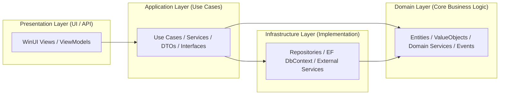
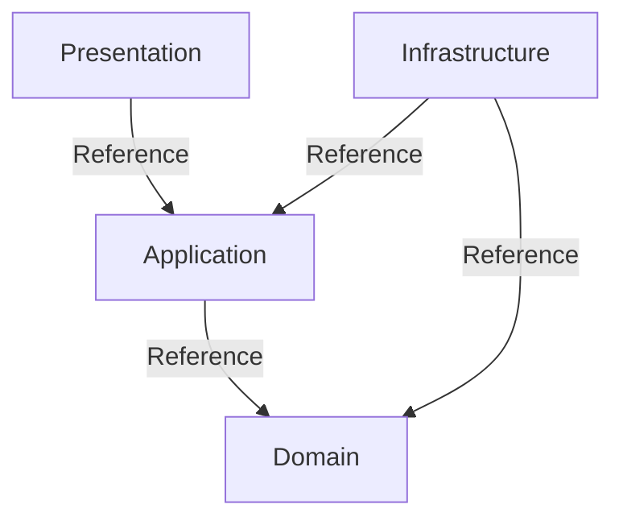

# TÀI LIỆU MÔ TẢ CẤU TRÚC DỰ ÁN

# Mục lục

- [Tổng quan kiến trúc](#1-tổng-quan-kiến-trúc)
- [Mô hình kiến trúc (Mermaid Diagram)](#2-mô-hình-kiến-trúc-mermaid-diagram)
- [Thư mục src/ — Source Code Chính](#3-thư-mục-src-—-source-code-chính)
  - [TechHaven.Domain — Tầng Domain (Core Business)](#31-techhaven-domain--tầng-domain-core-business)
  - [TechHaven.Application — Tầng Application (Use Cases)](#32-techhaven-application--tầng-application-use-cases)
  - [TechHaven.Infrastructure — Tầng Infrastructure (Implementation)](#33-techhaven-infrastructure--tầng-infrastructure-implementation)
  - [TechHaven.Presentation.WinUI — Tầng Presentation (UI)](#34-techhaven-presentationwinui--tầng-presentation-ui)
- [Thư mục tests/ — Kiểm thử phần mềm](#4-thư-mục-tests--kiểm-thử-phần-mềm)
- [Thư mục docs/ — Tài liệu kỹ thuật](#5-thư-mục-docs--tài-liệu-kỹ-thuật)
- [Sơ đồ phụ thuộc giữa các tầng](#6-sơ-đồ-phụ-thuộc-giữa-các-tầng)
- [Hướng dẫn chi tiết tạo Solution TechHaven](#hướng-dẫn-chi-tiết-tạo-solution-techhaven)
  - [Bước 1: Tạo Solution và cấu trúc thư mục](#bước-1-tạo-solution-và-cấu-trúc-thư-mục)
  - [Bước 2: Tạo Domain Layer (Core)](#bước-2-tạo-domain-layer-core)
  - [Bước 3: Tạo Application Layer](#bước-3-tạo-application-layer)
  - [Bước 4: Tạo Infrastructure Layer](#bước-4-tạo-infrastructure-layer)
  - [Bước 5: Tạo Presentation Layer (WinUI)](#bước-5-tạo-presentation-layer-winui)
  - [Bước 6: Tạo Migration và Database](#bước-6-tạo-migration-và-database)
  - [Bước 7: Tạo Test Projects](#bước-7-tạo-test-projects)
  - [Bước 8: Kiểm tra Dependencies](#bước-8-kiểm-tra-dependencies)
  - [Bước 9: Build và Run](#bước-9-build-và-run)
- [Phụ lục: Ví dụ mã, lệnh và ảnh minh họa](#phụ-lục-ví-dụ-mã-lệnh-và-ảnh-minh-họa)

<!-- Nếu cần bổ sung thêm mục con cụ thể (ví dụ ViewModel, Repositories, Mappings...), báo tên mục con để cập nhật. -->

# TÀI LIỆU MÔ TẢ CẤU TRÚC DỰ ÁN

# Mục lục


# Cấu trúc folder

```json
TechHaven.sln
│
├── src/
│   ├── TechHaven.Domain/                         // .NET Standard / .NET 6+ (Core)
│   │   ├── TechHaven.Domain.csproj
│   │   ├── Entities/
│   │   │   ├── Product.cs
│   │   │   ├── Order.cs
│   │   │   └── OrderItem.cs
│   │   ├── ValueObjects/
│   │   │   └── Money.cs
│   │   ├── Exceptions/
│   │   │   └── DomainException.cs
│   │   ├── Events/
│   │   │   └── OrderCreatedEvent.cs
│   │   └── Services/                           // Domain services (if logic không thuộc entity)
│   │       └── IInventoryDomainService.cs
│   │
│   ├── TechHaven.Application/                      // .NET Standard / .NET 6+
│   │   ├── TechHaven.Application.csproj
│   │   ├── Interfaces/                          // Abstractions (repositories, external services)
│   │   │   ├── IProductRepository.cs
│   │   │   └── IEmailService.cs
│   │   ├── DTOs/
│   │   │   └── ProductDto.cs
│   │   ├── UseCases/                            // Use cases (each as small class / handler)
│   │   │   ├── Orders/
│   │   │   │   ├── CreateOrderCommand.cs
│   │   │   │   └── CreateOrderHandler.cs
│   │   │   └── Products/
│   │   ├── Mappings/                            // AutoMapper/Mapster profiles
│   │   └── ApplicationModule.cs                 // Extension method for DI (AddApplication)
│   │
│   ├── TechHaven.Infrastructure/                   // .NET 6+
│   │   ├── TechHaven.Infrastructure.csproj
│   │   ├── Persistence/
│   │   │   ├── AppDbContext.cs
│   │   │   └── Repositories/
│   │   │       ├── ProductRepository.cs         // implements IProductRepository
│   │   │       └── OrderRepository.cs
│   │   ├── ExternalServices/
│   │   │   └── EmailService.cs                  // implements IEmailService
│   │   ├── Migrations/                          // EF Core migrations
│   │   └── InfrastructureModule.cs              // Extension method for DI (AddInfrastructure)
│   │
│   └── TechHaven.Presentation.WinUI/                // .NET 6+ WinUI / or API project
│       ├── TechHaven.Presentation.WinUI.csproj
│       ├── Views/
│       │   └── ProductDetailPage.xaml
│       ├── ViewModels/
│       │   └── ProductDetailViewModel.cs
│       ├── Converters/
│       ├── Helpers/
│       └── App.xaml
│
├── tests/
│   ├── TechHaven.UnitTests/                        // Unit tests (Domain + Application)
│   │   ├── TechHaven.UnitTests.csproj
│   │   └── Domain/
│   │       └── OrderTests.cs
│   └── TechHaven.IntegrationTests/                 // Integration tests (with in-memory db)
│       ├── TechHaven.IntegrationTests.csproj
│       └── Persistence/
│
└── docs/
    ├── ARCHITECTURE.md
    └── README.md
```

## 1. Tổng quan kiến trúc

Dự án **TechHaven** được thiết kế dựa trên nguyên tắc của **Clean Architecture** kết hợp **3-Layer Architecture**.

Mục tiêu:

- Phân tách rõ ràng giữa các tầng: **Domain**, **Application**, **Infrastructure**, và **Presentation**.
- Dễ dàng **test, mở rộng, bảo trì** và **thay thế công nghệ** (ví dụ: thay DB, UI framework mà không ảnh hưởng business logic).
- Tuân thủ nguyên tắc **Dependency Inversion**: các tầng cấp cao không phụ thuộc tầng cấp thấp.

Cấu trúc tổng quát:

```
TechHaven.sln
├── src/
│   ├── TechHaven.Domain/
│   ├── TechHaven.Application/
│   ├── TechHaven.Infrastructure/
│   └── TechHaven.Presentation.WinUI/
├── tests/
│   ├── TechHaven.UnitTests/
│   └── TechHaven.IntegrationTests/
└── docs/
```

---

## 2. Mô hình kiến trúc (Mermaid Diagram)



Giải thích luồng phụ thuộc:

- **UI (Presentation)** chỉ gọi vào **Application** thông qua các UseCase hoặc ViewModel.
- **Application** gọi sang **Domain** để xử lý nghiệp vụ, và **Infrastructure** để truy xuất dữ liệu.
- **Domain** hoàn toàn **độc lập**, không phụ thuộc bất kỳ tầng nào khác.

---

## 3. Thư mục `src/` — Source Code Chính

### 3.1. `TechHaven.Domain/` — Tầng **Domain Layer (Core Business)**

> Tầng chứa logic nghiệp vụ thuần túy.
> 

**Mục tiêu:**

- Độc lập hoàn toàn (không phụ thuộc EF, UI, hay framework nào).
- Có thể tái sử dụng trong các ứng dụng khác.

**Cấu trúc:**

```
TechHaven.Domain/
├── Entities/
├── ValueObjects/
├── Exceptions/
├── Events/
└── Services/
```

**Giải thích:**

| Thành phần | Vai trò |
| --- | --- |
| **Entities/** | Đại diện cho các đối tượng chính trong nghiệp vụ, có định danh (ví dụ: `Product`, `Order`). |
| **ValueObjects/** | Các giá trị bất biến, không có ID (ví dụ: `Money`, `Address`). |
| **Exceptions/** | Các ngoại lệ mang tính nghiệp vụ (ví dụ: `DomainException`). |
| **Events/** | Các sự kiện domain (ví dụ: `OrderCreatedEvent`) – dùng để phản ứng trong nghiệp vụ. |
| **Services/** | Chứa logic nghiệp vụ không thuộc về một entity cụ thể (Domain Service). |

**Ví dụ:**

- `Product.cs`: định nghĩa thuộc tính `Id`, `Name`, `Price`, kèm validate logic.
- `Money.cs`: value object cho tiền tệ, xử lý cộng/trừ tiền hợp lệ.
- `IInventoryDomainService.cs`: interface cho các nghiệp vụ kiểm tra tồn kho.

---

### 3.2. `TechHaven.Application/` — Tầng **Application Layer (Use Cases)**

> Tầng chịu trách nhiệm điều phối các hành động nghiệp vụ, sử dụng Domain và gọi hạ tầng thông qua abstraction.
> 

**Cấu trúc:**

```
TechHaven.Application/
├── Common/
├── Interfaces/
├── DTOs/
├── UseCases/
├── Mappings/
└── ApplicationModule.cs
```

**Giải thích:**

| Thành phần | Vai trò |
| --- | --- |
| **Common/** | Kho chứa các thành phần tiện ích, dùng chung, không thuộc UseCase riêng lẻ (`DateTimeHelper`, `CurrencyFormatter`). |
| **Interfaces/** | Định nghĩa abstraction cho repository hoặc service bên ngoài (`IProductRepository`, `IEmailService`). |
| **DTOs/** | Dữ liệu truyền qua các tầng (ví dụ: `ProductDto`). |
| **UseCases/** | Chứa từng kịch bản nghiệp vụ (command, handler). |
| **Mappings/** | Cấu hình AutoMapper hoặc Mapster để map Entity ↔ DTO. |
| **ApplicationModule.cs** | Extension method cho DI: `services.AddApplication()`. |

**Ví dụ:**

- `CreateOrderCommand.cs`: input cho nghiệp vụ tạo đơn hàng.
- `CreateOrderHandler.cs`: xử lý nghiệp vụ tạo đơn hàng bằng cách gọi repository và domain logic.

**Nguyên tắc:**

Application chỉ **phụ thuộc vào interface**, không phụ thuộc implement thực tế của Infrastructure.

---

### 3.3. `TechHaven.Infrastructure/` — Tầng **Infrastructure Layer (Implementation)**

> Cung cấp cài đặt thực tế cho các interface trong Application (VD: EF Core, email service, logging...).
> 

**Cấu trúc:**

```
TechHaven.Infrastructure/
├── Persistence/
│   ├── Configurations/
│   └── Repositories/
│       ├── ProductRepository.cs
│       └── OrderRepository.cs
├── ExternalServices/
│   └── EmailService.cs
├── Migrations/
└── InfrastructureModule.cs

```

**Giải thích:**

| Thành phần | Vai trò |
| --- | --- |
| **Persistence/** | Chứa DbContext và Repository implement. |
| **Configurations/** | Khi dùng **EF Core** hoặc các ORM **tách riêng phần cấu hình cho các entity** ra khỏi `DbContext`. |
| **Repositories/** | Cài đặt cụ thể của các Repository (EF Core hoặc Dapper). |
| **ExternalServices/** | Cài đặt dịch vụ bên ngoài (Email, File Storage, API...). |
| **Migrations/** | Lưu trữ migration của Entity Framework Core. |
| **InfrastructureModule.cs** | Cấu hình DI: `services.AddInfrastructure(connectionString)`. |

**Nguyên tắc:**

Infrastructure **phụ thuộc Application**, nhưng **Application không phụ thuộc Infrastructure**.

---

### 3.4. `TechHaven.Presentation.WinUI/` — Tầng **Presentation Layer (UI)**

> Là giao diện người dùng (WinUI / WPF / API Controller).
> 
> 
> Giao tiếp với Application thông qua ViewModel hoặc UseCase.
> 

**Cấu trúc:**

```
TechHaven.Presentation.WinUI/
├── Views/
├── ViewModels/
├── Services/
├── Helpers/
└── App.xaml
```

**Giải thích:**

| Thành phần | Vai trò |
| --- | --- |
| **Views/** | Các file XAML giao diện. |
| **ViewModels/** | Chứa logic UI (MVVM pattern). |
| **Services/** | Chứa các lớp service phục vụ cho UI / ViewModel, không phải domain hoặc business logic (`NavigationService`, `DialogService`) |
| **Helpers/** | Các tiện ích chung cho UI. |
| **App.xaml** | Cấu hình khởi động ứng dụng WinUI. |

**Nguyên tắc:**

ViewModel gọi đến Application (qua DI) → Application gọi Domain hoặc Infrastructure theo chiều đúng của Clean Architecture.

---

## 4. Thư mục `tests/` — Kiểm thử phần mềm

> Mục tiêu: đảm bảo logic nghiệp vụ hoạt động đúng, độc lập với UI.
> 

**Cấu trúc:**

```
tests/
├── TechHaven.UnitTests/
│   └── Domain/
│       └── OrderTests.cs
└── TechHaven.IntegrationTests/
    └── Persistence/
```

**Giải thích:**

| Test type | Vai trò |
| --- | --- |
| **Unit Tests** | Kiểm thử từng unit nhỏ (Entity, Service, UseCase) với mock dependencies (dùng xUnit + Moq + FluentAssertions). |
| **Integration Tests** | Kiểm thử tích hợp với database hoặc external service (thường dùng InMemory DB). |

**Ví dụ:**

- `OrderTests.cs`: test validate tổng tiền, logic thêm sản phẩm.
- `PersistenceTests.cs`: test CRUD với EF InMemory database.

---

## 5. Thư mục `docs/` — Tài liệu kỹ thuật

> Chứa toàn bộ tài liệu mô tả hệ thống, phục vụ cho đọc hiểu cấu trúc/ thuật ngữ dự án.
> 

**Cấu trúc:**

```
docs/
├── ARCHITECTURE.md    // Tài liệu này
└── README.md          // Giới thiệu, hướng dẫn chạy project
```

---

## 6. Sơ đồ phụ thuộc giữa các tầng



- **Domain**: Không phụ thuộc ai.
- **Application**: Phụ thuộc Domain (và abstraction của Infrastructure).
- **Infrastructure**: Cài đặt chi tiết cho Application.
- **Presentation**: Gọi Application, không biết gì về Infrastructure.

---

# Hướng dẫn chi tiết tạo Solution TechHaven

Hài liệu hướng dẫn từng bước tạo cấu trúc solution theo kiến trúc Clean Architecture cho dự án TechHaven.

## Bước 1: Tạo Solution và cấu trúc thư mục

### 1.1. Tạo Solution mới

1. Mở Visual Studio
2. Chọn **Create a new project**
3. Tìm và chọn **Blank Solution**
4. Đặt tên: `TechHaven`
5. Chọn location và nhấn **Create**


### 1.2. Tạo Solution Folders

Trong Solution Explorer, chuột phải vào Solution → **Add** → **New Solution Folder**

Tạo các folder theo thứ tự:

- `src` (chứa source code)
- `tests` (chứa unit tests & integration tests)
- `docs` (chứa tài liệu)


---

## Bước 2: Tạo Domain Layer (Core)

### 2.1. Tạo Class Library Project

1. Chuột phải vào folder **src** → **Add** → **New Project**
    
    
    
    
2. Chọn **Class Library** (C#)
    
    
    
3. Đặt tên: `TechHaven.Domain`
4. Framework: **.NET 8.0** (hoặc .NET 6+)
5. Nhấn **Create**

### 2.2. Cấu trúc thư mục trong TechHaven.Domain

Chuột phải vào project `TechHaven.Domain` → **Add** → **New Folder**

Tạo các folder:

```
TechHaven.Domain/
├── Entities/
├── ValueObjects/
├── Exceptions/
├── Events/
└── Services/
```

### 2.3. Xóa file Class1.cs mặc định

---

## Bước 3: Tạo Application Layer

### 3.1. Tạo Class Library Project

1. Chuột phải vào folder **src** → **Add** → **New Project**
2. Chọn **Class Library**
3. Đặt tên: `TechHaven.Application`
4. Framework: **.NET 8.0**
5. Nhấn **Create**

### 3.2. Tạo cấu trúc thư mục

```
TechHaven.Application/
├── Interfaces/
├── DTOs/
├── UseCases/
│   ├── Products/
│   └── Orders/
├── Mappings/
└── Common/
```

### 3.3. Add Reference đến Domain

Chuột phải vào **TechHaven.Application** → **Add** → **Project Reference**
→ Chọn **TechHaven.Domain** → OK


---

## Bước 4: Tạo Infrastructure Layer

### 4.1. Tạo Class Library Project

1. Chuột phải vào **src** → **Add** → **New Project**
2. Chọn **Class Library**
3. Đặt tên: `TechHaven.Infrastructure`
4. Framework: **.NET 8.0**

### 4.2. Cấu trúc thư mục

```
TechHaven.Infrastructure/
├── Persistence/
│   ├── Repositories/
│   └── Configurations/
├── ExternalServices/
└── Migrations/
```

### 4.3. Add References

Chuột phải **TechHaven.Infrastructure** → **Add** → **Project Reference**:

- Chọn **TechHaven.Domain**
- Chọn **TechHaven.Application**

### 4.4. Cài đặt NuGet Packages (Chưa làm → Tìm hiểu về NuGet package cho PostgreSQL và cài đặt)

Chuột phải **TechHaven.Infrastructure** → **Manage NuGet Packages**

Cài đặt các package:

```
Microsoft.EntityFrameworkCore
Microsoft.EntityFrameworkCore.SqlServer
Microsoft.EntityFrameworkCore.Tools
Microsoft.EntityFrameworkCore.Design
Microsoft.Extensions.Configuration.Abstractions
Microsoft.Extensions.DependencyInjection.Abstractions
```

### 4.6. Tạo Dependency Injection Module

**InfrastructureModule.cs:**

```csharp
using Microsoft.EntityFrameworkCore;
using Microsoft.Extensions.Configuration;
using Microsoft.Extensions.DependencyInjection;
using TechHaven.Application.Interfaces;
using TechHaven.Infrastructure.Persistence;
using TechHaven.Infrastructure.Persistence.Repositories;

namespace TechHaven.Infrastructure;

public static class InfrastructureModule
{
    public static IServiceCollection AddInfrastructure(
        this IServiceCollection services,
        IConfiguration configuration)
    {
        // Register DbContext
        services.AddDbContext<AppDbContext>(options =>
            options.UseSqlServer(
                configuration.GetConnectionString("DefaultConnection"),
                b => b.MigrationsAssembly(typeof(AppDbContext).Assembly.FullName)));

        // Register Repositories
        services.AddScoped<IProductRepository, ProductRepository>();

        return services;
    }
}
```

---

## Bước 5: Tạo Presentation Layer (WinUI)

### 5.1. Tạo WinUI 3 Project

1. Chuột phải **src** → **Add** → **New Project**
2. Tìm **WinUI 3** → chọn **Blank App, Packaged (WinUI 3 in Desktop)**
    
    
    
3. Đặt tên: `TechHaven.Presentation.WinUI`
4. Framework: **.NET 8.0**
5. Nhấn **Create**

### 5.2. Add References

Chuột phải **TechHaven.Presentation.WinUI** → **Add** → **Project Reference**:

- **TechHaven.Application**

### 5.3. Cài đặt NuGet Packages (Chưa cài - Frontend tự tìm hiểu và cài đặt)

```
Microsoft.Extensions.Hosting
Microsoft.Extensions.DependencyInjection
Microsoft.EntityFrameworkCore.Design
CommunityToolkit.Mvvm
```

### 5.4. Cấu trúc thư mục

```
TechHaven.Presentation.WinUI/
├── Views/
├── ViewModels/
├── Services/
├── Converters/
└── Helpers/
```

### 5.5. Thêm appsettings.json (Chưa làm → Làm sau khi cài xong database)

1. Chuột phải project → **Add** → **New Item** → **JSON File**
2. Đặt tên: `appsettings.json`
3. Nội dung:

```json
{
  "ConnectionStrings": {
    "DefaultConnection": "Server=(localdb)\\mssqllocaldb;Database=TechHavenDb;Trusted_Connection=True;MultipleActiveResultSets=true"
  },
  "Logging": {
    "LogLevel": {
      "Default": "Information",
      "Microsoft": "Warning"
    }
  }
}
```

1. Chuột phải file → **Properties** → **Copy to Output Directory**: **Copy if newer**

### 5.7. Tạo ViewModel

### 5.8. Tạo View

- Di chuyển `MainWindow` vào `View`
- Sẽ thấy có báo lỗi → Nhấn OK và cấu hình lại:
    
    
    
    Bước 1: Sửa namespace trong `MainWindow.xaml.cs`:
    
    ```csharp
    *// Từ:*
    namespace TechHaven.Presentation.WinUI;
    
    *// Thành:*
    namespace TechHaven.Presentation.WinUI.Views;
    ```
    
    Bước 2:  Sửa `x:Class` trong `MainWindow.xaml`:
    
    ```xml
    *<!-- Từ: -->*
    x:Class="TechHaven.Presentation.WinUI.MainWindow"
    
    *<!-- Thành: -->*
    x:Class="TechHaven.Presentation.WinUI.Views.MainWindow"
    ```
    
    Bước 3: Update `App.xaml.cs`:
    
    ```csharp
    using TechHaven.Presentation.WinUI.Views; *// ← Thêm using// Trong OnLaunched:*
    m_window = Services.GetRequiredService<MainWindow>();
    ```
    

---

## Bước 6: Tạo Migration và Database (Chưa làm → Làm sau khi xong database)

### 6.1. Set Startup Project

Chuột phải **TechHaven.Presentation.WinUI** → **Set as Startup Project**

### 6.2. Mở Package Manager Console

**Tools** → **NuGet Package Manager** → **Package Manager Console**

### 6.3. Chọn Default Project

Trong Console, chọn dropdown **Default project**: `TechHaven.Infrastructure`

### 6.4. Tạo Migration

Chạy lệnh:

```powershell
Add-Migration InitialCreate
```

### 6.5. Update Database

```powershell
Update-Database
```

---

## Bước 7: Tạo Test Projects

### 7.1. Unit Tests

1. Chuột phải folder **tests** → **Add** → **New Project**
2. Chọn **xUnit Test Project** hoặc **NUnit Test Project**
3. Đặt tên: `TechHaven.UnitTests`
4. Add reference đến **TechHaven.Domain** và **TechHaven.Application**

### 7.2. Integration Tests

Tương tự tạo project `TechHaven.IntegrationTests`

---

## Bước 8: Kiểm tra Dependencies

### 8.1. Sơ đồ Dependencies (không có vòng lặp)

```
TechHaven.Presentation.WinUI
    ↓
TechHaven.Infrastructure
    ↓
TechHaven.Application
    ↓
TechHaven.Domain (không phụ thuộc gì)
```

### 8.2. Kiểm tra

Chuột phải từng project → **Edit Project File** để xem `<ProjectReference>`

**TechHaven.Domain** - KHÔNG có ProjectReference nào

**TechHaven.Application**:

```xml
<ItemGroup>
  <ProjectReference Include="..\TechHaven.Domain\TechHaven.Domain.csproj" />
</ItemGroup>
```

**TechHaven.Infrastructure**:

```xml
<ItemGroup>
  <ProjectReference Include="..\TechHaven.Application\TechHaven.Application.csproj" />
  <ProjectReference Include="..\TechHaven.Domain\TechHaven.Domain.csproj" />
</ItemGroup>
```

**TechHaven.Presentation.WinUI**:

```xml
<ItemGroup>
  <ProjectReference Include="..\TechHaven.Application\TechHaven.Application.csproj" />
  <ProjectReference Include="..\TechHaven.Infrastructure\TechHaven.Infrastructure.csproj" />
</ItemGroup>
```

---

## Bước 9: Build và Run

1. Setup Project:
    - Đảm bảo **Default Project** trong PMC là `TechHaven.Infrastructure`
        
        B1: Mở **Package Manager Console**:
        
        - **Tools** → **NuGet Package Manager** → **Package Manager Console**
        - Hoặc phím tắt: **Ctrl + `** (backtick)
        
        
        
        - Tìm dropdown **"Default project:"** ở phía trên của PMC window
        - Click vào dropdown và chọn: **`TechHaven.Infrastructure`**
            
            
            
    - Đảm bảo **Startup Project** là `TechHaven.Presentation.WinUI`
        
        
        
2. **Clean Solution**
3. **Build Solution**: Ctrl + Shift + B
4. Kiểm tra không có lỗi
5. **Run**: F5

---